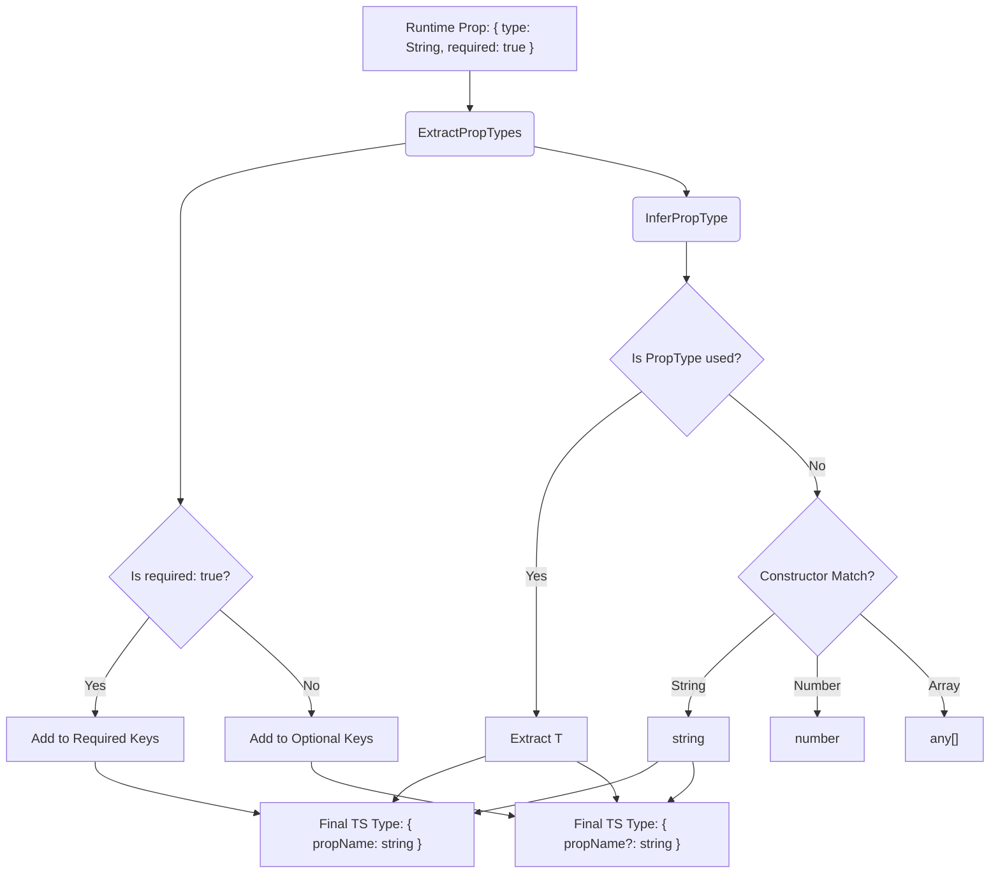

# Props Type Extraction

## 1. Концепция и Архитектура (Mental Model)

Исторически во Vue пропсы объявлялись рантайм-конструкторами (например, `type: String` или `type: Array`). С приходом TypeScript возникла сложная архитектурная задача: как из объекта конфигурации JavaScript, использующего рантайм-функции (`String`, `Number`, `Boolean`), математически точно вывести TypeScript-типы (`string`, `number`, `boolean`), сохраняя информацию об обязательности (`required`) и значениях по умолчанию (`default`)?

Решение кроется в паттерне **Type Extraction**. Vue использует сложные условные типы (Conditional Types), чтобы разобрать рантайм-объект по косточкам и собрать из него строгий интерфейс.

## 2. Визуализация (Mermaid)



## 3. Ссылки на исходный код (Source Code References)

- `packages/runtime-core/src/componentProps.ts` — Место обитания `ExtractPropTypes` и `InferPropType`.
- `packages/shared/src/index.ts` — Вспомогательные типы для анализа массивов и объектов.

## 4. Разбор реализации (Code Deep Dive)

В ядре Vue процесс извлечения типов разбит на несколько этапов. Главный оркестратор — `ExtractPropTypes`.

```typescript
// Упрощенная выдержка из componentProps.ts

// 1. Утилита PropType используется разработчиками для "проброса" сложных типов через рантайм-объект.
// В рантайме она ничего не делает, это просто маркер для TS.
export type PropType<T> = PropConstructor<T> | PropConstructor<T>[]

// 2. InferPropType переводит рантайм-конструктор в TS тип
type InferPropType<T> = [T] extends [null]
  ? any // null type => any
  : [T] extends [{ type: null | true }]
    ? any
    // Если разработчик использовал PropType<T>, вытаскиваем T
    : [T] extends [ObjectConstructor | { type: ObjectConstructor }]
      ? Record<string, any>
      : [T] extends [BooleanConstructor | { type: BooleanConstructor }]
        ? boolean
        // И так далее для String, Number, Array...
        : T extends Prop<infer V, infer D>
          ? unknown extends V ? D : V
          : T

// 3. ExtractPropTypes собирает все воедино, разделяя ключи на обязательные и опциональные
export type ExtractPropTypes<O> = {
  // Обязательные ключи (required: true)
  [K in RequiredKeys<O>]: InferPropType<O[K]>
} & {
  // Опциональные ключи
  [K in OptionalKeys<O>]?: InferPropType<O[K]>
}
```

Ключевой момент здесь: TypeScript разделяет объект на два (Required и Optional) через `Intersection (&)`. Если проп имеет `required: true`, он попадает в первый блок, иначе — во второй (со знаком `?`).

## 5. Оптимизации и Edge Cases (Подводные камни)

1. **Boolean Edge Case:** Во Vue булевы пропсы имеют особое поведение. Если проп не передан, он по умолчанию `false`, а не `undefined` (если нет `default`). Из-за этого `BooleanConstructor` в типах обрабатывается отдельно, чтобы TS не ругался на отсутствие пропа, даже если у него нет `required: true`.
2. **Function as Prop:** Когда проп — это функция, синтаксис `type: Function` в рантайме конфликтует с вызовом функции `default()`. Разработчикам приходится писать `type: Function as PropType<() => void>`. Извлечение `InferPropType` должно различать функцию-конструктор и реальную функцию.
3. **Производительность:** `ExtractPropTypes` — очень "тяжелый" тип. В компонентах с десятками пропсов он вызывает значительную задержку при компиляции. Именно поэтому в Composition API появился `defineProps<{ foo: string }>()` (Type-based declaration) — он работает в обратную сторону: компилятор Vue берет легкий TS-тип и генерирует из него рантайм-объект, избавляя TS от необходимости парсить "тяжелые" условные типы `ExtractPropTypes`.
