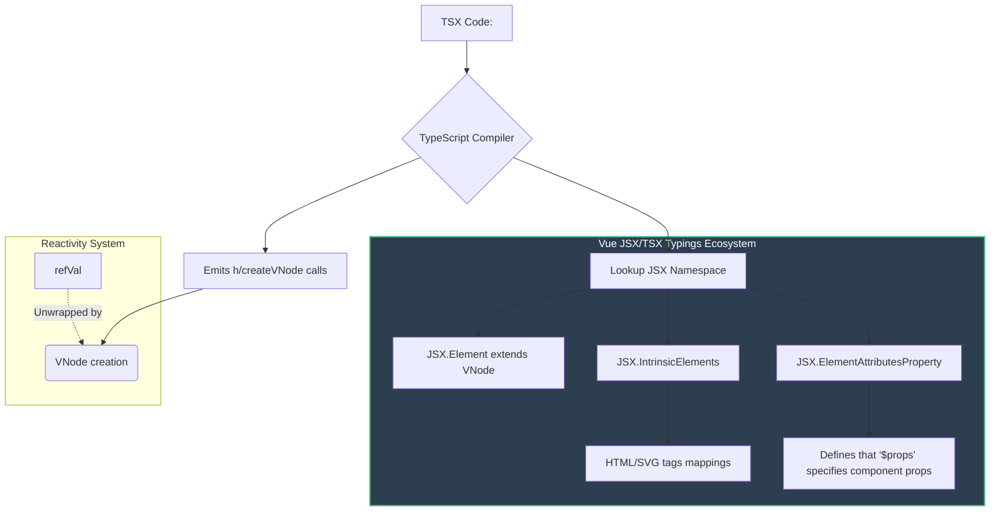

# JSX and TSX Typings

## 1. Концепция и Архитектура (Mental Model)

Хотя Vue исторически опирается на собственные шаблоны (Templates), он предоставляет полноценную поддержку JSX/TSX. Проблема в том, что стандартная спецификация JSX (которая де-факто контролируется React-экосистемой через TypeScript) имеет жесткие ожидания от того, как элементы и их пропсы должны типизироваться (например, глобальные пространства имен `JSX.IntrinsicElements`).

Архитектурная задача Vue: интегрировать свою специфику (реактивность, директивы `v-model`, `v-slots`, кастомные модификаторы событий) в стандартный TSX так, чтобы разработчик получал строгую проверку типов, автокомплит и вывод типов для слотов без коллизий с React.

## 2. Визуализация (Mermaid)



## 3. Ссылки на исходный код (Source Code References)

- `packages/runtime-dom/types/jsx.d.ts` — Глобальные декларации JSX.
- `packages/runtime-core/src/vnode.ts` — Базовые типы VNode.
- `packages/babel-plugin-jsx` — Трансформация JSX в `createVNode`.

## 4. Разбор реализации (Code Deep Dive)

Магия TSX во Vue кроется в переопределении глобальных неймспейсов JSX.

```typescript
// Упрощенная выдержка из runtime-dom/types/jsx.d.ts
export namespace JSX {
  // 1. Возвращаемый тип любого JSX-выражения — это VNode
  interface Element extends VNode {}
  
  // 2. Указывает компилятору, откуда брать типы для пропсов компонента.
  // Во Vue компоненты (как объекты или классы) имеют свойство (часто виртуальное) $props
  interface ElementAttributesProperty {
    $props: {}
  }
  
  // 3. Базовые типы для HTML атрибутов, интегрированные с Vue событиями
  interface IntrinsicAttributes extends ReservedProps {}
  
  interface IntrinsicElements {
    // Каждый HTML-тег типизируется так, чтобы принимать стандартные атрибуты
    // плюс Vue-специфичные: v-model, классы как массивы/объекты, и события onUpdate:modelValue
    div: HTMLAttributes & ReservedProps;
    span: HTMLAttributes & ReservedProps;
    // ...
  }
}

// ReservedProps включает служебные вещи Vue, которые можно вешать на любой VNode
export interface ReservedProps {
  key?: string | number | symbol
  ref?: VNodeRef
  ref_for?: boolean
  ref_key?: string
}
```

Отличительная черта Vue 3: поддержка `v-model` в JSX реализуется через конвенцию событий. Директива `v-model:modelValue={foo}` на уровне типизации (через Babel плагин) разворачивается в ожидание пропа `modelValue` и события `onUpdate:modelValue`.

## 5. Оптимизации и Edge Cases (Подводные камни)

1. **Reactivity Unwrapping в TSX:** В отличие от Vue-шаблонов, где компилятор автоматически знает, где стоит `ref` и разворачивает его (`.value`), внутри JSX/TSX вы пишете чистый JavaScript. TypeScript не позволит передать `Ref<string>` в проп, который ожидает `string`, если нет специальных типов-оберток. Из-за этого типы пропсов компонентов пропускаются через `UnwrapRef`, чтобы TSX понимал: передавая реактивный объект, компонент получит его значение.
2. **Конфликты глобальных типов:** Если в проекте одновременно установлены React и Vue (например, в микрофронтендах), их глобальные пространства имен `JSX` сталкиваются лбами. Во Vue 3.3+ были введены локальные JSX-фабрики (JSX pragma), чтобы можно было изолировать Vue-специфичные типы (через `"jsxImportSource": "vue"` в `tsconfig.json`).
3. **Строгость обработчиков событий:** TSX во Vue строго проверяет типы емитов. Если компонент объявлен с `emits: ['change']`, TypeScript в TSX потребует, чтобы `onChange` принимал правильные аргументы, что делает рефакторинг безопаснее по сравнению со строковыми шаблонами.
