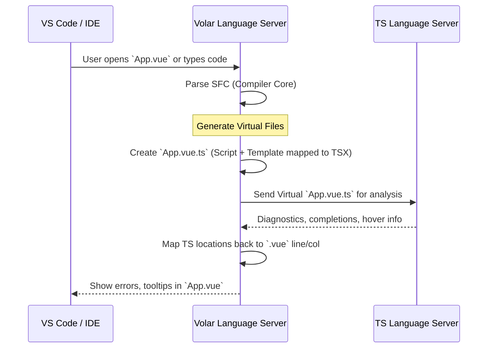

# Volar (Language Tools) Integration

## 1. Концепция и Архитектура (Mental Model)

Файлы `.vue` (Single File Components) — это кастомный формат, который TypeScript "из коробки" не понимает. В эпоху Vue 2 плагин Vetur работал как сложный линтер/парсер, часто отвязанный от реального TS-компилятора, что приводило к рассинхронизации ошибок.

Vue 3 ввел **Volar** (теперь официально `@vue/language-tools`). Архитектурный сдвиг колоссален: вместо того чтобы "учить" редактор понимать `.vue`, Volar на лету транслирует `.vue` в "виртуальные" файлы `.ts` (Virtual TypeScript Code). Затем эти виртуальные файлы скармливаются нативному TypeScript Language Server (TSServer). Результат: идеальная точность типов, автокомплитов и рефакторинга, потому что проверку делает сам TypeScript.

## 2. Визуализация (Mermaid)



## 3. Ссылки на исходный код (Source Code References)

- `vuejs/language-tools` (репозиторий Volar) — `packages/language-core/src/virtualFiles.ts`
- `packages/compiler-sfc/src/compileTemplate.ts` — Связь компилятора Vue с генерацией Source Maps для Volar.
- `@vue/language-core` — Преобразование `<template>` в виртуальный TSX.

## 4. Разбор реализации (Code Deep Dive)

Ключевой трюк Volar — это компиляция Vue-шаблона в функцию рендеринга на базе TSX. Это делается исключительно для проверки типов в памяти, код не идет в продакшен.

```vue
<!-- Исходный App.vue -->
<script setup lang="ts">
import { ref } from 'vue'
const count = ref(0)
</script>

<template>
  <button @click="count++">{{ count }}</button>
</template>
```

Volar под капотом превращает это в нечто похожее на:

```typescript
// Виртуальный App.vue.ts (Упрощенно)
import { ref } from 'vue'

// 1. Изоляция контекста <script setup>
const __setup = () => {
  const count = ref(0)
  
  // 2. Виртуальная функция рендеринга шаблона
  const __render = () => {
    // Внутренние макросы Volar для проверки типов
    const _ctx = { count } // Unwrapped context
    
    // Преобразование шаблона в TSX-like структуры
    // Здесь TS проверит, что _ctx.count можно инкрементировать, и что onClick принимает функцию
    <button onClick={() => _ctx.count.value++}>{ _ctx.count.value }</button>
  }

  // 3. Возврат типа компонента для импортов в других файлах
  return { count }
}

export default __setup
```

Чтобы при ошибке в `<button>` IDE подсветила именно 10-ю строку в `.vue`, Volar поддерживает сложные bidirectional source maps между виртуальным TSX и исходным HTML-шаблоном.

## 5. Оптимизации и Edge Cases (Подводные камни)

1. **Memory Leaks & Performance:** Виртуализация шаблонов порождает гигантские объемы сгенерированного TS-кода. В ранних версиях Volar это вызывало OOM (Out of Memory) в TS Server. Для оптимизации Volar (начиная с 1.0 и далее) стал использовать механизм `ts-plugin` и "Language Modules", минимизируя размер виртуального кода и переиспользуя AST.
2. **`ComponentCustomProperties`:** Если разработчик добавляет глобальные свойства (например, `app.config.globalProperties.$i18n`), Volar должен узнать об этом в шаблоне. Для этого используется TypeScript module augmentation:
   ```typescript
   declare module 'vue' {
     interface ComponentCustomProperties {
       $i18n: I18nPlugin
     }
   }
   ```
   Volar берет тип `_ctx` из пересечения инстанса компонента и `ComponentCustomProperties`.
3. **Takeover Mode (Исторический контекст):** Ранее, чтобы избежать запуска двух экземпляров TS Server (один стандартный от VS Code для `.ts` файлов, другой от Volar для `.vue`), использовался "Takeover Mode" — Volar брал на себя анализ и `.ts`, и `.vue`. В новых версиях Vue 3.4+ / Language Tools 2.0+ используется гибридный плагин (`@vue/typescript-plugin`), который встраивается прямо в нативный TS Server, навсегда избавляя от проблемы дублирования и "Takeover Mode".
