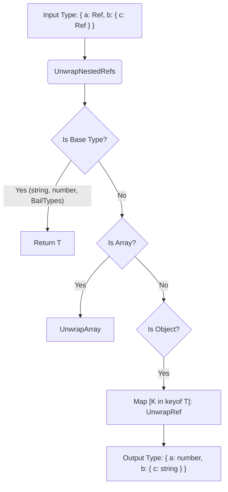

# Internal Utility Types

## 1. Концепция и Архитектура (Mental Model)

Кодовая база Vue активно использует набор "силовых" утилит-типов (Utility Types) уровня Advanced TypeScript. Их основная цель — моделирование рантайм-поведения фреймворка (которое часто весьма динамично) в статической системе типов. 

Две главные проблемы, которые решают эти типы:
1. **Рекурсивное развертывание реактивности (Reactivity Unwrapping):** когда `ref` вкладывается в `reactive`, или когда массив содержит рефы. В рантайме Vue прозрачно разворачивает это (`.value` не нужен). Типы должны это отражать.
2. **Очистка типа (Type Flattening / Prettifying):** сложная композиция типов делает всплывающие подсказки в IDE (hover tooltips) нечитаемыми. Утилиты сжимают пересечения объектов в плоские интерфейсы.

## 2. Визуализация (Mermaid)



## 3. Ссылки на исходный код (Source Code References)

- `packages/reactivity/src/ref.ts` — `UnwrapRef`, `ShallowUnwrapRef`, `BailTypes`.
- `packages/shared/src/index.ts` — `Prettify`, `IfAny`, `IsUnion`.
- `packages/runtime-core/src/componentProps.ts` — `ExtractPropTypes`.

## 4. Разбор реализации (Code Deep Dive)

Давайте заглянем в "моторный отсек" системы реактивности:

### `IfAny<T, Y, N>`
Часто нужно определить, передал ли пользователь тип `any`. `any` обходит стандартные проверки TS. Хак для обнаружения `any` строится на том, что `0 extends 1` ложно, но если подставить `any`, выражение вычисляется иначе.
```typescript
// Возвращает Y если T это any, иначе N
export type IfAny<T, Y, N> = 0 extends 1 & T ? Y : N
```

### `UnwrapRef<T>`
Это сердце системы типов реактивности. Обратите внимание на рекурсивность и защиту от падений компилятора (`BailTypes`).
```typescript
export type UnwrapRef<T> = T extends ShallowRef<infer V>
  ? V
  : T extends Ref<infer V>
    ? UnwrapNestedRefs<V>
    : UnwrapNestedRefs<T>

export type UnwrapNestedRefs<T> = T extends Ref ? T : UnwrapRefSimple<T>

type UnwrapRefSimple<T> = T extends
  | Function
  | CollectionTypes // Map, Set, WeakMap
  | BaseTypes // string, number, boolean
  | VNode
  | Window
  | Node // BailTypes - здесь рекурсия останавливается!
  ? T
  : T extends ReadonlyArray<any>
    ? { [K in keyof T]: UnwrapRefSimple<T[K]> }
    : T extends object & { [ShallowReactiveMarker]?: never }
      ? { [K in keyof T]: UnwrapRefSimple<T[K]> }
      : T
```

### `Prettify<T>` (также известен как `Expand` или `Compute`)
Используется повсеместно, чтобы преобразовать `{ a: 1 } & { b: 2 }` в `{ a: 1, b: 2 }` для читабельности в IDE.
```typescript
export type Prettify<T> = { [K in keyof T]: T[K] } & {}
```

## 5. Оптимизации и Edge Cases (Подводные камни)

1. **BailTypes (Предотвращение бесконечной рекурсии):** Если в реактивное состояние положить инстанс `Window`, `VNode` или сложный DOM-узел, рекурсивный обход `UnwrapRef` уйдет в бесконечный цикл (у DOM-узлов есть ссылки на `parentNode` и `childNodes`, создающие циклы графа). Хардкодинг "Bail Types" заставляет TS компилятор немедленно вернуть сам тип, пропуская его внутренности.
2. **`ShallowReactiveMarker`:** Для оптимизации рантайма (и типизации) существуют `shallowReactive` и `shallowRef`. В типах используется специальный скрытый символ/поле `[ShallowReactiveMarker]`. В `UnwrapRefSimple` есть проверка: если объект имеет этот маркер, рекурсивный разворот останавливается, отражая поведение рантайма (мелкая реактивность не трогает вложенные свойства).
3. **Деградация скорости компиляции (Compile Time):** Широкое использование `[K in keyof T]` и `infer` в массивах замедляет работу TS. Поэтому внутри кодовой базы ядра (в директориях `src`) эти утилиты кастятся через `as any`, а применяются только на границе экспорта для конечного пользователя.
