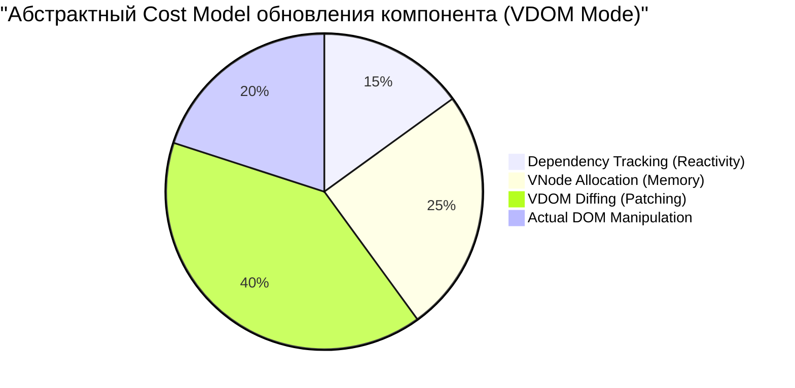
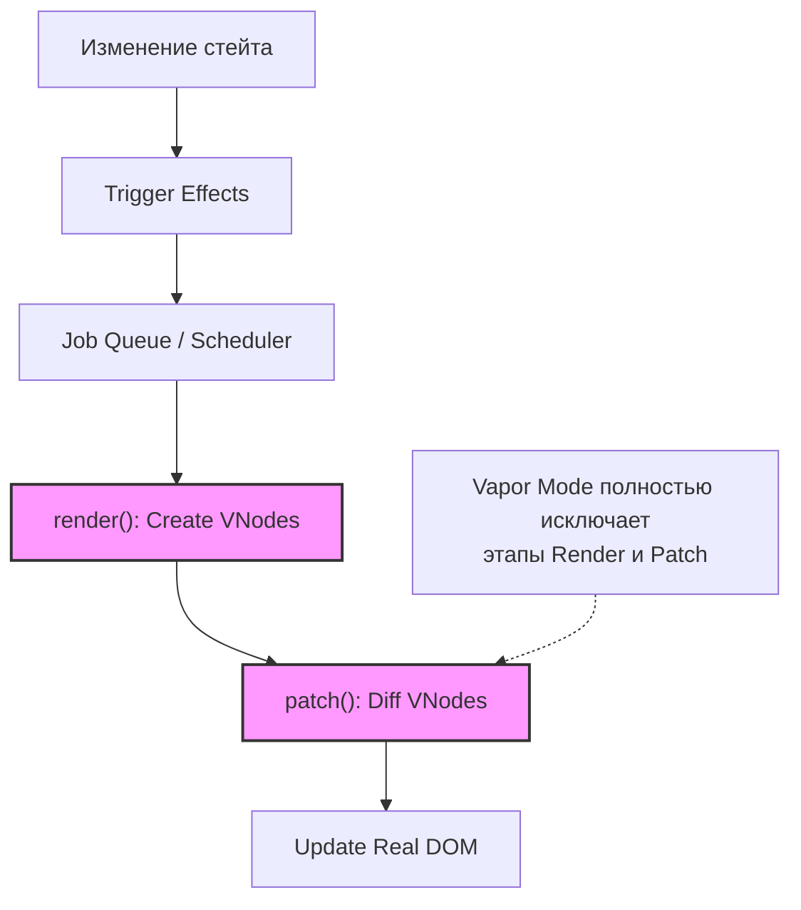

# Performance Cost Model в Vue.js

## 1. Концепция и Архитектура (Mental Model)

Vue стремится к балансу между выразительностью (DX) и производительностью (UX). "Модель стоимости" производительности во Vue складывается из трех основных слоев:
1. **Реактивность:** Затраты на трекинг зависимостей и триггеры обновлений.
2. **VDOM:** Затраты на аллокацию памяти под виртуальные узлы (VNodes) и их последующий diffing.
3. **Компилятор:** Сдвиг максимального количества вычислений из рантайма в этап компиляции (AOT-оптимизации).

Проблема, которую решает архитектура ядра: как обновлять DOM только там, где это необходимо, минимизируя нагрузку на сборщик мусора (GC) и парсер JS-движка. С выходом Vapor Mode (и оптимизаций Vue 3.5), фреймворк сдвигает эту модель в сторону нулевых затрат на VDOM, компилируя шаблоны напрямую в императивные вызовы DOM API.

## 2. Визуализация (Mermaid)





## 3. Ссылки на исходный код
- `packages/runtime-core/src/vnode.ts` (Структура VNode, ShapeFlags)
- `packages/runtime-core/src/renderer.ts` (Алгоритм патчинга)
- `packages/compiler-core/src/transforms/hoistStatic.ts` (Static Hoisting)

## 4. Разбор реализации (Code Deep Dive)

Одним из главных способов снижения стоимости рантайма во Vue является использование **Shape Flags**. Это позволяет движку вместо тяжелых проверок (например, `typeof vnode.children === 'string'`) использовать сверхбыстрые побитовые операции.

```typescript
// packages/shared/src/shapeFlags.ts
export const enum ShapeFlags {
  ELEMENT = 1,
  FUNCTIONAL_COMPONENT = 1 << 1,
  STATEFUL_COMPONENT = 1 << 2,
  TEXT_CHILDREN = 1 << 3,
  ARRAY_CHILDREN = 1 << 4,
  SLOTS_CHILDREN = 1 << 5,
  TELEPORT = 1 << 6,
  SUSPENSE = 1 << 7,
  COMPONENT_SHOULD_KEEP_ALIVE = 1 << 8,
  COMPONENT_KEPT_ALIVE = 1 << 9,
  COMPONENT = ShapeFlags.STATEFUL_COMPONENT | ShapeFlags.FUNCTIONAL_COMPONENT
}

// packages/runtime-core/src/renderer.ts (упрощенно)
const patch = (n1, n2, container, anchor) => {
  if (n1 === n2) return
  
  const { type, shapeFlag } = n2
  
  // Быстрая побитовая проверка вместо сложных if-else и typeof
  if (shapeFlag & ShapeFlags.ELEMENT) {
    processElement(n1, n2, container, anchor)
  } else if (shapeFlag & ShapeFlags.COMPONENT) {
    processComponent(n1, n2, container, anchor)
  }
}
```

## 5. Оптимизации и Edge Cases (Подводные камни)

- **Static Hoisting (Поднятие статики):** Компилятор выносит статические VNodes за пределы функции `render`. Это экономит аллокацию памяти при каждом перерендере.
- **Block Tree & PatchFlags:** Vue генерирует VNodes с `patchFlag` (также битовая маска), указывающим, что именно изменилось (например, только `TEXT` или только `CLASS`). Это позволяет алгоритму diffing пропускать целые ветви VDOM и обновлять только точечные атрибуты.
- **Vapor Mode:** В случаях, когда стоимость VDOM неприемлема (ограниченные устройства, огромные таблицы), Vapor Mode позволяет компилировать код напрямую в `document.createElement` и `effect`, минуя `VNode` и фазу diffing полностью.
