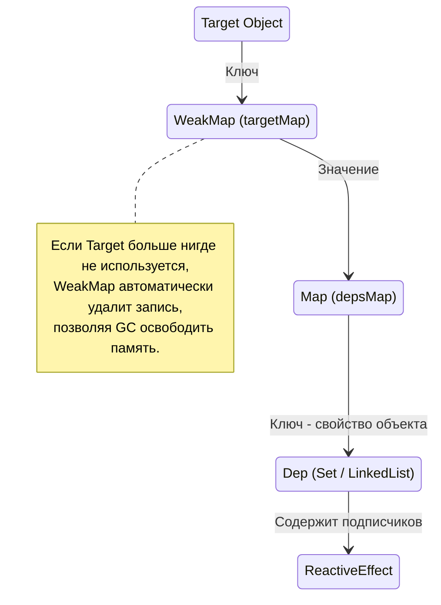

# Memory Management & GC Profiling во Vue

## 1. Концепция и Архитектура (Mental Model)

В Single Page Applications (SPA) утечки памяти — критическая проблема. Реактивные системы особенно склонны к этому, так как они создают сложные графы подписок: наблюдатели (Effects) подписываются на изменения свойств объектов (Observables). Если забыть отписаться при удалении компонента, сборщик мусора (GC) не сможет очистить память.

Vue решает эту проблему через несколько архитектурных паттернов:
1. Использование `WeakMap` для хранения метаданных реактивности.
2. Жесткая привязка жизненного цикла эффектов (Effects) к компоненту-владельцу.
3. Оптимизация структур данных в Vue 3.5 (замена массивов на двусвязные списки) для снижения нагрузки на GC.

## 2. Визуализация (Mermaid)



## 3. Ссылки на исходный код
- `packages/reactivity/src/reactive.ts` (targetMap)
- `packages/reactivity/src/effect.ts` (ReactiveEffect)
- `packages/reactivity/src/dep.ts` (Link structures in 3.5+)

## 4. Разбор реализации (Code Deep Dive)

В основе управления памятью реактивности лежит глобальный `targetMap`. Это `WeakMap`, ключами в котором выступают сами целевые объекты (target). 

```typescript
// packages/reactivity/src/reactive.ts
// Ключ - исходный объект, Значение - Map свойств
type KeyToDepMap = Map<any, Dep>
const targetMap = new WeakMap<object, KeyToDepMap>()

// Если объект перестанет существовать в пользовательском коде, 
// WeakMap не удержит его от сборки мусора.

export function track(target: object, type: TrackOpTypes, key: unknown) {
  if (activeEffect) {
    let depsMap = targetMap.get(target)
    if (!depsMap) {
      targetMap.set(target, (depsMap = new Map()))
    }
    let dep = depsMap.get(key)
    if (!dep) {
      depsMap.set(key, (dep = createDep()))
    }
    trackEffect(activeEffect, dep)
  }
}
```

В Vue 3.5 произошел масштабный рефакторинг реактивности (версия 2). Внедрены двусвязные списки (Doubly-linked lists) вместо массивов/множеств (Sets) для подписок.

```typescript
// packages/reactivity/src/dep.ts (Упрощенно Vue 3.5+)
export class ReactiveEffect<T = any> {
  // Указатели для двусвязного списка подписок
  deps: Link | undefined = undefined
  depsTail: Link | undefined = undefined
  
  stop() {
    // Очистка графа без дорогих операций Array.splice или Set.delete
    cleanupEffect(this)
  }
}
```

## 5. Оптимизации и Edge Cases (Подводные камни)

- **Почему `WeakMap`?** Использование `Map` привело бы к утечке каждого реактивного объекта в приложении. `WeakMap` держит "слабую" ссылку, отдавая приоритет GC.
- **Оптимизация Vue 3.5 (Двусвязные списки):** Исторически Vue использовал массивы и `Set` для хранения зависимостей. При удалении эффекта (например, при уничтожении компонента `v-if`) требовалось удалять его из всех подписок (`Set.delete` или `Array.slice`). Для глубоких деревьев компонентов это создавало микро-паузы из-за ре-аллокации памяти. Переход на двусвязные списки (`Link` узлы) сделал операции добавления/удаления зависимости $O(1)$, кардинально снизив "мусор" (thrashing) для сборщика памяти (GC) в крупных приложениях.
