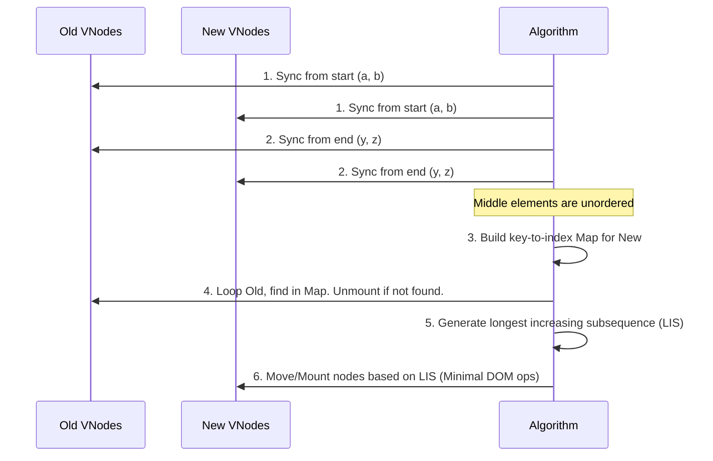

# VDOM Diffing: Алгоритмы и Бенчмарки

## 1. Концепция и Архитектура (Mental Model)

Обновление списка узлов (детей) — самая сложная задача в VDOM. Когда мы имеем дело с массивами ключей компонентов (например, список `v-for`), компоненты могут быть добавлены, удалены, или перемешаны. 
Цель Diffing-алгоритма: найти минимальное количество операций над реальным DOM (перемещений, вставок, удалений), чтобы превратить старый массив узлов в новый. Vue решает эту задачу с помощью алгоритма, находящего **Наибольшую возрастающую подпоследовательность (Longest Increasing Subsequence, LIS)**.

## 2. Визуализация (Mermaid)



## 3. Ссылки на исходный код
- `packages/runtime-core/src/renderer.ts` (Функция `patchKeyedChildren`)

## 4. Разбор реализации (Code Deep Dive)

Сердце алгоритма — `patchKeyedChildren`. Это реализация алгоритма diffing с временем работы $O(n \log n)$ для худшего случая.

```typescript
// packages/runtime-core/src/renderer.ts (Концептуальный срез)
const patchKeyedChildren = (c1, c2, container, parentAnchor) => {
  let i = 0
  const l2 = c2.length
  let e1 = c1.length - 1
  let e2 = l2 - 1

  // 1. Обход с начала: (a b) c -> (a b) d e
  while (i <= e1 && i <= e2 && isSameVNodeType(c1[i], c2[i])) { patch(c1[i], c2[i]); i++ }

  // 2. Обход с конца: a (b c) -> d e (b c)
  while (i <= e1 && i <= e2 && isSameVNodeType(c1[e1], c2[e2])) { patch(c1[e1], c2[e2]); e1--; e2-- }

  // ... 3. Обработка неизвестной середины ...
  
  // 5. Вычисление Наибольшей возрастающей подпоследовательности (LIS)
  // Это массив индексов новых элементов, которые УЖЕ идут в правильном порядке.
  // Их не нужно двигать в DOM!
  const increasingNewIndexSequence = moved
    ? getSequence(newIndexToOldIndexMap)
    : EMPTY_ARR
    
  // 6. Итерация с конца для перемещения/вставки
  let j = increasingNewIndexSequence.length - 1
  for (let i = toBePatched - 1; i >= 0; i--) {
    const nextIndex = s2 + i
    const nextChild = c2[nextIndex]
    if (newIndexToOldIndexMap[i] === 0) {
      // Узел новый - монтируем
      patch(null, nextChild, container, anchor)
    } else if (moved) {
      if (j < 0 || i !== increasingNewIndexSequence[j]) {
        // Узла нет в LIS - передвигаем в DOM
        move(nextChild, container, anchor)
      } else {
        // Узел есть в LIS - пропускаем перемещение
        j--
      }
    }
  }
}

// Бинарный поиск LIS внутри getSequence() обеспечивает O(n log n)
```

## 5. Оптимизации и Edge Cases (Подводные камни)

- **Почему LIS (Longest Increasing Subsequence)?** Перемещения в реальном DOM — одни из самых дорогих операций (recalc style/layout). Если у нас есть элементы `[1, 2, 3, 4]`, и они изменились на `[1, 4, 2, 3]`, наивный алгоритм может переместить 3 элемента. LIS `[1, 2, 3]` показывает, что переместить нужно только элемент `4`. Алгоритм вычисляет эту последовательность за $O(n \log n)$ используя бинарный поиск, что делает его невероятно быстрым даже для десятков тысяч строк таблиц.
- **Быстрые пути (Fast paths):** В первую очередь Vue всегда пытается схлопнуть изменения с краев (префиксы и суффиксы). Это решает 90% реальных кейсов (бесконечный скролл, добавление элемента в начало/конец), вообще избегая создания Map и подсчета LIS.
