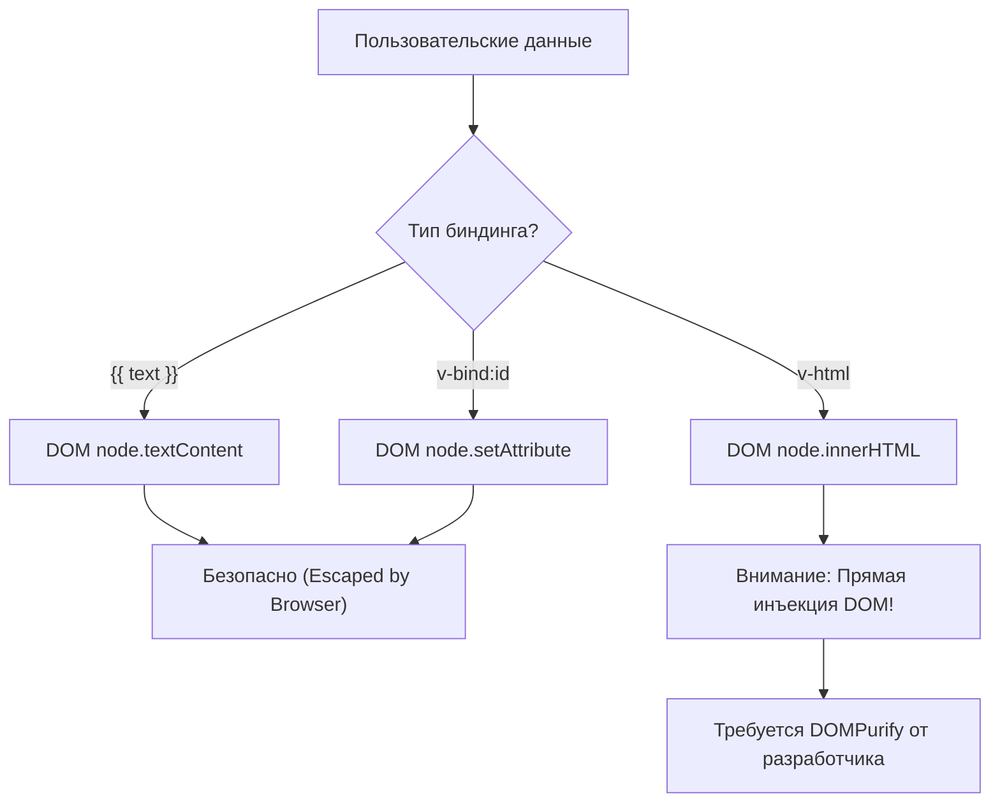

# Безопасность: XSS и `v-html`

## 1. Концепция и Архитектура (Mental Model)

С точки зрения безопасности фреймворков, XSS (Cross-Site Scripting) — основная угроза. Vue by design (по умолчанию) безопасен: любые данные, выводимые через интерполяцию `{{ }}` или привязку атрибутов `v-bind`, экранируются. Текст обрабатывается как `textContent`, а не `innerHTML`.

Однако фреймворку нужен механизм (escape hatch) для рендеринга сырого HTML (например, из WYSIWYG редактора). Для этого существует `v-html`. Архитектурное решение Vue — **НЕ включать санитайзер HTML в ядро фреймворка**. Это сознательный trade-off между размером бандла и безопасностью из коробки.

## 2. Визуализация (Mermaid)



## 3. Ссылки на исходный код
- `packages/runtime-dom/src/modules/props.ts` (patchDOMProp)
- `packages/server-renderer/src/helpers/escapeHtml.ts` (SSR escaping)

## 4. Разбор реализации (Code Deep Dive)

В рантайме браузера Vue использует нативные безопасные API:

```typescript
// packages/runtime-dom/src/nodeOps.ts
export const nodeOps = {
  // Установка текста всегда безопасна
  setElementText: (el, text) => {
    el.textContent = text
  },
  // ...
}
```

Директива `v-html` компилируется в прямое назначение свойства `innerHTML`:

```typescript
// packages/runtime-dom/src/modules/props.ts (patchDOMProp - обработка v-html)
if (key === 'innerHTML' || key === 'textContent') {
  if (value != null) {
    // ВНИМАНИЕ: Здесь нет встроенной валидации.
    // Фреймворк полностью доверяет переданному value.
    el[key] = value
  }
  return
}
```

В контексте **SSR (Server-Side Rendering)** Vue должен вручную экранировать все атрибуты и текст, так как браузерного `textContent` на сервере не существует:

```typescript
// packages/server-renderer/src/helpers/escapeHtml.ts
const escapeRE = /["'&<>]/
export function escapeHtml(string: unknown): string {
  const str = '' + string
  const match = escapeRE.exec(str)
  // ... быстрая замена спецсимволов на HTML-сущности (&lt;, &gt;, &amp;)
  // Этот алгоритм сильно оптимизирован на посимвольный обход для скорости SSR.
}
```

## 5. Оптимизации и Edge Cases (Подводные камни)

- **Почему нет встроенного санитайзера?** Включение мощного санитайзера вроде `DOMPurify` добавило бы 10-20kb к размеру ядра Vue. Большинству приложений `v-html` не нужен. Встраивание легкого/наивного санитайзера — еще хуже, так как это создает ложное чувство безопасности и легко обходится хакерами.
- **Атрибуты:** `v-bind:href` не проверяется на протоколы `javascript:`. Vue считает это ответственностью разработчика. Если вы биндите пользовательский URL к `href`, злоумышленник может внедрить `javascript:alert(1)`.
- **Опасные контексты:** Нельзя позволять пользователям контролировать шаблоны компонента (передавать строку в `compile()` на клиенте). Компилятор Vue допускает выполнение произвольного JS в AST выражениях.
