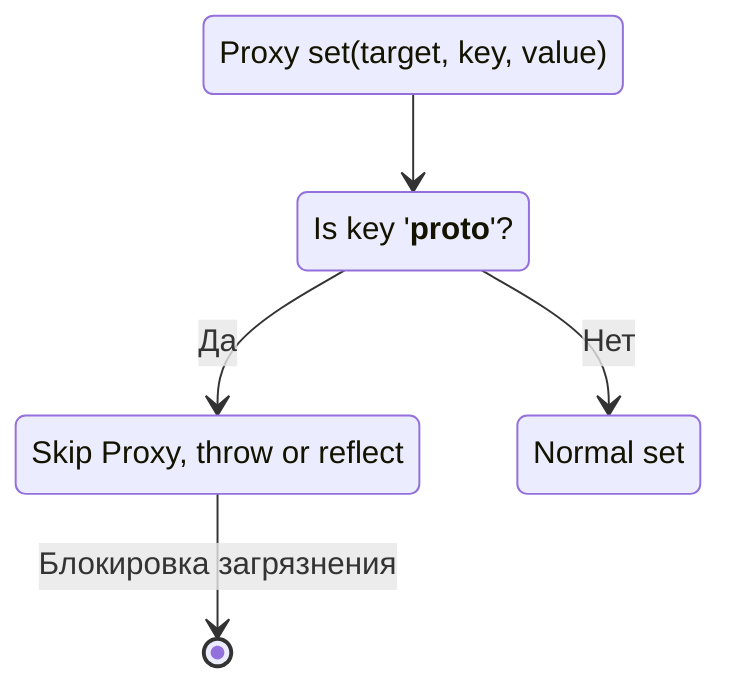

# Защита от Prototype Pollution в Реактивности

## 1. Концепция и Архитектура (Mental Model)

Prototype Pollution — это уязвимость в JS, при которой злоумышленник внедряет свойства в базовые прототипы (например, `Object.prototype`) через манипуляции с ключами типа `__proto__`.
Поскольку Vue глубоко проксирует объекты с помощью функции `reactive` (через `Proxy`), ядро фреймворка должно гарантировать, что реактивные операции (get/set) не приведут к случайной или злонамеренной перезаписи прототипов.

## 2. Визуализация (Mermaid)



## 3. Ссылки на исходный код
- `packages/reactivity/src/baseHandlers.ts` (Обработчики Proxy)
- `packages/shared/src/index.ts` (Словари встроенных символов)

## 4. Разбор реализации (Code Deep Dive)

При создании прокси (`Proxy`) Vue перехватывает все операции `get` и `set`. Для защиты от уязвимостей и сбоев внутренней логики движка JS, некоторые ключи жестко игнорируются системой трекинга зависимостей.

```typescript
// packages/reactivity/src/baseHandlers.ts

const builtInSymbols = new Set(
  Object.getOwnPropertyNames(Symbol)
    .filter(key => key !== 'arguments' && key !== 'caller')
    .map(key => (Symbol as any)[key])
    .filter(isSymbol)
)

const isNonTrackableKeys = /*#__PURE__*/ makeMap(`__proto__,__v_isRef,__isVue`)

function createGetter(isReadonly = false, shallow = false) {
  return function get(target: Target, key: string | symbol, receiver: object) {
    // 1. Возврат внутренних флагов Vue (например, проверка isReactive)
    if (key === ReactiveFlags.IS_REACTIVE) {
      return !isReadonly
    }
    
    // ...

    const res = Reflect.get(target, key, receiver)

    // 2. ЗАЩИТА: Игнорируем __proto__ и встроенные символы.
    // Если этого не сделать, трекинг __proto__ может привести к 
    // утечкам памяти или prototype pollution при глубоком мердже (merge).
    if (isSymbol(key) ? builtInSymbols.has(key) : isNonTrackableKeys(key)) {
      return res
    }

    if (!isReadonly) {
      track(target, TrackOpTypes.GET, key)
    }

    return res
  }
}
```

## 5. Оптимизации и Edge Cases (Подводные камни)

- **Блокировка `__proto__`:** В Vue 3 ключи `__proto__` намеренно исключены из системы отслеживания (`track()`). Во-первых, следить за изменением прототипа дорого и бессмысленно для UI фреймворка. Во-вторых, обход этих ключей предотвращает уязвимости в функциях вроде глубокого копирования и рекурсивной реактивности.
- **Встроенные `Symbol`:** Такие символы как `Symbol.iterator` не отслеживаются. Иначе, банальный `for...of` цикл над реактивным массивом вызывал бы подписку на сам итератор массива, что породило бы хаос в зависимостях и лишние перерендеры.
- **Reflect API:** Использование `Reflect.get(target, key, receiver)` вместо `target[key]` гарантирует, что если свойство является геттером, то `this` внутри геттера будет указывать на `receiver` (сам `Proxy`), что позволяет корректно отследить доступ к вложенным свойствам.
