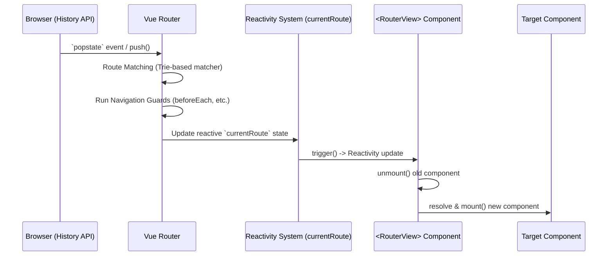

# Внутренняя архитектура интеграции Vue Router

## 1. Концепция и Архитектура (Mental Model)
Vue Router — это не просто библиотека, а глубоко интегрированный плагин, который внедряется в жизненный цикл (lifecycle) и систему реактивности Vue.
Основная проблема, которую решает роутер на уровне архитектуры — это синхронизация URL-адреса браузера с графом компонентов (Component Tree) и реактивным состоянием приложения.
Роутер работает как стейт-машина (State Machine). При изменении URL (`history.pushState` или событие `popstate`) роутер вычисляет (resolve) новый маршрут (Route Record), извлекает необходимые компоненты (включая ленивые (async/lazy) чанки) и реактивно обновляет объект `currentRoute`. Глобальные компоненты `<RouterView>` реагируют на изменение этого стейт-объекта и запускают ререндер.

## 2. Визуализация (Mermaid)


## 3. Ссылки на исходный код (Source Code References)
- `vue-router/src/router.ts` (Основной класс роутера и метод `install`)
- `vue-router/src/matcher/index.ts` (Система матчинга маршрутов, основанная на Radix Tree / Prefix Tree)
- `vue-router/src/components/View.ts` (Реализация `<RouterView>`)
- `packages/runtime-core/src/apiInject.ts` (Механизмы Provide/Inject в ядре Vue)

## 4. Разбор реализации (Code Deep Dive)
Установка роутера использует стандартный API плагинов Vue `app.use()`. Роутер инжектит свои инстансы через `provide`, делая их доступными в любом компоненте без проп-дриллинга.

```typescript
// vue-router/src/router.ts (упрощенно)
export function createRouter(options: RouterOptions): Router {
  const currentRoute = shallowRef<RouteLocationNormalizedLoaded>(START_LOCATION_NORMALIZED)

  const router: Router = {
    currentRoute,
    install(app: App) {
      // 1. Провайдим инстанс роутера и текущий реактивный маршрут
      app.provide(routerKey, router)
      app.provide(routeLocationKey, reactive(computed(() => currentRoute.value)))
      
      // 2. Регистрация глобальных компонентов
      app.component('RouterView', RouterView)
      app.component('RouterLink', RouterLink)
      
      // 3. Интеграция с Vue Devtools
      if (isBrowser) setupDevtools(app, router)
    },
    push(to: RouteLocationRaw) {
      return pushWithRedirect(to)
    }
  }
  return router
}
```

Компонент `<RouterView>` — это функциональный (или render-only) компонент. Он подписывается на `routeLocationKey` и динамически рендерит нужный компонент с помощью `h()` (createVNode).

```typescript
// vue-router/src/components/View.ts (упрощенно)
export const RouterViewImpl = defineComponent({
  name: 'RouterView',
  setup(props, { slots }) {
    const injectedRoute = inject(routeLocationKey)!
    const depth = inject(viewDepthKey, 0)
    provide(viewDepthKey, depth + 1) // Для вложенных роутов

    return () => {
      const matchedRoute = injectedRoute.matched[depth]
      if (!matchedRoute) return null

      const ViewComponent = matchedRoute.components[props.name]
      // Динамическое создание VNode компонента
      return h(ViewComponent, { ...props })
    }
  }
})
```

## 5. Оптимизации и Edge Cases (Подводные камни)
- **Использование `shallowRef` для стейта маршрута:** `currentRoute` хранится как `shallowRef`, а не `ref` или `reactive`. Это критичная микрооптимизация: объект маршрута содержит много метаданных (компоненты, инстансы), и глубокое сканирование (deep proxy) вызвало бы огромный оверхед и утечки памяти.
- **Trie Matcher (Radix Tree):** Роутер Vue 3 использует Radix Tree для парсинга и сопоставления URL. Вместо линейного прохода по всем маршрутам (`O(N)`), он ищет маршрут за `O(K)` где `K` — длина URL сегментов. Это радикально ускоряет работу при тысячах маршрутов (Enterprise scale).
- **KeepAlive интеграция:** Роутер должен общаться с компонентом `<KeepAlive>` напрямую через `slots`, чтобы понимать, когда кэшировать `VNode`, а когда уничтожать (unmount), избегая конфликтов в lifecycle hooks (`activated` / `deactivated`).
