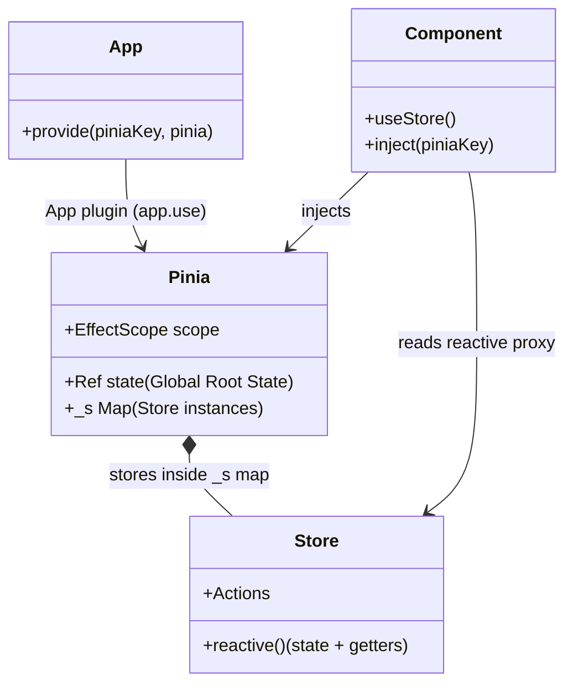

# Внутренняя архитектура Pinia и интеграция с реактивностью Vue

## 1. Концепция и Архитектура (Mental Model)
Pinia — это современный стейт-менеджер для Vue, пришедший на замену Vuex. Его архитектурная философия: "Минимум абстракций поверх ядра Vue".
В отличие от Vuex, который реализовывал свою собственную систему подписок и мутаций, Pinia напрямую использует `@vue/reactivity`. Store в Pinia — это просто `reactive` объект. State — это `ref` или `reactive`, Getters — это `computed`, а Actions — обычные функции. 
Интеграция с Vue происходит на уровне Dependency Injection (через `app.provide`) и `effectScope`. Pinia создает изолированную область эффектов (`EffectScope`) для всего стора, чтобы безопасно очищать реактивные зависимости при уничтожении приложения (например, в SSR).

## 2. Визуализация (Mermaid)


## 3. Ссылки на исходный код (Source Code References)
- `pinia/src/rootStore.ts` (Создание корневого экземпляра Pinia и плагина)
- `pinia/src/store.ts` (Функция `defineStore`, создание `setup` и `options` сторов)
- `packages/reactivity/src/effectScope.ts` (API управления эффектами в Vue Core, на котором строится Pinia)

## 4. Разбор реализации (Code Deep Dive)
Pinia регистрируется как плагин и создает глобальное хранилище всех состояний в одном корневом `ref`. Это критично для SSR-гидратации.

```typescript
// pinia/src/rootStore.ts (упрощенно)
export function createPinia(): Pinia {
  // Изолируем все сторы в одном глобальном EffectScope
  const scope = effectScope(true)
  
  // Корневой state (ref словаря), куда монтируются все сторы
  const state = scope.run<Ref<Record<string, StateTree>>>(() => ref({}))!

  const pinia: Pinia = markRaw({
    install(app: App) {
      pinia._a = app
      app.provide(piniaSymbol, pinia)
      app.config.globalProperties.$pinia = pinia
    },
    state,
    _s: new Map(), // Кэш инстансов сторов
    _e: scope,     // Корневой scope
  })

  return pinia
}
```

Когда компонент вызывает `useStore()`, Pinia проверяет кэш. Если стор не создан, он инициализируется. Внутри `setup`-стора Pinia перехватывает возвращаемый объект.

```typescript
// pinia/src/store.ts (концепт setup store)
function createSetupStore($id, setup, pinia) {
  let scope!
  
  // Создаем дочерний EffectScope для конкретного стора
  const setupStore = pinia._e.run(() => {
    scope = effectScope()
    return scope.run(() => setup())
  })!

  // Мапим возвращенные ref/reactive/computed свойства в store
  for (const key in setupStore) {
    const prop = setupStore[key]
    if (isRef(prop) && !isComputed(prop) || isReactive(prop)) {
      // Монтируем состояние в глобальный root state Pinia
      pinia.state.value[$id][key] = prop
    }
  }

  const store = reactive(setupStore)
  pinia._s.set($id, store) // Кэшируем стор
  return store
}
```

## 5. Оптимизации и Edge Cases (Подводные камни)
- **Использование `effectScope`:** До появления `effectScope` в Vue 3.2, глобальные реактивные объекты в плагинах могли вызывать утечки памяти (Memory Leaks), так как `computed` и `watch` не знали, к какому компоненту они привязаны. Pinia использует `effectScope` для сборки мусора (GC): при вызове `pinia._e.stop()` все трекеры и сайд-эффекты всех сторов уничтожаются одновременно (важно для SSR и HMR).
- **`markRaw` для экземпляра Pinia:** Инстанс Pinia помечается `markRaw()`. Это предотвращает систему реактивности Vue от глубокого обхода (deep traverse) самого объекта Pinia при внедрении (inject), что экономит CPU циклы при инстанцировании приложения.
- **Cross-Request State Pollution:** В SSR среде используется функция `createPinia` на каждый запрос. Глобальные сторы (модули-одиночки) запрещены, так как Node.js процесс долгоживущий. Pinia привязывает инстансы сторов к контексту запроса (через `app.provide` -> `inject`), полностью исключая шаринг стейта между пользователями.
