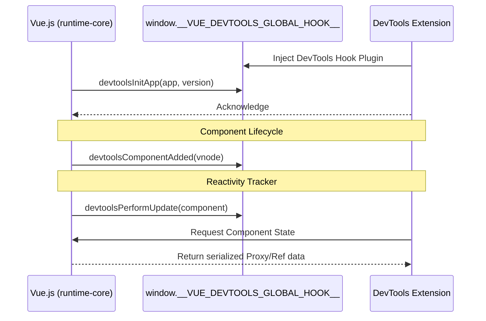

# Внутренняя архитектура хуков Vue DevTools

## 1. Концепция и Архитектура (Mental Model)
Интеграция Vue DevTools с ядром фреймворка строится вокруг паттерна Event Bus. Ядро Vue (runtime-core) содержит минимальный интерфейс для отправки хуков (Telemetry Hooks) о жизненном цикле компонентов, мутациях состояния, отслеживании производительности и вызове событий (`emit`).
Сам фреймворк не содержит логики DevTools. Вместо этого он предоставляет глобальный хук (обычно висящий на `window.__VUE_DEVTOOLS_GLOBAL_HOOK__`), через который внешнее расширение (browser extension) инжектит своего слушателя. Если расширение присутствует, Vue отправляет туда сериализованные "снэпшоты" внутреннего состояния.

## 2. Визуализация (Mermaid)


## 3. Ссылки на исходный код (Source Code References)
- `packages/runtime-core/src/devtools.ts` (Обертки для отправки событий в DevTools)
- `packages/runtime-core/src/component.ts` (Интеграция хуков `emit`, `mount`, `unmount` в жизненный цикл)
- `packages/reactivity/src/effect.ts` (Трассировка зависимостей, onTrack/onTrigger)

## 4. Разбор реализации (Code Deep Dive)
В ядре Vue все вызовы DevTools обернуты в флаг `__DEV__`. На продакшене сборщик (Vite/Rollup) через dead-code elimination (DCE) полностью вырезает этот код, чтобы обеспечить нулевой оверхед (zero-cost abstraction).

```typescript
// packages/runtime-core/src/devtools.ts (упрощенно)
export let devtools: DevtoolsHook

export function setDevtoolsHook(hook: DevtoolsHook, target: any) {
  devtools = hook
}

export function devtoolsComponentAdded(app: App, uid: number, parentUid: number, vnode: VNode) {
  if (!devtools) return
  // Эмитим событие в глобальный хук DevTools
  devtools.emit('app:init', app, app.version, {
    Fragment,
    Text,
    Comment,
    Static
  })
}
```

Внутри жизненного цикла компонента вызовы расставлены стратегически:
```typescript
// packages/runtime-core/src/renderer.ts (упрощенно - функция mountComponent)
const mountComponent: MountComponentFn = (initialVNode, container, anchor, parentComponent) => {
  const instance = createComponentInstance(initialVNode, parentComponent)
  
  setupComponent(instance)
  
  if (__DEV__) {
    // Регистрация компонента в дереве инспектора
    devtoolsComponentAdded(appContext.app, instance.uid, parent?.uid, instance.vnode)
  }
  
  setupRenderEffect(instance, initialVNode, container, anchor, ... )
}
```

## 5. Оптимизации и Edge Cases (Подводные камни)
- **Асинхронная загрузка DevTools:** Расширение браузера может загрузиться позже, чем инициализируется Vue приложение. Vue решает это через паттерн "Buffer". Глобальный объект `__VUE_DEVTOOLS_GLOBAL_HOOK__` имеет буфер событий. Если приложение стартует раньше расширения, оно складывает события инициализации в буфер. Когда DevTools запускается, он "проигрывает" буфер, восстанавливая дерево компонентов.
- **Сериализация прокси:** Отправка реактивных объектов (Proxy) в изолированный мир DevTools (Content Script) требует осторожности. Vue DevTools обходит графы объектов, "распаковывая" Proxy и `ref`, преобразуя их в плоский JSON, заменяя циклические ссылки на маркеры, чтобы избежать `Maximum call stack size exceeded` при `postMessage`.
- **Производительность:** Чтобы не блокировать Main Thread при большом количестве обновлений (например, анимации), DevTools троттлит/дебаунсит события (batching) и запрашивает детальный стейт компонента *только* если этот компонент сейчас выделен (selected) в UI расширения.
