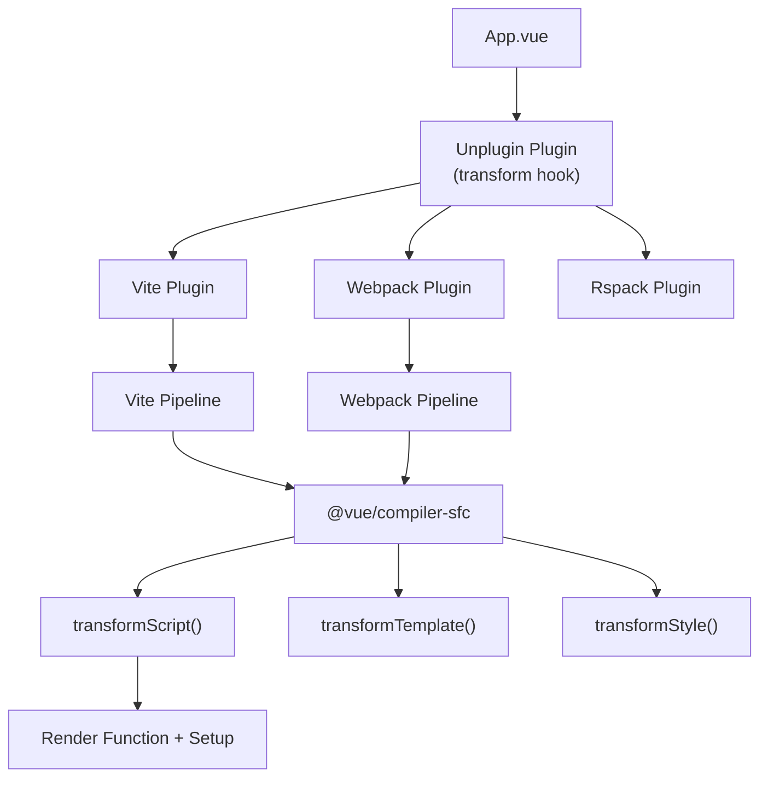

# Архитектура плагинов сборки и Unplugin

## 1. Концепция и Архитектура (Mental Model)
В экосистеме Vue компиляция Single File Components (SFC — `.vue` файлов) делегируется на уровень сборщика (Vite, Webpack, Rspack). Пакет `@vue/compiler-sfc` предоставляет AST-парсеры, а "плагин сборщика" интегрирует этот парсер в пайплайн (например, `@vitejs/plugin-vue`).
Исторически для каждого сборщика писался свой плагин. Для унификации экосистемы был создан **Unplugin** (от создателей Vue/Nuxt) — универсальный API для написания плагинов, который компилируется в нативные плагины для Vite, Rollup, Webpack, esbuild и Rspack из единой кодовой базы. 
Unplugin использует виртуальную файловую систему и хуки (transform, resolveId), абстрагируя специфичные AST-манипуляции сборщиков.

## 2. Визуализация (Mermaid)


## 3. Ссылки на исходный код (Source Code References)
- `packages/compiler-sfc/src/index.ts` (API компилятора SFC: `parse`, `compileScript`, `compileTemplate`)
- `vitejs/vite-plugin-vue/src/index.ts` (Реализация плагина Vite для Vue)
- `unjs/unplugin/src/index.ts` (Ядро абстракции Unplugin)

## 4. Разбор реализации (Code Deep Dive)
Сборка `.vue` файла проходит через мульти-запросную архитектуру. Плагин перехватывает `.vue` файл и генерирует виртуальные под-импорты (Virtual Modules) для скриптов, шаблонов и стилей.

```typescript
// Концепт работы vite-plugin-vue (на базе unplugin-подобных хуков)
export function vuePlugin(): Plugin {
  return {
    name: 'vite:vue',
    
    // Хук трансформации: вызывается сборщиком для каждого файла
    async transform(code: string, id: string) {
      if (!id.endsWith('.vue')) return null

      // 1. Парсинг SFC
      const { descriptor } = compiler.parse(code)
      
      // 2. Компиляция <script setup>
      const script = compiler.compileScript(descriptor, { id })
      
      // 3. Компиляция <template> в render функцию
      const template = compiler.compileTemplate({
        source: descriptor.template!.content,
        id,
        // ...
      })

      // 4. Сборка итогового JS модуля
      let output = script.content + '\n'
      output += template.code + '\n'
      output += `_sfc_main.render = render\n`
      output += `export default _sfc_main`

      // Возвращаем трансформированный код и Source Maps сборщику
      return {
        code: output,
        map: script.map // Важно для отладки
      }
    }
  }
}
```
Unplugin унифицирует этот интерфейс. Разработчик пишет объект с методами `transform` и `resolveId`, а Unplugin проксирует их в `apply: 'webpack'` (loader) или `transform` в Vite.

## 5. Оптимизации и Edge Cases (Подводные камни)
- **HMR (Hot Module Replacement):** Самая сложная часть плагина. При изменении `<template>`, плагин должен обновить только render-функцию, не перезапуская стейт компонента (`setup()`). `@vue/compiler-sfc` генерирует HMR-код, который привязывается к уникальному ID компонента (`data-v-hash`). Плагин инжектит код `import.meta.hot.accept` для обработки перерисовки.
- **Кэширование AST (Descriptor Cache):** Так как каждый блок (`<script>`, `<template>`, `<style>`) может обрабатываться сборщиком как отдельный виртуальный модуль (с добавлением query параметров `?vue&type=style`), плагин кэширует AST (`SFCDescriptor`) в памяти (через `Map`). Иначе парсинг одного файла происходил бы 3-4 раза.
- **CSS Scope (Scoped CSS):** Для реализации `<style scoped>`, компилятор SFC модифицирует AST шаблона, добавляя дата-атрибуты (`data-v-xxxx`) ко всем HTML-тегам. Плагин должен гарантировать, что этот же ID передается в `compileStyle`, чтобы PostCSS плагин добавил этот же атрибут в селекторы CSS.
