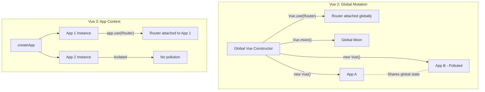

# Vue 2 Architecture Recap & Legacy

## 1. Концепция и Архитектура (Mental Model)
Архитектура Vue 2 строилась вокруг монолитного класса (или функции-конструктора) `Vue`. Приложения и компоненты инициализировались через `new Vue(options)`. Вся функциональность (директивы, миксины, плагины) регистрировалась глобально через мутацию самого конструктора `Vue`. 

Основная проблема такого подхода — отсутствие изоляции (в одном приложении нельзя было иметь две версии плагина) и плохая поддержка Tree-Shaking'а, так как все возможности фреймворка (рендеринг, реактивность, анимации) были жестко привязаны к глобальному объекту. Переход к Vue 3 обусловлен необходимостью отвязки API от глобального состояния (появление `createApp`) и разделения монолита на независимые пакеты (reactivity, runtime-core, compiler-core).

## 2. Визуализация (Mermaid)
Сравнение архитектуры глобального состояния Vue 2 и изолированных контекстов Vue 3.



## 3. Ссылки на исходный код (Source Code References)
- **Vue 2 (Global API):** `src/core/global-api/index.ts`
- **Vue 2 (Instance Init):** `src/core/instance/init.ts`
- **Vue 3 (App Context):** `packages/runtime-core/src/apiCreateApp.ts`

## 4. Разбор реализации (Code Deep Dive)

Во Vue 2 плагины и миксины мутировали сам класс `Vue`, добавляя свойства в `Vue.options`, которые затем мержились в каждый создаваемый компонент.

```typescript
// Vue 2 - src/core/global-api/mixin.ts (упрощенно)
export function initMixin(Vue: GlobalAPI) {
  Vue.mixin = function (mixin: Object) {
    // Мутация глобального объекта опций
    this.options = mergeOptions(this.options, mixin)
    return this
  }
}
```

Во Vue 3 используется концепция `AppContext`. При вызове `createApp` создается изолированный объект приложения со своим собственным `context`, который передается корню и всем дочерним компонентам.

```typescript
// Vue 3 - packages/runtime-core/src/apiCreateApp.ts (упрощенно)
export function createAppAPI(render: RootRenderFunction) {
  return function createApp(rootComponent, rootProps = null) {
    const context = createAppContext() // Изолированный контекст!
    const app: App = {
      _context: context,
      use(plugin: Plugin, ...options: any[]) {
        plugin.install(app, ...options)
        return app
      },
      mixin(mixin: ComponentOptions) {
        // Мутация только контекста КОНКРЕТНОГО приложения
        context.mixins.push(mixin)
        return app
      },
      mount(rootContainer) {
        const vnode = createVNode(rootComponent, rootProps)
        vnode.appContext = context // Проброс контекста в дерево
        render(vnode, rootContainer)
      }
    }
    return app
  }
}
```

## 5. Оптимизации и Edge Cases (Подводные камни)
- **Утечки памяти в микрофронтендах:** Мутация глобального `Vue` во Vue 2 делала крайне сложным использование Vue в микрофронтендах, где несколько микроприложений (возможно, требующих разные версии плагинов) делили один объект `window.Vue`. Vue 3 решает это полностью через `createApp`.
- **Global API Tree-Shaking:** Во Vue 2 методы вроде `Vue.nextTick`, `Vue.observable` нельзя было вырезать бандлером, так как они были свойствами объекта. Во Vue 3 это независимые экспорты `import { nextTick } from 'vue'`, что позволяет сборщикам (Rollup, Webpack) удалять неиспользуемый код.
- **Внутренний мердж опций (Option Merging):** Во Vue 2 `mergeOptions` был одной из самых ресурсоемких операций при инстанцировании компонента из-за необходимости слияния глобальных, локальных опций и миксинов. Во Vue 3 с `setup()` и Composition API этот этап фактически пропускается, так как логика инкапсулируется в функции, а не объектах конфигурации.
