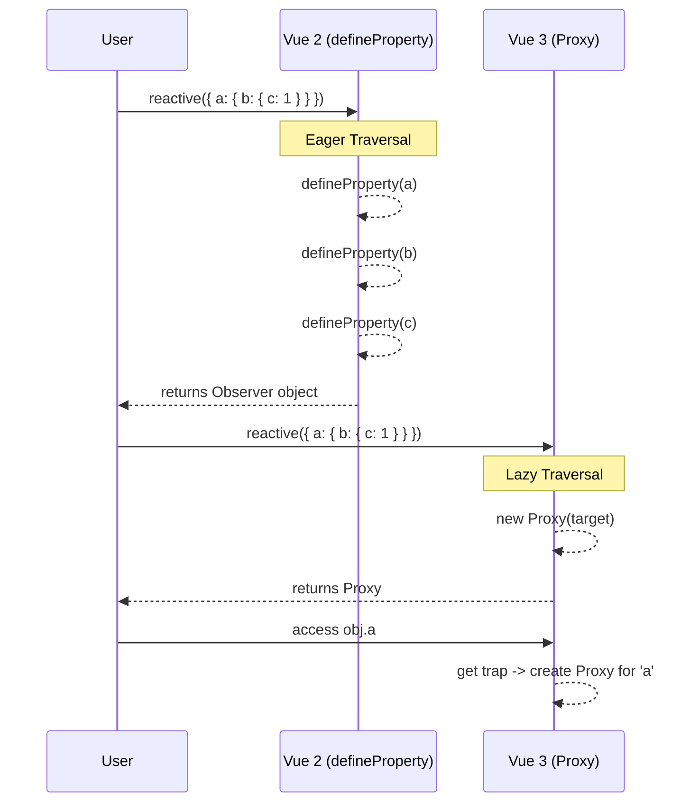

# Object.defineProperty vs Proxy (Смена парадигмы реактивности)

## 1. Концепция и Архитектура (Mental Model)
Главное изменение под капотом Vue 3 — переход системы реактивности с `Object.defineProperty` на `Proxy`. Во Vue 2 реактивность была **eager (жадной)** и **деструктивной**: при инициализации объекта фреймворк рекурсивно обходил все вложенные свойства и переопределял их через геттеры и сеттеры. Это не позволяло отслеживать добавление/удаление новых свойств и прямое изменение индексов массивов.

Vue 3 использует `Proxy`, что делает реактивность **lazy (ленивой)** и **прозрачной**. `Proxy` перехватывает операции на уровне самого объекта, а не его конкретных свойств. Вложенные объекты становятся реактивными только в момент обращения к ним, что радикально ускоряет первичный рендеринг глубоких структур данных.

## 2. Визуализация (Mermaid)
Сравнение времени инициализации (Eager vs Lazy).



## 3. Ссылки на исходный код (Source Code References)
- **Vue 2 (Observer):** `src/core/observer/index.ts`
- **Vue 3 (Reactive):** `packages/reactivity/src/reactive.ts`
- **Vue 3 (Base Handlers):** `packages/reactivity/src/baseHandlers.ts`

## 4. Разбор реализации (Code Deep Dive)

Во Vue 2 каждый ключ объекта переписывался, замыкая внутри себя экземпляр `Dep` (зависимость).

```typescript
// Vue 2 - src/core/observer/index.ts (Упрощенно)
export function defineReactive(obj: Object, key: string, val: any) {
  const dep = new Dep() // Замыкание для каждого ключа!
  
  // Рекурсивный обход ВЕСЬМА дорог для больших объектов (на старте)
  observe(val) 

  Object.defineProperty(obj, key, {
    get() {
      dep.depend() // Сбор зависимостей
      return val
    },
    set(newVal) {
      val = newVal
      dep.notify() // Триггер обновлений
    }
  })
}
```

Во Vue 3 `Proxy` перехватывает доступ. Если возвращаемое значение является объектом, оно заворачивается в прокси *на лету* (Lazy Reactivity).

```typescript
// Vue 3 - packages/reactivity/src/baseHandlers.ts (Упрощенно)
function createGetter(isReadonly = false, shallow = false) {
  return function get(target: Target, key: string | symbol, receiver: object) {
    const res = Reflect.get(target, key, receiver)

    // Сбор зависимостей через глобальный targetMap
    if (!isReadonly) {
      track(target, TrackOpTypes.GET, key)
    }

    if (shallow) return res

    // ЛЕНИВАЯ РЕАКТИВНОСТЬ: Рекурсия происходит только при ЧТЕНИИ свойства
    if (isObject(res)) {
      return isReadonly ? readonly(res) : reactive(res)
    }

    return res
  }
}
```

## 5. Оптимизации и Edge Cases (Подводные камни)
- **`proxyMap` (WeakMap Cache):** Чтобы не создавать новый `Proxy` при каждом обращении к `obj.a`, Vue 3 кэширует уже созданные прокси в глобальном `WeakMap` (`proxyMap`). `WeakMap` используется для избежания утечек памяти (GC может очистить исходный объект, если на него нет ссылок).
- **Массивы:** Во Vue 2 для массивов приходилось "патчить" методы (`push`, `pop`, `splice`), так как `defineProperty` не ловит изменение `length` или индексов. В Vue 3 `Proxy` нативно перехватывает изменения массивов. Однако для методов вроде `indexOf` или `includes` во Vue 3 добавлены специальные обертки, чтобы поиск работал корректно как с raw-объектами, так и с proxy.
- **Identity Hazard (`obj !== reactive(obj)`):** Прокси не равен исходному объекту по ссылке. Vue 3 решает это, всегда возвращая существующий прокси, если `reactive()` вызывают на уже реактивном объекте, а в геттерах проверяет специальный флаг `__v_raw` для доступа к оригинальному таргету.
