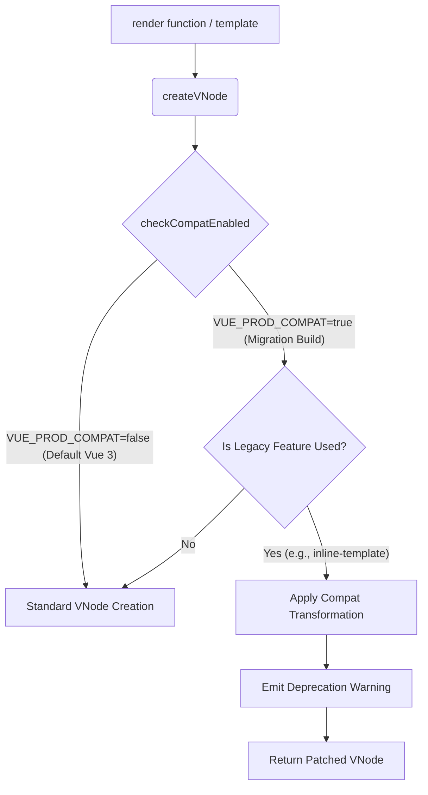

# Архитектура Migration Build (@vue/compat)

## 1. Концепция и Архитектура (Mental Model)
Migration Build (`@vue/compat`) — это специальная сборка Vue 3, в которую интегрированы прослойки (shims) и полифиллы для поведения Vue 2. Главная цель — позволить крупным кодовым базам постепенно мигрировать на Vue 3, обновляя компоненты один за другим, а не переписывая все приложение разом.

Механизм работает на основе системы флагов (`COMPAT_CONFIG`). На этапе выполнения фреймворк проверяет эти флаги при ключевых операциях (парсинг опций компонента, создание VNode, жизненный цикл) и, если включен режим совместимости для конкретной фичи (или глобально), перехватывает управление, эмулируя поведение Vue 2 и попутно выбрасывая предупреждения (Deprecation Warnings) в консоль.

## 2. Визуализация (Mermaid)
Диаграмма перехвата управления при создании VNode.



## 3. Ссылки на исходный код (Source Code References)
- **Runtime Compat Core:** `packages/runtime-core/src/compat/`
- **Compiler Compat:** `packages/compiler-core/src/compat/`
- **Флаги совместимости:** `packages/runtime-core/src/compat/compatConfig.ts`

## 4. Разбор реализации (Code Deep Dive)

В исходниках Vue 3 есть специальный макрос или константа `__COMPAT__`, которая на этапе сборки вырезается (Tree-Shaking) для обычной версии. В Migration Build она равна `true`.

```typescript
// packages/runtime-core/src/vnode.ts (Упрощенно)
export function createVNode(type, props = null, children = null) {
  // ... стандартная логика создания ...

  // Внедрение логики совместимости
  if (__COMPAT__) {
    // Вызов обработчиков для преобразования пропсов/эвентов Vue 2 -> Vue 3
    // Например, конвертация `.native` модификаторов или `.sync`
    convertLegacyVModelProps(vnode)
    convertLegacyDirectives(vnode)
  }

  return vnode
}
```

Проверка конфигурации выполняется через глобальный трекер:

```typescript
// packages/runtime-core/src/compat/compatConfig.ts
export function checkCompatEnabled(
  key: DeprecationTypes,
  instance: ComponentInternalInstance | null,
  emitWarning = true
): boolean {
  // Проверяем глобальный конфиг или конфиг конкретного компонента
  const config = instance?.type.compatConfig || globalCompatConfig
  const enabled = config[key] ?? true // По умолчанию включено в compat-билде
  
  if (enabled && emitWarning) {
    warnDeprecation(key, instance)
  }
  return enabled
}
```

## 5. Оптимизации и Edge Cases (Подводные камни)
- **Удаление из Production:** Migration Build значительно тяжелее обычного (включает весь компилятор для обработки legacy-шаблонов и тяжелые runtime-проверки). Он **не предназначен** для production. Флаг сборщика (например, в Vite/Webpack) `__VUE_PROD_COMPAT__` позволяет вырезать всю эту ветку логики для релизного билда.
- **Оверхед на Proxy:** В Vue 2 геттеры/сеттеры устанавливались на массивы, заменяя методы `push`, `splice` и т.д. В compat-билде Vue 3 делает специальную прокси-обертку поверх реактивных массивов, чтобы методы вроде `$set` и `$delete` (которые стали no-op во Vue 3) продолжали работать и не ломали старый код.
- **Деоптимизация компилятора:** Использование compat-режима отключает многие продвинутые оптимизации компилятора Vue 3 (Block Tree, Hoisting), так как поведение Vue 2 гораздо более динамичное (например, наличие фильтров требует другой структуры AST).
