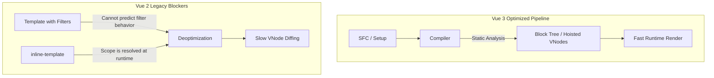

# Почему от некоторых фич Vue 2 отказались?

## 1. Концепция и Архитектура (Mental Model)
При переходе на Vue 3 часть популярного API Vue 2 (Фильтры, Event Bus `$on`/`$off`, `$children`, `inline-template`) была удалена. Это решение не было вопросом вкуса. В его основе лежат строгие архитектурные причины: **статическая типизация (TypeScript)**, **AOT (Ahead-of-Time) оптимизация компиляции** и **Tree-Shaking**. 

Сохранение этих фич ограничивало потолок производительности фреймворка и раздувало базовый размер бандла, заставляя всех пользователей платить за инструменты, которые нарушали паттерны предсказуемого потока данных.

## 2. Визуализация (Mermaid)
Влияние "inline-template" и фильтров на конвейер компиляции (Почему они ломали оптимизацию).



## 3. Ссылки на исходный код (Source Code References)
- **Удаленный Event Bus:** В Vue 3 базовый класс компонента очищен. См. `packages/runtime-core/src/componentPublicInstance.ts` (Там больше нет свойств `$on`).
- **Трансформация выражений:** `packages/compiler-core/src/transforms/transformExpression.ts` (Фильтры делали парсинг JS-выражений нестандартным).

## 4. Разбор реализации (Code Deep Dive)

### Фильтры (Filters: `{{ msg | uppercase }}`)
В Vue 2 парсер шаблонов содержал кастомный regex для поиска символа `|`, что усложняло парсинг. В Vue 3 шаблоны компилируются в стандартные JS-выражения (AST AST). 
Фильтры ломают **Type Inference**. В TypeScript невозможно адекватно типизировать пайплайн фильтров внутри строки шаблона.

```typescript
// То как Vue 2 видел это:
_s(_f("uppercase")(msg)) // _f резолвится в RUNTIME

// Как Vue 3 заставляет делать (Computed / Methods):
uppercase(msg) // Обычный JS вызов. TypeScript легко выводит типы! Компилятор может это анализировать.
```

### Event Bus (`$on`, `$off`, `$once`)
В Vue 2 класс компонента наследовался от `EventEmitter` (или реализовывал его паттерн). Это означало, что *каждый* инстанс компонента (даже если это простой `<span>`) нес в себе логику шины событий, увеличивая потребление памяти.
Удаление Event Bus позволило сделать `ComponentInternalInstance` гораздо легковеснее. Теперь для шины рекомендуется использовать внешние микробиблиотеки (например, `mitt`), которые не загрязняют ядро.

### Inline Templates
Позволяли передавать HTML внутрь компонента, который он использовал как свой шаблон. Это катастрофа для компилятора:
1. Шаблон должен компилироваться в **браузере** (Runtime Compiler), что требует поставки тяжелой сборки Vue.
2. Область видимости переменных (Lexical Scope) определялась динамически, ломая любые надежды на Tree-Shaking и статический анализ.

## 5. Оптимизации и Edge Cases (Подводные камни)
- **`$children`:** Доступ к дочерним компонентам через массив `$children` был крайне хрупким. Порядок элементов в массиве не гарантировался при асинхронном рендеринге или использовании `<Suspense>`. Во Vue 3 оставлен только паттерн Template Refs (`ref="child"`), который жестко связывает элемент с конкретной переменной, что безопасно для типизации и предсказуемо при рефафакторинге.
- **Micro-optimizations ядра:** Отказ от этих фич позволил команде Vue 3 реализовать **PatchFlags**. Если компилятор видит, что данные статические (нет динамических фильтров, неявных инлайн-скоупов), он помечает VNode битовым флагом (например, `PatchFlags.TEXT`), и движок рендеринга вообще не тратит время на Diffing атрибутов этого узла, обновляя только текстовый узел.
