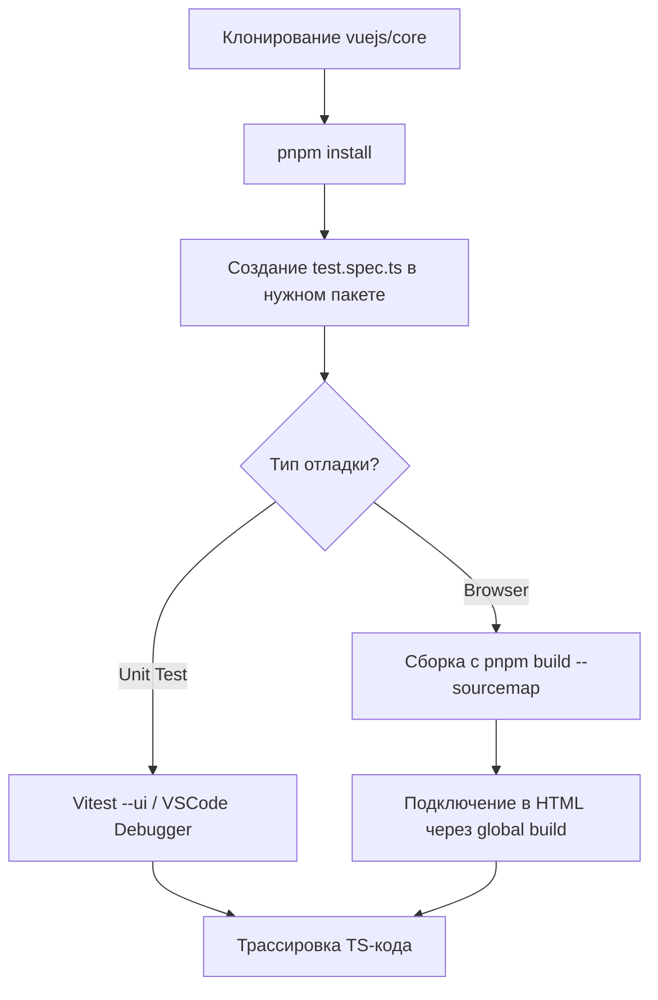

# Отладка Vue Core: Экосистема и Инструментарий

## 1. Концепция и Архитектура (Mental Model)
Отладка ядра Vue требует понимания архитектуры монорепозитория на базе pnpm и системы сборки на Rollup/esbuild. Ядро разделено на независимые пакеты (compiler, reactivity, runtime), каждый из которых имеет свои тесты на Vitest. Эффективная отладка строится на изоляции проблемы в минимальном тест-кейсе и запуске его в режиме отладки с source maps. Это позволяет прокинуть брейкпоинты прямо в `.ts` исходники, минуя бандлы.

## 2. Визуализация (Mermaid)


## 3. Ссылки на исходный код (Source Code References)
- Конфигурация тестов: `vitest.config.ts`
- Сборка бандлов: `scripts/build.js` / `rollup.config.js`
- Входные точки для браузера: `packages/vue/src/index.ts`

## 4. Разбор реализации (Code Deep Dive)
В `scripts/build.js` можно увидеть, как Vue генерирует различные форматы бандлов:
```typescript
// Упрощенный фрагмент scripts/build.js
const formats = {
  global: {
    file: `packages/vue/dist/vue.global.js`,
    format: 'iife'
  },
  esm: {
    file: `packages/vue/dist/vue.esm-bundler.js`,
    format: 'es'
  }
}
```
Для отладки в браузере мы собираем `global` билд с флагом sourcemap. Однако внутри команды мы предпочитаем писать изолированный тест в папке `packages/{module}/__tests__/` и использовать debugger:
```typescript
// packages/reactivity/__tests__/custom.spec.ts
import { ref, effect } from '../src'

test('debug reactivity', () => {
  const count = ref(0)
  effect(() => {
    debugger // <- Точка входа для IDE
    console.log(count.value)
  })
  count.value++
})
```

## 5. Оптимизации и Edge Cases (Подводные камни)
- **Макросы и __DEV__ флаги:** В исходниках часто встречается `if (__DEV__)`. При сборке для production этот код вырезается через Rollup replace plugin. Если вы дебажите prod-баг, убедитесь, что собираете билд с `PROD=true`, иначе поведение может отличаться.
- **Tree-shaking в ESM:** При отладке через `esm-bundler` бандлеры (Vite/Webpack) могут вырезать часть кода. Для чистой трассировки лучше использовать `cjs` тесты или чистый `global` скрипт в браузере.
