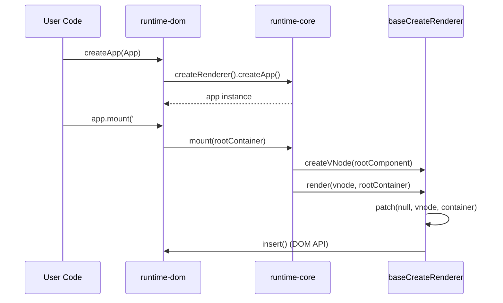

# Трассировка createApp().mount()

## 1. Концепция и Архитектура (Mental Model)
`createApp` — это фасад, скрывающий сложную инициализацию приложения. Процесс разделен на две фазы: создание контекста приложения (app context, где хранятся глобальные компоненты, директивы, плагины) и процесс монтирования (`mount`), который запускает создание VNode корневого компонента и его рендеринг через `render` функцию. Архитектура намеренно разделяет платформо-независимый код (`runtime-core`) и платформо-специфичный (`runtime-dom`), что позволяет использовать один и тот же паттерн для браузера, SSR или кастомных рендереров (например, для Canvas или мобильных платформ).

## 2. Визуализация (Mermaid)


## 3. Ссылки на исходный код (Source Code References)
- Фасад для браузера: `packages/runtime-dom/src/index.ts`
- Фабрика приложения: `packages/runtime-core/src/apiCreateApp.ts`
- Рендерер: `packages/runtime-core/src/renderer.ts`

## 4. Разбор реализации (Code Deep Dive)
Когда мы вызываем `createApp` в браузере, мы фактически обращаемся к обертке из `runtime-dom`:

```typescript
// packages/runtime-dom/src/index.ts
export const createApp = ((...args) => {
  // 1. Создаем платформо-зависимый рендерер, который делегирует вызов runtime-core
  const app = ensureRenderer().createApp(...args)
  
  const { mount } = app
  // 2. Переопределяем mount для работы с реальным DOM
  app.mount = (containerOrSelector: Element | ShadowRoot | string): any => {
    const container = normalizeContainer(containerOrSelector)
    if (!container) return
    
    const component = app._component
    // Очистка контейнера и вызов оригинального mount из runtime-core
    container.innerHTML = ''
    const proxy = mount(container, false, resolveRootNamespace(container))
    return proxy
  }
  return app
}) as CreateAppFunction<Element>
```

Внутри `runtime-core` функция `mount` создает VNode и запускает `render`:

```typescript
// packages/runtime-core/src/apiCreateApp.ts
mount(rootContainer: HostElement, isHydrate?: boolean) {
  if (!isMounted) {
    // 3. Создание корневой VNode
    const vnode = createVNode(rootComponent, rootProps)
    vnode.appContext = context

    // 4. Запуск рендерера
    if (isHydrate && hydrate) {
      hydrate(vnode as VNode<Node, Element>, rootContainer as any)
    } else {
      render(vnode, rootContainer, isSVG)
    }
    isMounted = true
  }
}
```

## 5. Оптимизации и Edge Cases (Подводные камни)
- **Ленивая инициализация рендерера (`ensureRenderer`):** В Vue 3 рендерер создается только при вызове `createApp` (или других API рендеринга). Это паттерн Singleton, который улучшает tree-shaking: если пользователь не импортирует платформо-зависимый код, объект рендерера с тяжелыми операциями DOM не попадет в бандл.
- **Подмена `mount`:** Метод `mount` патчится в `runtime-dom`. Архитектурный смысл в том, чтобы `runtime-core` ничего не знал о `document.querySelector` или `innerHTML`. Core оперирует только абстрактными контейнерами.
