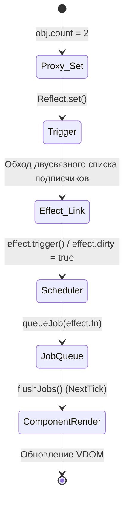

# Трассировка Reactivity Trigger

## 1. Концепция и Архитектура (Mental Model)
Реактивность Vue построена на паттерне Publisher-Subscriber с использованием `Proxy` для перехвата операций доступа (get) и изменения (set). Когда происходит `get` (чтение свойства в шаблоне или `computed`), текущий активный эффект (`ReactiveEffect`) подписывается на это свойство (track). Когда происходит `set` (изменение данных), система находит всех подписчиков этого свойства и уведомляет их (trigger). В Vue 3.4+ система реактивности была фундаментально переписана: вместо хранения связей в `Set` используются двусвязные списки (doubly-linked lists), что радикально снизило потребление памяти и нагрузку на Garbage Collector, а также ввело версионирование (versioning) для более умного инвалидирования эффектов.

## 2. Визуализация (Mermaid)


## 3. Ссылки на исходный код (Source Code References)
- Обработчики Proxy: `packages/reactivity/src/baseHandlers.ts`
- Ядро реактивности (track/trigger): `packages/reactivity/src/reactiveEffect.ts`
- Планировщик (Scheduler): `packages/runtime-core/src/scheduler.ts`

## 4. Разбор реализации (Code Deep Dive)
Перехватчик мутаций `set` триггерит обновление:
```typescript
// packages/reactivity/src/baseHandlers.ts
function createSetter(shallow = false) {
  return function set(target: object, key: string | symbol, value: unknown, receiver: object): boolean {
    const oldValue = (target as any)[key]
    const result = Reflect.set(target, key, value, receiver)
    
    // Если значение реально изменилось, запускаем trigger
    if (hasChanged(value, oldValue)) {
      trigger(target, TriggerOpTypes.SET, key, value, oldValue)
    }
    return result
  }
}
```

Внутри `trigger` происходит поиск подписчиков и их запуск. Начиная с Vue 3.4+, это делается через обход `Link` узлов графа зависимостей:
```typescript
// packages/reactivity/src/reactiveEffect.ts
export function trigger(target: object, type: TriggerOpTypes, key?: unknown, newValue?: unknown, oldValue?: unknown, oldTarget?: Map<unknown, unknown> | Set<unknown>) {
  const depsMap = targetMap.get(target)
  if (!depsMap) return // Никто не подписан
  
  let dep: Dep | undefined = depsMap.get(key)
  if (dep) {
    // В 3.4+ используется система версий и двусвязный список (dep.subs)
    dep.version++ // Увеличиваем версию для оптимизации computed
    triggerEffects(dep, type)
  }
}

export function triggerEffects(dep: Dep, debuggerEventExtraInfo?: DebuggerEventExtraInfo) {
  // Обход двусвязного списка эффектов, подписанных на эту зависимость
  for (let link = dep.subs; link; link = link.nextSub) {
    const effect = link.effect
    // Помечаем эффект как грязный и планируем его выполнение
    if (effect.scheduler) {
      effect.scheduler() // Для компонентов это вызовет queueJob()
    } else {
      effect.run()
    }
  }
}
```

## 5. Оптимизации и Edge Cases (Подводные камни)
- **Двусвязные списки вместо массивов/Set (Vue 3.4+):** Ранее каждая `Dep` содержала `Set` подписчиков. При частых перерисовках (например, `v-for`) создание и очистка множества `Set` перегружала GC. Использование выделенных узлов (`Link`), связывающих `Dep` и `Effect`, позволяет переиспользовать объекты памяти, избегая постоянных аллокаций.
- **Битовые маски (Bitwise operations):** Для отслеживания глубины вызовов эффектов и статуса трекинга (чтобы не зациклить `track` внутри `trigger`) используются битовые флаги (например, `trackOpBit = 1 << trackDepth`). Это дает O(1) проверку статуса без выделения массивов под стек.
- **Глобальная версия (Global Versioning):** Введено в 3.4+. Каждый раз, когда мутирует *любая* реактивная переменная, инкрементируется глобальный счетчик. При чтении `computed` мы просто сравниваем глобальную версию с сохраненной. Если они равны, даже не нужно обходить граф зависимостей — гарантированно ничего не изменилось.
