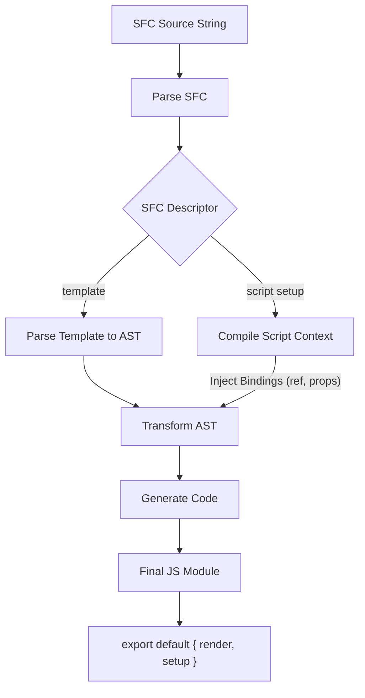

# Трассировка компиляции SFC в JS

## 1. Концепция и Архитектура (Mental Model)
Процесс компиляции Single File Components (SFC, `.vue` файлы) — это многоступенчатый пайплайн, превращающий декларативный синтаксис в оптимизированный JavaScript-код рендер-функции. Компилятор ядром Vue не исполняется в браузере (в production), а работает на этапе сборки (через Vite/Rollup-плагины). Он берет строку `.vue` файла, парсит её в AST (Abstract Syntax Tree), применяет трансформации (например, подъем статики (hoisting), генерацию блоков (block tree)) и генерирует JS-код. Ключевая концепция — агрессивная статическая аналитика (AOT оптимизации), которая позволяет "запечь" максимум информации в код, чтобы `runtime` делал минимум работы во время обновления VDOM.

## 2. Визуализация (Mermaid)


## 3. Ссылки на исходный код (Source Code References)
- SFC Парсер: `packages/compiler-sfc/src/parse.ts`
- Компиляция `script setup`: `packages/compiler-sfc/src/compileScript.ts`
- Компиляция шаблона (Core): `packages/compiler-core/src/compile.ts`
- Генерация кода: `packages/compiler-core/src/codegen.ts`

## 4. Разбор реализации (Code Deep Dive)
Когда сборщик (например, `vite-plugin-vue`) встречает файл `.vue`, он сначала вызывает `parse`:

```typescript
// packages/compiler-sfc/src/parse.ts
export function parse(source: string, options: SFCParseOptions = {}): SFCParseResult {
  const compiler = options.compiler || baseCompiler
  // Создание базового дескриптора (извлечение блоков <template>, <script>, <style>)
  const descriptor: SFCDescriptor = {
    source,
    filename: options.filename || 'anonymous.vue',
    template: null,
    script: null,
    scriptSetup: null,
    styles: [],
    customBlocks: []
  }
  // ... логика парсинга HTML-подобной структуры
  return { descriptor, errors: [] }
}
```
Затем компилируется `<script setup>`. Компилятор анализирует TS/JS код для определения привязок (bindings):
```typescript
// packages/compiler-sfc/src/compileScript.ts
export function compileScript(sfc: SFCDescriptor, options: SFCScriptCompileOptions): SFCScriptBlock {
  // Использование Babel (или SWC в новых экспериментах) для парсинга JS
  const scriptAst = babelParse(sfc.scriptSetup.content)
  const bindingMetadata = analyzeBindings(scriptAst) 
  // bindingMetadata знает, что `const count = ref(0)` — это реактивная переменная
  
  // Возвращается скомпилированный код, где макросы (defineProps) заменены на реальный JS
}
```
Наконец, шаблон компилируется в рендер-функцию, учитывая `bindingMetadata` для правильной генерации доступа (например, без `.value`):
```typescript
// packages/compiler-core/src/compile.ts
export function compile(template: string, options: CompilerOptions): CodegenResult {
  const ast = baseParse(template, options)
  // Трансформации: подъем статики, создание Block Tree, оптимизация слотов
  transform(ast, {
    ...options,
    nodeTransforms: [transformElement, transformText],
    // ...
  })
  // Генерация JS-строки
  return generate(ast, options)
}
```

## 5. Оптимизации и Edge Cases (Подводные камни)
- **Block Tree & PatchFlags:** Это главная инновация Vue 3. При трансформации AST компилятор помечает динамические узлы битовыми флагами (например, `PatchFlags.TEXT = 1`, `PatchFlags.CLASS = 2`). Статические узлы "поднимаются" (hoisted) из рендер-функции. Рендер-функция генерирует "Блок" (обычно корень шаблона или `v-if`/`v-for`), который содержит плоский массив (flattened array) только динамических узлов. При ре-рендере Vue обходит только этот плоский массив, полностью пропуская статичные части DOM (алгоритм O(динамических узлов) вместо O(всех узлов шаблона)).
- **Парсинг макросов `defineProps`:** В `script setup` `defineProps` не является реальной JS-функцией. Во время компиляции скрипта AST-парсер извлекает типы (TypeScript) из `defineProps<{ msg: string }>()` и преобразует их в объект `props` времени выполнения (`{ msg: { type: String, required: true } }`). Это сложный мост между миром типов TS и миром рантайма JS.
