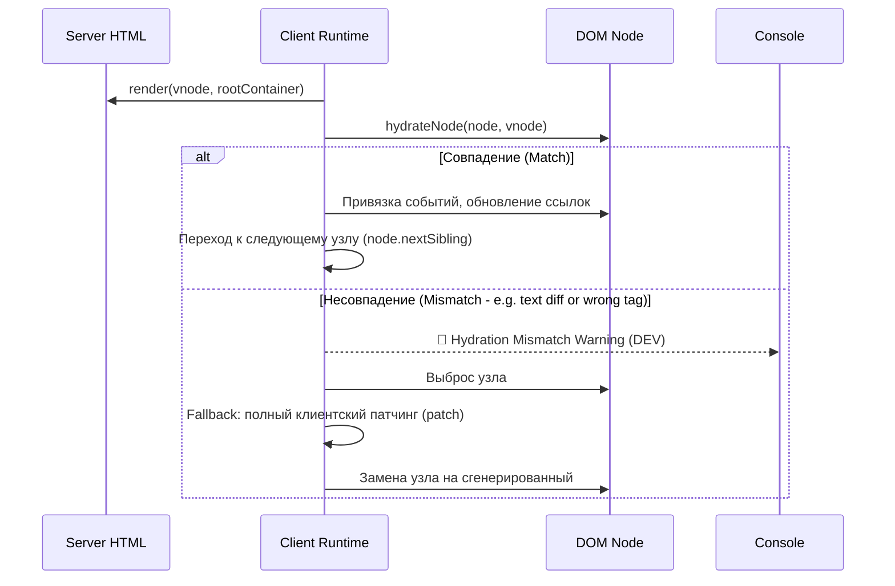

# Трассировка Hydration Mismatch

## 1. Концепция и Архитектура (Mental Model)
Hydration (гидратация) — это процесс, при котором клиентское Vue-приложение "оживляет" статичный HTML, пришедший от сервера (SSR). Вместо того чтобы уничтожать серверный DOM и рендерить его заново, Vue обходит существующий DOM и привязывает к нему event listeners, связывая DOM-узлы с реактивным контекстом (VNode).
Hydration Mismatch (несовпадение гидратации) происходит, когда структура VNode, сгенерированная на клиенте при первом рендеринге, не совпадает с реальной структурой DOM, пришедшей с сервера. Чтобы обеспечить консистентность, Vue должен уметь быстро детектировать такие несовпадения, логировать их (в dev-моде) и грациозно восстанавливаться (обычно путем полного перерендеринга проблемного участка).

## 2. Визуализация (Mermaid)


## 3. Ссылки на исходный код (Source Code References)
- Логика гидратации: `packages/runtime-core/src/hydration.ts`
- Обработка Mismatch: функции `hasMismatch`, `handleMismatch` внутри `hydration.ts`

## 4. Разбор реализации (Code Deep Dive)
Точка входа для гидратации находится в `runtime-core`. Она обходит VNode дерево и параллельно обходит реальный DOM.

```typescript
// packages/runtime-core/src/hydration.ts
function hydrateNode(node: Node, vnode: VNode, parentComponent: ComponentInternalInstance | null, ...): Node | null {
  const type = vnode.type
  // 1. Сравнение ожидаемого типа узла и реального HTML-тега
  if (type === Text) {
    if (node.nodeType !== 3 /* TEXT_NODE */) {
      // 2. Mismatch детектирован
      handleMismatch(node, vnode, ...)
      return null
    }
    // Если текст не совпадает, обновляем его, но продолжаем гидратацию
    if ((node as Text).data !== vnode.children) {
      warn(`Hydration text mismatch: ...`)
      ;(node as Text).data = vnode.children as string
    }
  } else if (vnode.shapeFlag & ShapeFlags.ELEMENT) {
    if (node.nodeType !== 1 /* ELEMENT_NODE */ || (node as Element).tagName.toLowerCase() !== (type as string).toLowerCase()) {
      handleMismatch(node, vnode, ...)
      return null
    }
    // 3. Рекурсивная гидратация детей
    hydrateChildren(node, vnode, parentComponent)
  }
  
  // Привязываем VNode к реальному DOM элементу
  vnode.el = node
  return node.nextSibling
}
```
Если возникает Mismatch, вызывается `handleMismatch`:
```typescript
function handleMismatch(node: Node, vnode: VNode, ...) {
  if (__DEV__) {
    warn(`Hydration node mismatch: ...`)
  }
  // Сигнализируем рендереру, что нужно выбросить эту ветку и отрендерить с нуля
  // Это fallback механизм
  vnode.shapeFlag |= ShapeFlags.HYDRATION_MISMATCH
}
```

## 5. Оптимизации и Edge Cases (Подводные камни)
- **Текстовые несовпадения (Text Mismatches):** Если не совпадает только текстовое содержимое (например, сервер отрендерил дату, а клиент сгенерировал её в другой таймзоне), Vue просто обновляет текст в DOM-узле (`node.data = newText`), не разрушая сам узел. Это важная оптимизация, сохраняющая структуру.
- **Комментарии как маркеры:** В SSR Vue генерирует специальные HTML-комментарии (например, `<!--[-->` и `<!--]-->`) для оборачивания фрагментов (`<template>`) или асинхронных компонентов. Гидрататор опирается на эти комментарии для правильного понимания границ узлов. Если минификатор HTML (на сервере или CDN) удалит эти комментарии, гидратация сломается полностью, вызвав массивный Mismatch.
- **Client-Only Fallback:** Для компонентов, которые гарантированно дадут Mismatch (например, зависящие от `window.innerWidth`), Vue предоставляет механизм `<ClientOnly>` (в Nuxt) или ручное монтирование через проверку `onMounted`, что исключает узел из SSR и откладывает его рендер на клиент.
