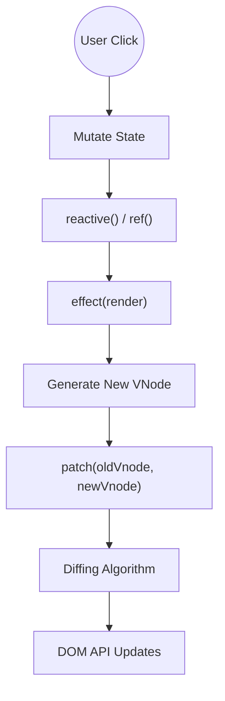

# Создание своего Mini Vue

## 1. Концепция и Архитектура (Mental Model)
Чтобы по-настоящему понять архитектуру фреймворка, лучший способ — написать его микро-версию (Mini Vue). Ядро современного Vue 3 базируется на трех независимых, но интегрируемых подсистемах:
1.  **Reactivity System:** Независимый пакет, предоставляющий примитивы наблюдения (`reactive`, `ref`, `effect`).
2.  **Virtual DOM & Runtime:** Подсистема рендеринга (`h`, `render`, `patch`), которая берет VNode и транслирует их в вызовы DOM API, используя алгоритмы diffing'а.
3.  **Compiler:** (Опционально для базового понимания, но важно для экосистемы) преобразует шаблоны в вызовы VDOM.

В архитектуре Mini Vue мы соединяем систему реактивности с Virtual DOM: функция `render` оборачивается в `effect`, благодаря чему любое изменение реактивного состояния автоматически вызывает процесс `patch` (diff + DOM update).

## 2. Визуализация (Mermaid)


## 3. Ссылки на исходный код (Source Code References)
- Эталонная структура: Репозиторий [vuejs/core](https://github.com/vuejs/core), в частности `packages/reactivity` и `packages/runtime-core/src/renderer.ts`.
- Учебный аналог: Репозиторий `mini-vue` от сообщества (упрощенная модель).

## 4. Разбор реализации (Code Deep Dive)
Сборка Mini Vue помещается в несколько десятков строк кода:

**Шаг 1: Микро-Реактивность**
```javascript
// Глобальная переменная для текущего эффекта
let activeEffect = null;

class Dep {
  constructor() { this.subscribers = new Set(); }
  depend() { if (activeEffect) this.subscribers.add(activeEffect); }
  notify() { this.subscribers.forEach(effect => effect()); }
}

function reactive(target) {
  const depsMap = new Map();
  return new Proxy(target, {
    get(obj, key) {
      if (!depsMap.has(key)) depsMap.set(key, new Dep());
      depsMap.get(key).depend(); // Сбор зависимостей
      return obj[key];
    },
    set(obj, key, value) {
      obj[key] = value;
      depsMap.get(key).notify(); // Вызов подписчиков
      return true;
    }
  });
}

function effect(fn) {
  activeEffect = fn;
  fn(); // Первый запуск: триггерит геттеры и собирает зависимости
  activeEffect = null;
}
```

**Шаг 2: VDOM и Монтирование**
```javascript
function h(tag, props, children) {
  return { tag, props, children }; // Упрощенный VNode
}

function mount(vnode, container) {
  const el = vnode.el = document.createElement(vnode.tag);
  // Обработка props и children... (пропущено для краткости)
  if (typeof vnode.children === 'string') el.textContent = vnode.children;
  container.appendChild(el);
}
```

**Шаг 3: Синхронизация (Сборка фреймворка)**
```javascript
function mountApp(component, container) {
  let isMounted = false;
  let oldVnode = null;

  // Главная магия: оборачиваем рендеринг в effect!
  effect(() => {
    if (!isMounted) {
      oldVnode = component.render();
      mount(oldVnode, container);
      isMounted = true;
    } else {
      const newVnode = component.render();
      patch(oldVnode, newVnode); // Запуск Diff алгоритма
      oldVnode = newVnode;
    }
  });
}

// Использование:
const state = reactive({ count: 0 });
const App = {
  render: () => h('div', null, `Count is: ${state.count}`)
};
mountApp(App, document.getElementById('app'));
```

## 5. Оптимизации и Edge Cases (Подводные камни)
- **Сложность алгоритма Patch:** В реальном Vue алгоритм diffing'а гораздо сложнее. Он обрабатывает перемещение узлов с ключами (keyed children) с использованием алгоритма поиска наибольшей возрастающей подпоследовательности (Longest Increasing Subsequence, LIS), что минимизирует количество операций вставки/удаления в DOM до O(n log n).
- **Пакетная обработка (Batching):** В нашем `effect` изменение переменной сразу вызывает перерисовку синхронно. В реальном ядре Vue используется `Scheduler`. Когда мы вызываем `dep.notify()`, эффекты помещаются в `JobQueue` (`Set`), и запускаются асинхронно через `Promise.resolve().then(flushJobs)`. Это гарантирует, что если вы измените 100 переменных подряд, DOM обновится только один раз (NextTick).
- **Разделение фаз:** Vue 3 позволяет использовать систему реактивности вообще без DOM (например, для state management) благодаря строгой модульности.
