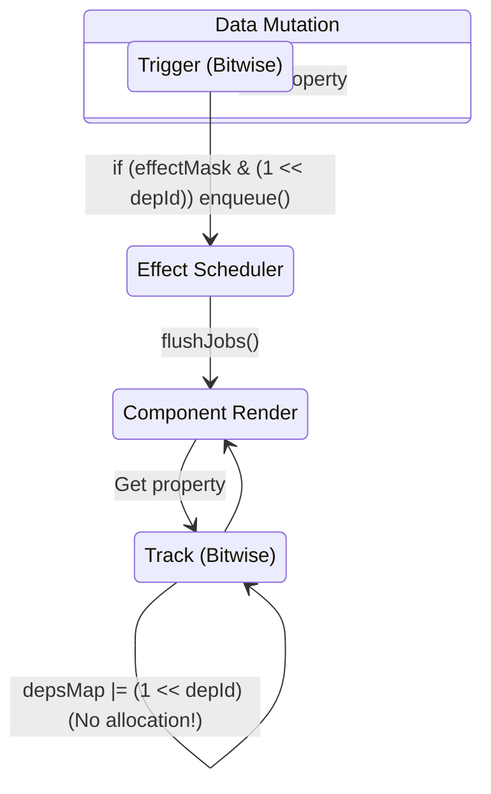

# Идеи и гипотезы (Research Ideas & Hypotheses)

## 1. Концепция и Архитектура (Mental Model)
При разработке ядра Vue часто возникает необходимость тестировать гипотезы по оптимизации. Одна из таких гипотез — **агрессивная батчинг-стратегия реактивных эффектов с помощью побитовых масок** (до внедрения в 3.4). Суть: вместо создания массивов зависимостей (Set/Array), мы можем кодировать графы зависимостей небольшой глубины (до 32) в одно число (Bitwise Track/Trigger). 

Проблема, которую это решает — аллокация памяти. Сборщик мусора (GC) тратит много времени на очистку `Set` при частых перерисовках (teardown эффектов). Использование чисел (Smi в V8) полностью убирает аллокацию для небольших компонентов.

## 2. Визуализация (Mermaid)


## 3. Ссылки на исходный код (Source Code References)
- `packages/reactivity/src/effect.ts` (Система битовых масок для отслеживания `trackOpBit`)
- `packages/reactivity/src/dep.ts` (Структуры `Dep`)

## 4. Разбор реализации (Code Deep Dive)
Упрощенная модель того, как мы тестируем побитовые операции для трекинга зависимостей:

```typescript
// Глобальный счетчик уровней вложенности эффектов (до 30 в V8)
let effectTrackDepth = 0;
let trackOpBit = 1;

export function track(target: object, type: TrackOpTypes, key: unknown) {
  if (activeEffect) {
    let depsMap = targetMap.get(target);
    if (!depsMap) {
      targetMap.set(target, (depsMap = new Map()));
    }
    let dep = depsMap.get(key);
    if (!dep) {
      depsMap.set(key, (dep = createDep()));
    }
    
    // БЫЛО: dep.add(activeEffect); activeEffect.deps.push(dep);
    // ГИПОТЕЗА (подобно Vue 3.4+):
    if (!(dep.w & trackOpBit)) {
      dep.w |= trackOpBit; // Помечаем зависимость как собранную в текущем цикле
      dep.n |= trackOpBit; // Новая зависимость (new)
    }
  }
}
```
**Комментарий**: Мы заменяем дорогие операции вставки в `Set` на `|=` (OR) и проверку на `&` (AND). Переменная `trackOpBit` сдвигается на `1 << ++effectTrackDepth` при вложенных эффектах.

## 5. Оптимизации и Edge Cases (Подводные камни)
- **Ограничение в 30 бит**: В JS побитовые операции работают с 32-битными целыми числами, причем 1 бит знаковый. V8 оптимизирует числа до 31 бита (Smi). Если глубина вложенности эффектов `> 30`, мы вынуждены фоллбечиться на классическую очистку через массивы/сеты.
- **Мономорфные структуры**: Инициализация `dep` как объекта `{ w: 0, n: 0 }` помогает V8 создать один Hidden Class. Добавление новых полей в рантайме убило бы эту оптимизацию (переход в Dictionary Mode).
