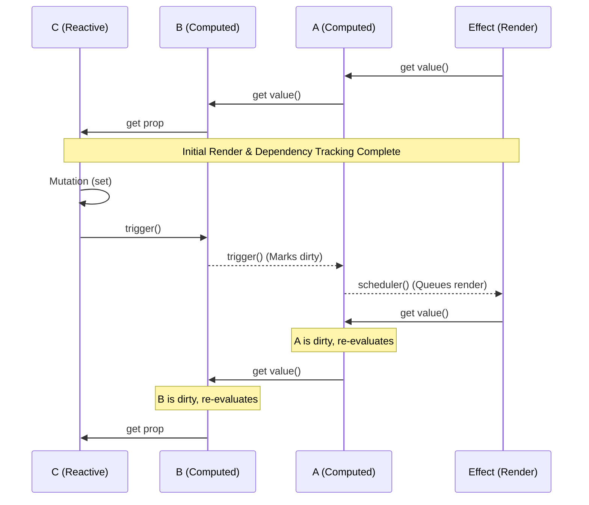

# Воспроизведение багов в ядре (Reproducing Core Bugs)

## 1. Концепция и Архитектура (Mental Model)
Когда мы дебажим ядро Vue, самые сложные баги обычно связаны с **Computed Properties** и **глобальным кэшем инвалидации**. `computed` во Vue ленивы (lazy): они не пересчитываются при изменении зависимости, а лишь помечаются как `dirty`. 

Проблема: каскадная инвалидация. Если `computed A` зависит от `computed B`, а `B` от реактивного объекта `C`, мутация `C` должна инвалидировать и `B`, и `A`. В старых версиях Vue (или при сложных ветвлениях) флаг `dirty` мог не дойти до `A` из-за того, что `B` не был прочитан (ленивость прерывала цепочку триггеров).

## 2. Визуализация (Mermaid)


## 3. Ссылки на исходный код (Source Code References)
- `packages/reactivity/src/computed.ts` (`ComputedRefImpl`)
- `packages/reactivity/src/effect.ts` (`triggerEffects`, `trackEffects`)

## 4. Разбор реализации (Code Deep Dive)
Как устроена стейт-машина в `ComputedRefImpl` для решения этой проблемы:

```typescript
export class ComputedRefImpl<T> {
  public dep?: Dep = undefined
  private _value!: T
  public readonly effect: ReactiveEffect<T>
  public _dirty = true

  constructor(getter: ComputedGetter<T>, setter: ComputedSetter<T>) {
    this.effect = new ReactiveEffect(
      getter,
      // SCHEDULER: Вызывается, когда зависимости меняются
      () => {
        if (!this._dirty) {
          this._dirty = true // Инвалидируем кэш
          // Каскадный триггер: сообщаем тем, кто зависит от НАС, что мы изменились
          if (this.dep) {
            triggerEffects(this.dep)
          }
        }
      }
    )
    this.effect.computed = this
  }

  get value() {
    // Собираем зависимости (если мы внутри другого эффекта)
    trackRefValue(this)
    if (this._dirty) {
      this._value = this.effect.run()!
      this._dirty = false
    }
    return this._value
  }
}
```
**Комментарий**: Ключевая часть фикса старых багов — наличие функции `scheduler` (второй аргумент `ReactiveEffect`). Когда реактивная зависимость (например, `C`) мутирует, она не вызывает `getter` напрямую, она вызывает `scheduler`. Он ставит `_dirty = true` и **сразу же** делает `triggerEffects(this.dep)`, проталкивая инвалидацию дальше по графу к `A`.

## 5. Оптимизации и Edge Cases (Подводные камни)
- **Топологическая сортировка (Topological Sort)**: В Vue 3.5+ введен механизм контроля версий (versioning) или двусвязные списки (doubly-linked lists) в `Subscriber` паттерне, чтобы избежать повторных вычислений (Glitch prevention). Если `B` и `C` изменяются в одном тике, а `A` зависит от обоих, `A` должен вычислиться только один раз.
- **Memory Leaks**: `effect` жестко привязан к `computed`. Если компонент размонтируется, `computed` должен перестать отслеживать зависимости. `ReactiveEffect` имеет флаг `active: boolean` и функцию `stop()`, которая отвязывает его от `dep` (вырезая себя из графа).
