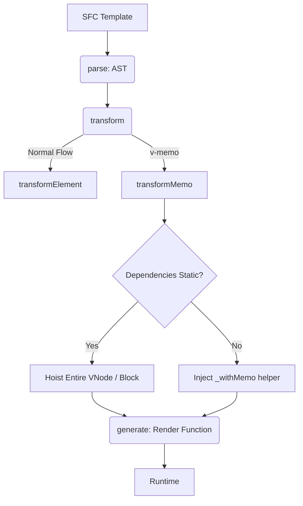

# Драфты PR (Pull Request Drafts)

## 1. Концепция и Архитектура (Mental Model)
Черновик PR: **Глубокая оптимизация директивы `v-memo` через Compiler Core.** 
`v-memo` мемоизирует VNode дерево, пропуская `patch`, если массив зависимостей не изменился. Однако в текущей реализации проверка зависимостей происходит в Runtime (`withMemo`). 

**Идея для PR**: В некоторых случаях (например, когда зависимости — это статические привязки или константы на уровне блока), компилятор может заранее анализировать `v-memo` и вообще удалять вызов `withMemo`, либо генерировать более агрессивные `Block` структуры (hoisting).

## 2. Визуализация (Mermaid)


## 3. Ссылки на исходный код (Source Code References)
- `packages/compiler-core/src/transforms/vMemo.ts`
- `packages/compiler-core/src/ast.ts`
- `packages/runtime-core/src/helpers/withMemo.ts`

## 4. Разбор реализации (Code Deep Dive)
Как мы модифицируем AST в процессе трансформации компилятора:

```typescript
export const transformMemo: NodeTransform = (node, context) => {
  if (node.type !== NodeTypes.ELEMENT) return

  const dir = findDir(node, 'memo')
  if (!dir || !dir.exp) return

  // Анализируем выражение: если это пустой массив [] или чистая статика
  if (isStaticExp(dir.exp)) {
    // PR IDEA: полностью поднимаем (Hoist) ноду, избегая проверок в рантайме
    node.codegenNode = context.hoist(node.codegenNode!)
    return
  }

  return () => {
    // Внедряем withMemo wrapper для генерации кода
    // _withMemo(dir.exp, () => _createBlock(...), _cache, _index)
    node.codegenNode = createCallExpression(context.helper(WITH_MEMO), [
      dir.exp,
      createFunctionExpression(undefined, node.codegenNode),
      `_cache`,
      String(context.cached++)
    ])
  }
}
```
**Комментарий**: Трансформеры во Vue работают как Middleware (сначала идут вниз по дереву, возвращая коллбеки (closures), которые затем вызываются при движении вверх). Это позволяет `transformMemo` обернуть уже сформированный дочерний `codegenNode`.

## 5. Оптимизации и Edge Cases (Подводные камни)
- **v-for + v-memo**: Самый сложный edge-case. Когда `v-memo` используется внутри `v-for`, кэш должен быть массивом (по одному на итерацию), а ключи VNode должны строго совпадать. Мы передаем индекс `_index` в хелпер `_withMemo`.
- **Slot Functions**: Если внутри `v-memo` передаются слоты (slots) в дочерний компонент, функция слота не может быть полностью закеширована, так как дочерний компонент может иметь свой контекст. В таком случае компилятор должен выбросить bailout-флаг, отключающий оптимизацию.
