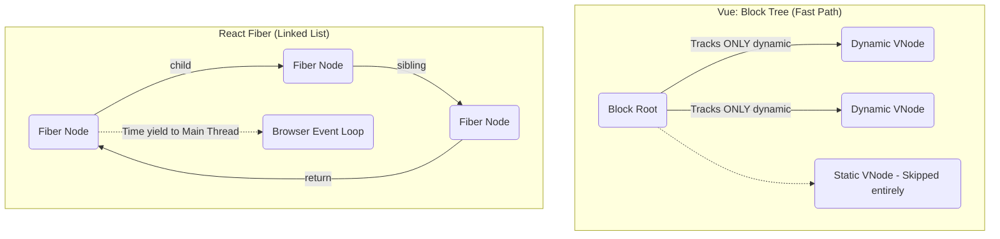

# Vue Virtual DOM vs React Fiber

## 1. Концепция и Архитектура (Mental Model)
Фундаментальное отличие рендереров: **Vue делает ставку на оптимизированный VDOM (Compiler-Informed Virtual DOM) с Block Trees, а React — на прерываемый (interruptible) Time-Slicing через Fiber-архитектуру.**

Vue исходит из гипотезы, что если сам VDOM работает молниеносно, прерывать его не нужно. Компилятор Vue анализирует шаблоны и выделяет динамические части в плоские массивы (`dynamicChildren`). В React нет компилятора шаблонов (по умолчанию, JSX), поэтому он должен рекурсивно обходить полное дерево, что дорого. Для защиты от блокировки Main Thread React превратил дерево в связный список (Fiber), который можно поставить на паузу (yield).

## 2. Визуализация (Mermaid)


## 3. Ссылки на исходный код (Source Code References)
- Vue: `packages/runtime-core/src/vnode.ts` (Block Trees: `openBlock`, `createBlock`)
- Vue: `packages/runtime-core/src/renderer.ts` (Синхронный `patch`)
- React (для сравнения): `react-reconciler/src/ReactFiberWorkLoop.js`

## 4. Разбор реализации (Code Deep Dive)
Во Vue `patch` (reconciliation) линеен для динамических узлов:

```typescript
// Vue Runtime (упрощенно)
function patchBlockChildren(
  oldChildren: VNode[],
  newChildren: VNode[],
  fallbackContainer: Element
) {
  // Vue обходит ТОЛЬКО те узлы, которые реально могут измениться!
  for (let i = 0; i < newChildren.length; i++) {
    const oldVNode = oldChildren[i]
    const newVNode = newChildren[i]
    // Синхронный, но невероятно быстрый patch, так как O(D) где D - динамические узлы
    patch(
      oldVNode,
      newVNode,
      newVNode.hostElement || fallbackContainer,
      null // anchor
    )
  }
}
```
**Комментарий**: В отличие от React, где `performUnitOfWork` возвращает следующий Fiber и проверяет `shouldYieldToRenderer()`, Vue вызывает `patch` синхронно в цикле `for`. У Vue нет Fiber-ов. VNode — это простой объект.

## 5. Оптимизации и Edge Cases (Подводные камни)
- **PatchFlags**: Vue компилятор помечает каждый динамический узел битовым флагом (например, `TEXT = 1`, `CLASS = 2`). Рантайму не нужно сравнивать все пропсы, он смотрит `if (patchFlag & 1) updateText()`. React сравнивает `oldProps` и `newProps` поверхностно целиком.
- **Trade-off**: Vue проигрывает React в сценариях с огромными списками, которые *все* динамические (нет статики) и рендерятся одновременно, так как синхронный цикл заблокирует UI. Но для этого во Vue есть виртуализация (Virtual Scroller), а в React Fiber пытается (не всегда удачно) сгладить этот спайк.
