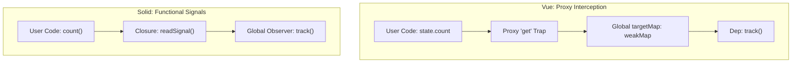

# Vue Reactivity (Proxies) vs Solid Signals

## 1. Концепция и Архитектура (Mental Model)
И Vue, и Solid используют **Fine-Grained Reactivity** на основе графов зависимостей (Signals/Observables). Разница кроется в API и механизме перехвата (Interception).
- **Vue**: Использует `Proxy`. Это позволяет сохранять привычный синтаксис мутации объектов (`state.count++`). Трекинг происходит "магически" на уровне движка JS (геттеры/сеттеры прокси).
- **Solid**: Использует явные геттеры-кложуры (closures) `count()` и сеттеры `setCount()`. Нет `Proxy` (кроме store), реактивность привязана к вызову функции.

## 2. Визуализация (Mermaid)


## 3. Ссылки на исходный код (Source Code References)
- Vue: `packages/reactivity/src/reactive.ts` (Proxy Handlers: `mutableHandlers`)
- Vue: `packages/reactivity/src/ref.ts` (Имплементация, похожая на Signals)
- Solid: `solid/src/reactive/signal.ts` (`createSignal`, `readSignal`)

## 4. Разбор реализации (Code Deep Dive)
Как отличается трекинг (упрощенно):

**Vue (Proxy based):**
```typescript
const mutableHandlers: ProxyHandler<object> = {
  get(target: object, key: string | symbol, receiver: object) {
    const res = Reflect.get(target, key, receiver)
    track(target, TrackOpTypes.GET, key) // <- Глобальный словарь targetMap
    // Ленивое проксирование глубоких объектов
    return isObject(res) ? reactive(res) : res
  },
  set(target, key, value, receiver) {
    const result = Reflect.set(target, key, value, receiver)
    trigger(target, TriggerOpTypes.SET, key, value)
    return result
  }
}
```

**Solid (Closure based):**
```typescript
function createSignal(value) {
  const s = { value, observers: null };
  const read = () => {
    const listener = Listener; // Текущий контекст эффекта
    if (listener) registerGraph(listener, s);
    return s.value;
  };
  const write = (nextValue) => {
    s.value = nextValue;
    notifyObservers(s);
  };
  return [read, write];
}
```

## 5. Оптимизации и Edge Cases (Подводные камни)
- **Деструктуризация**: Во Vue деструктуризация реактивного объекта `const { count } = state` ломает реактивность, так как извлекается примитив, и связь с `Proxy` теряется. Приходится использовать `toRefs()`. В Solid `createSignal` изначально возвращает кортеж (tuple) функций, деструктуризация безопасна.
- **Overhead**: `Proxy` в V8 работает медленнее, чем вызов обычной функции (Solid). Также Vue требуется аллокация `WeakMap` (`targetMap`) для связи оригинального объекта с его `Dep`. Solid хранит подписчиков прямо в замыкании (closure) сигнала, экономя память и время доступа.
- **Унификация во Vue**: Чтобы эмулировать сигналы (особенно для примитивов), Vue использует `ref()`, который под капотом использует не `Proxy`, а обычные get/set аксессоры в классе `RefImpl`. Это делает `ref` архитектурно почти идентичным `createSignal` из Solid.
