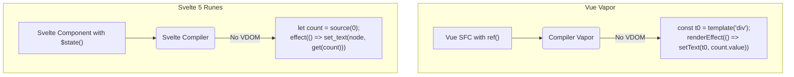

# Vue Vapor Mode vs Svelte 5 Runes

## 1. Концепция и Архитектура (Mental Model)
В 2024 году индустрия движется к полному отказу от Virtual DOM (VDOM overhead). И **Vue Vapor Mode**, и **Svelte 5 Runes** решают эту задачу, компилируя реактивные переменные напрямую в точечные обновления DOM (Fine-Grained DOM Updates).
- **Svelte 5 Runes**: Отказ от магического переназначения `let count` в пользу явных сигналов `$state()`. Компилятор превращает `$state` во внутренние геттеры/сеттеры, которые напрямую биндятся к DOM узлам.
- **Vue Vapor Mode**: Альтернативная стратегия компиляции для Vue SFC. Тот же `Composition API` (`ref`, `reactive`), но вместо функции `render`, возвращающей VNode, компилятор генерирует императивный JavaScript для создания DOM элементов и установки точечных `effect`, которые обновляют конкретные `text-nodes` или `attributes`.

## 2. Визуализация (Mermaid)


## 3. Ссылки на исходный код (Source Code References)
- Vue Vapor: `packages/compiler-vapor/src/generate.ts`
- Vue Vapor: `packages/runtime-vapor/src/dom/template.ts`

## 4. Разбор реализации (Code Deep Dive)
Как выглядит сгенерированный код:

**Исходный Vue SFC (Vapor):**
```html
<script setup>
import { ref } from 'vue'
const count = ref(0)
</script>

<template>
  <button @click="count++">{{ count }}</button>
</template>
```

**Скомпилированный Vue Vapor Output:**
```javascript
import { template, on, delegateEvents, renderEffect, setText } from 'vue/vapor';

// 1. Статический шаблон поднимается (hoisted) в виде HTML-строки
const t0 = template(`<button></button>`);

export default function render(_ctx) {
  // 2. Клонирование шаблона (очень быстро через cloneNode(true))
  const n0 = t0();
  
  // 3. Делегирование событий (вместо addEventListener на каждый узел)
  on(n0, 'click', () => _ctx.count++);
  delegateEvents('click');
  
  // 4. Точечный эффект, который обновит ТОЛЬКО текст в кнопке (без VDOM diffing)
  renderEffect(() => {
    setText(n0, _ctx.count);
  });
  
  return n0;
}
```

## 5. Оптимизации и Edge Cases (Подводные камни)
- **Использование `template()`**: Vue Vapor создает `HTMLTemplateElement` под капотом и использует `node.cloneNode(true)`. В браузерах клонирование DOM-дерева через C++ биндинги значительно быстрее, чем `document.createElement` в цикле.
- **Svelte vs Vue DX**: В Svelte 5 Runes (`$state()`) компилятор берет на себя распаковку `.value`, делая код более "чистым" визуально, но скрывая магию компилятора. Vue намеренно оставляет `.value` у `ref` явным, чтобы семантика JavaScript оставалась предсказуемой (мы передаем объект по ссылке, а не примитив). Vapor Mode не меняет семантику JS, он меняет только рендерер.
