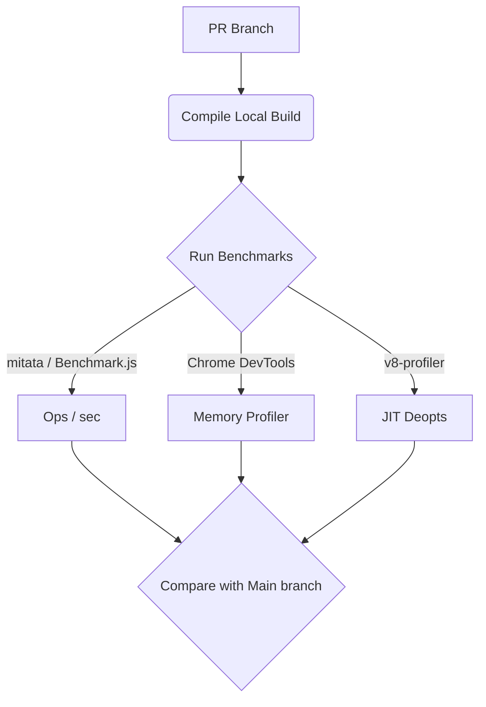

# Бенчмарки ядра (Benchmarking Vue Internals)

## 1. Концепция и Архитектура (Mental Model)
При контрибьютинге в ядро Vue (особенно в `reactivity` или `runtime-core`) любой PR, затрагивающий горячие пути (hot paths), должен сопровождаться микро-бенчмарками. 
Основная цель — не только измерить **ops/sec** (операции в секунду), но и отследить **Memory Allocations** (аллокации памяти) и **GC Pauses** (сборщик мусора). В V8 (движке Chrome/Node.js) даже небольшое изменение формы объекта (Hidden Classes) может привести к деоптимизации мономорфного кэша и просадке производительности.

## 2. Визуализация (Mermaid)


## 3. Ссылки на исходный код (Source Code References)
- `packages/reactivity/__tests__` (Юнит тесты с замером времени)
- `scripts/build.js` (Сборка с флагом `__DEV__ = false`)

## 4. Разбор реализации (Code Deep Dive)
Как мы пишем микро-бенчмарк для проверки скорости отслеживания зависимостей (track/trigger):

```typescript
// Используем библиотеку mitata (или аналог) для точных замеров в Node.js
import { run, bench, group } from 'mitata';
import { ref, effect } from '../packages/reactivity/src/index';

group('Reactivity: Ref Update', () => {
  bench('Update 1 Ref with 1 Effect', () => {
    // ВАЖНО: Мы изолируем только то, что хотим измерить.
    const counter = ref(0);
    let dummy;
    
    // Настраиваем эффект (не входит в цикл замеров)
    effect(() => {
      dummy = counter.value;
    });

    // Запускаем цикл мутаций
    return () => {
      counter.value++;
    };
  });
});

run();
```

## 5. Оптимизации и Edge Cases (Подводные камни)
- **Dead Code Elimination (DCE)**: Если V8 поймет, что результат вычислений (`dummy`) нигде не используется, JIT-компилятор (TurboFan) может полностью вырезать (утилизировать) ваш код. Бенчмарк покажет бесконечную скорость. Мы должны "экспортировать" или использовать `dummy`.
- **Megamorphic IC (Inline Caching)**: Если тестировать функцию `patch` на VNode разных типов (например, чередуя текст и компоненты), V8 перейдет в Megamorphic режим. Тесты нужно разделять: "Patch Element", "Patch Component", "Patch Text".
- **Среда `__DEV__`**: Бенчмарки **строго запрещено** запускать на dev-сборках. `__DEV__` флаг во Vue включает массивные проверки типов, warning-логи и сбор стектрейсов, что замедляет код в 10-20 раз. Перед тестированием необходимо делать production-билд: `pnpm build vue -f global-runtime`.
