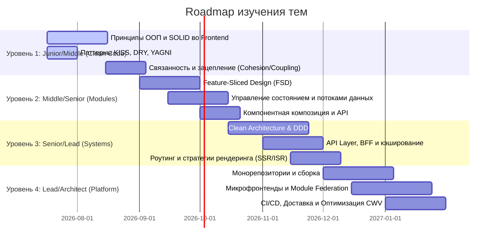

# Дорожная карта (Roadmap) изучения Frontend-архитектуры

Этот Roadmap разбит на уровни сложности и предназначен для системного развития разработчика от Middle до Architect / Lead Engineer.

---

## 🚦 Детализация этапов

### Этап 1: Чистый код и дизайн компонентов (Junior ➔ Middle)
* **Цель:** Научиться писать изолированные функции и переиспользуемые UI-компоненты.
* **Что изучать:**
  * SOLID применительно к React/Vue/TS.
  * Паттерны DRY, KISS, YAGNI, AHA.
  * Правильное разделение компонентов: Smart/Dumb, Controlled/Uncontrolled, Presentational/Container.
  * Паттерны композиции: Compound Components, Headless Components.
* **Практика:** Рефакторинг крупного «спагетти»-компонента на мелкие с использованием кастомных хуков.

### Этап 2: Проектирование приложений и стейт-менеджмент (Middle ➔ Senior)
* **Цель:** Понимать, как группировать код, управлять сложной бизнес-логикой и сетевыми данными.
* **Что изучать:**
  * Feature-Sliced Design (FSD) и его правила импортов.
  * Модель распределения стейта: Local vs Global vs Server State vs URL State.
  * Применение паттернов CQRS и Event-Driven на клиенте.
  * Изоляция сетевого слоя: HttpClient, Axios interceptors, валидация контрактов с бэкендом (Zod).
* **Практика:** Перевод проекта со стандартной структуры `components/pages` на FSD. Внедрение TanStack Query для серверного стейта и React Hook Form для валидации форм.

### Этап 3: Архитектурные стили и оптимизация (Senior ➔ Lead)
* **Цель:** Строить высокопроизводительные приложения с глубоким разделением слоев, выбирать правильный рендеринг.
* **Что изучать:**
  * Чистая архитектура (Ports and Adapters, Domain/Infra/UI слои).
  * Domain Driven Design во фронтенде (Bounded Context, Entities, Value Objects).
  * Стратегии доставки UI: SSR, CSR, SSG, Island Architecture, Hydration vs Resumability.
  * Оптимизация Critical Rendering Path, JavaScript Cost, Tree Shaking и Code Splitting.
* **Практика:** Создание MVP на Next.js/Astro с гибридными стратегиями рендеринга и профилирование Core Web Vitals (LCP, FID/INP, CLS).

### Этап 4: Платформа и масштаб (Lead ➔ Architect)
* **Цель:** Управлять разработкой в командах 50+ человек, разделять релизные циклы, настраивать инфраструктуру.
* **Что изучать:**
  * Инструменты монорепозиториев (Nx, Turborepo) и кэширование сборок.
  * Микрофронтенды: Module Federation, iframe, Web Components, проблемы шаринга зависимостей.
  * Безопасность фронтенда: XSS, CSRF, CSP, CORS, Trusted Types.
  * Процессы документирования архитектуры (ADR, RFC, C4 Model).
* **Практика:** Настройка монорепозитория pnpm/Nx с независимым деплоем приложений и общей библиотекой дизайн-системы, документирование архитектурных изменений через ADR.
