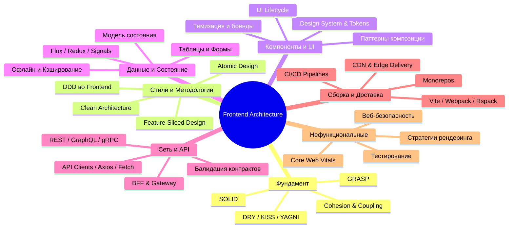

# Карта знаний (Frontend Architecture Mind Map)

Эта карта знаний визуализирует взаимосвязи между различными областями проектирования фронтенд-приложений. Каждая область раскрывается в соответствующих главах нашей базы знаний.

---

## 🔗 Интерактивные переходы по карте

1. **Фундаментальные основы:**
   * Как писать чистый код и разделять ответственность: см. `01. Фундаментальные принципы/`.
   * Шаблоны структурирования кода в JS/TS: см. `01. Фундаментальные принципы/Принципы проектирования/Паттерны проектирования в JS.md`.
2. **Как разложить папки и файлы:**
   * Если проект масштабируется под FSD: см. `04. Методологии организации Frontend-кода/Feature Sliced Design/`.
   * Если проект имеет глубокую бизнес-логику: см. `02. Архитектурные стили и подходы/Domain Driven Design/`.
3. **Где хранить стейт:**
   * Выбор стейт-менеджера и классификация состояний: см. `07. Данные, состояние и бизнес-логика/`.
4. **Как повысить скорость работы приложения:**
   * Работа с бандлом и рендерингом: см. `12. Производительность/`.
   * Стратегии кэширования: см. `09. Кэширование и офлайн-архитектура/`.
5. **Как обеспечить качество и безопасность:**
   * Покрытие тестами: см. `17. Тестирование и качество/`.
   * Защита от уязвимостей: см. `16. Безопасность и надежность/`.
