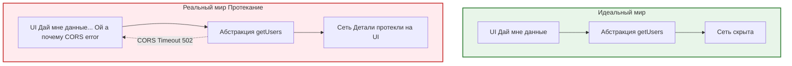

В программировании абстракции создаются для того, чтобы скрыть сложность. Мы используем `fetch`, не задумываясь о том, как формируются TCP-пакеты. Мы пишем `<button>`, не думая о том, как браузер рендерит пиксели. Закон протекающих абстракций, сформулированный Джоэлом Спольски, гласит: **«Все нетривиальные абстракции в какой-то мере протекают»**. 

## 1. Какую боль мы решаем абстракциями (и почему они протекают)?
Мы строим абстракции, чтобы разработчики могли сфокусироваться на бизнес-логике, не закапываясь в детали инфраструктуры. 

Но абстракция "протекает", когда детали реализации нижнего уровня, которые мы пытались скрыть, внезапно "прорываются" наверх, заставляя программиста разбираться в том, как всё устроено под капотом, чтобы починить баг или обойти ограничение.



## 2. Примеры во Frontend

### Пример 1: ORM и утечка SQL
Вы используете мощную ORM на Node.js (или GraphQL на фронтенде), которая скрывает работу с базой данных.
Вы пишите: `users.filter(u => u.age > 18).map(u => u.name)`.
Вроде бы чистая работа с массивами. Но внезапно этот запрос выполняется 10 секунд. Оказывается, ORM стянула в память 10 миллионов записей и фильтрует их на сервере (или клиенте), потому что вы забыли вызвать `.query()`. Абстракция протекла: вам пришлось лезть в документацию ORM и понимать, как она транслирует JS-код в SQL-запросы (N+1 problem).

### Пример 2: UI-компоненты и стилизация
Вы берете библиотеку компонентов (Material UI, Ant Design). Абстракция `<Button />` обещает, что вы просто передаете пропсы `variant="primary"` и всё работает.
**Антипаттерн (Протечка):**
Дизайнер просит сделать кнопку с градиентом, который выходит за границы. Вы понимаете, что пропсами это не решить. Приходится использовать `!important`, искать специфичные внутренние классы вроде `.MuiButton-root-123` и переопределять их. Внутренняя структура DOM компонента протекла наружу. Ваше приложение теперь зависит от того, что внутри `<Button />` есть определенный `div` с определенным классом.

```tsx
// ❌ Протекающая абстракция: завязка на внутренние классы чужой библиотеки
import styled from 'styled-components';
import { Button } from 'external-ui-lib';

const CustomButton = styled(Button)`
  /* Мы знаем, что внутри либы есть span с классом .inner-text */
  .inner-text {
     background: linear-gradient(...);
  }
`;
```

## 3. Скрытые трейдоффы и как с этим жить

1. **Иллюзия "черного ящика":** Невозможно создать абсолютно герметичную абстракцию. Если вы используете React, вы должны понимать, как работает Virtual DOM и Reconciliation, иначе вы столкнетесь с утечками абстракции в виде просадок производительности (лишние ререндеры) и не будете знать, почему это происходит.
2. **"Дрянные" абстракции (Leaky by design):** Если ваша обертка над Axios всё равно заставляет прокидывать заголовки запроса из UI-компонента, это не абстракция, это лишний слой кода. Абстракция должна скрывать детали. Если она этого не делает, лучше использовать оригинальный инструмент напрямую.
3. **Закон сохранения сложности:** При создании "Идеального UI-компонента", который поддерживает 100500 юзкейсов (пропсы `size`, `color`, `isLoading`, `iconLeft`, `iconRight`), вы усложняете сам компонент до такой степени, что его исходный код становится нечитаемым. Вы просто перенесли сложность из места использования в само ядро абстракции.
4. **Когда протекание — это нормально:** Если инструмент предлагает "аварийный люк" (escape hatch) — это признак хорошего дизайна. Например, React предоставляет `ref`, позволяя получить прямой доступ к DOM, когда абстракция Virtual DOM не справляется (фокус, анимации). Это контролируемая протечка, которая лучше, чем наглухо закрытая система.
