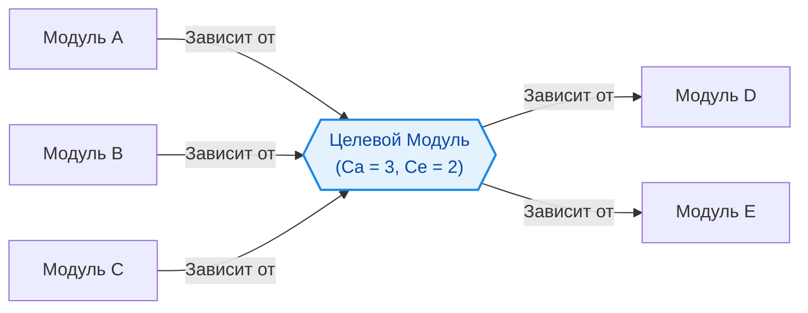

В процессе эволюции кодовой базы зависимости между модулями неизбежно растут. Если не контролировать этот процесс, проект превращается в запутанный клубок (Big Ball of Mud), где изменение одной функции ломает половину приложения. 

**Afferent Coupling (Ca)** и **Efferent Coupling (Ce)** — это две метрики связности, которые помогают оценить, насколько сложно будет изменить или переиспользовать конкретный модуль.

## 1. Суть концепции

*   **Afferent Coupling (Ca) — Входящая связность:** Количество внешних модулей, которые зависят от *нашего* модуля. "Кто зависит от меня?". Чем выше Ca, тем сложнее изменить этот модуль, так как это повлияет на множество других частей системы. 
*   **Efferent Coupling (Ce) — Исходящая связность:** Количество внешних модулей, от которых зависит *наш* модуль. "От кого завишу я?". Чем выше Ce, тем более хрупким является модуль, так как изменение любой из его зависимостей может сломать его работу.

### Диаграмма связей



*   **Идеальный базовый модуль (например, UI-кит или utils):** Высокий Ca, низкий Ce. Его все используют, но он сам ни от чего не зависит.
*   **Идеальный высокоуровневый модуль (например, страница или виджет):** Низкий Ca, высокий Ce. Он объединяет в себе множество зависимостей для реализации фичи, но сам никем не переиспользуется.

## 2. Как это работает на практике

Представим компонент профиля пользователя.

### Антипаттерн: Высокий Ce (Исходящая связность)
Компонент знает обо всем: о роутинге, о глобальном сторе, об API, о форматировании дат.

```tsx
import { useStore } from '@/store/user';
import { api } from '@/api/client';
import { useRouter } from 'next/router';
import { formatDate } from '@/utils/date';
import { Button, Avatar } from '@/ui-kit';

// Ce = 5. Компонент крайне хрупок. Изменение в api, store или роутинге сломает его.
export function UserProfile() {
  const { user } = useStore();
  const router = useRouter();
  
  const handleLogout = async () => {
    await api.logout();
    router.push('/login');
  };

  return (
    <div>
      <Avatar src={user.avatar} />
      <p>{formatDate(user.createdAt)}</p>
      <Button onClick={handleLogout}>Выйти</Button>
    </div>
  );
}
```

### Решение: Снижение Ce через инверсию зависимостей (DIP) или композицию
Мы выносим зависимости на уровень выше, делая компонент "глупее" и независимее.

```tsx
import { Button, Avatar } from '@/ui-kit';

interface UserProfileProps {
  user: { avatar: string; createdAt: string };
  onLogout: () => void;
  formatDate: (date: string) => string;
}

// Ce = 1 (только UI-kit). Компонент теперь изолирован и легко тестируется.
export function UserProfile({ user, onLogout, formatDate }: UserProfileProps) {
  return (
    <div>
      <Avatar src={user.avatar} />
      <p>{formatDate(user.createdAt)}</p>
      <Button onClick={onLogout}>Выйти</Button>
    </div>
  );
}
```

## 3. Неочевидные нюансы и трейдоффы

*   **Зависимость стабильности от связности:** Модули с высоким Ca (от которых все зависят) должны быть максимально стабильными. Если вы часто меняете утилиту форматирования дат (`utils/date.ts`), у вас будут "кровоточить" баги по всему проекту.
*   **Оверхед абстракций:** Если фанатично снижать Ce для каждого компонента, вы получите сотни "глупых" (dumb) компонентов, и вся бизнес-логика скопится в огромных, нечитаемых "умных" (smart) компонентах-контейнерах. 
*   **Границы применимости:** Снижать Ce имеет смысл для переиспользуемых модулей и доменных сущностей. Для корневых компонентов (Page, App) высокий Ce абсолютно нормален и неизбежен, так как их задача — оркестрировать всю систему.
