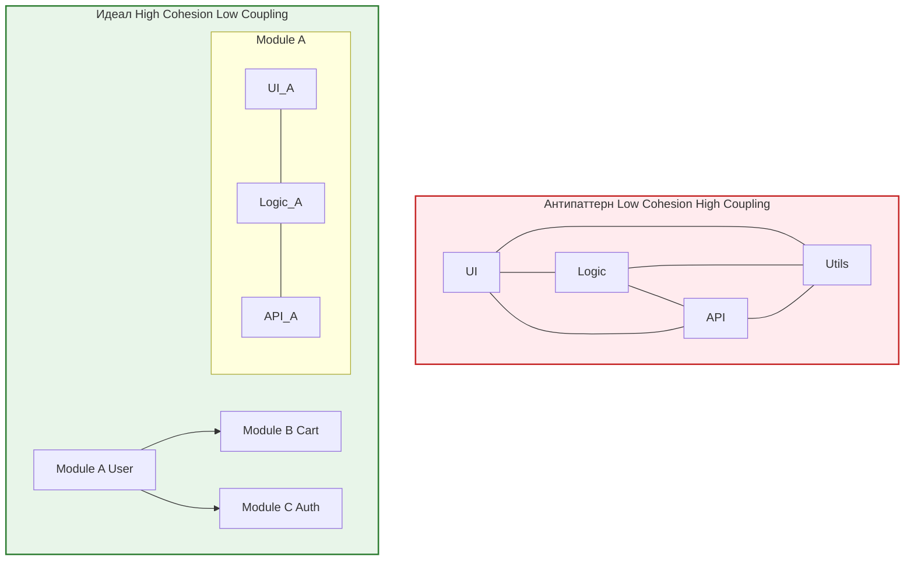

Зацепление (Coupling) и Связность (Cohesion) — это два важнейших критерия, по которым мы оцениваем качество архитектуры любого приложения. В идеальном мире мы стремимся к **Low Coupling** (слабому зацеплению) и **High Cohesion** (высокой связности). 

Но что это значит на практике? Представьте себе команду поваров на кухне. Если каждый повар знает рецепты других и постоянно заимствует чужие ножи (High Coupling), кухня превратится в хаос при первой же запаре. С другой стороны, если у каждого повара есть своя зона ответственности и все нужные ингредиенты под рукой (High Cohesion), работа будет идти гладко.

## 1. Какую боль мы решаем?
* **Эффект домино:** Изменение в одном компоненте (например, изменение формата даты) ломает половину приложения. Это признак сильного Coupling.
* **Размытие ответственности:** Чтобы понять, как работает корзина пользователя, вам нужно прочитать код в `utils/`, `store/`, `components/` и `hooks/`. Это признак слабого Cohesion.
* **Невозможность переиспользования:** Вы хотите взять компонент из старого проекта в новый, но он тянет за собой половину старого приложения.

## 2. Разбираем понятия

* **Cohesion (Связность)** — это то, насколько элементы внутри одного модуля (класса, компонента, папки) сфокусированы на одной задаче. Высокая связность означает, что вещи, которые изменяются вместе и логически связаны, лежат вместе.
* **Coupling (Зацепление)** — это то, насколько один модуль зависит от другого. Слабое зацепление означает, что модуль можно легко вырвать из контекста и использовать в другом месте, и он ничего не знает о внутреннем устройстве соседей.



## 3. Практический пример во Frontend

### Антипаттерн (Low Cohesion, High Coupling)
Представим, что мы группируем файлы по их типу (типичная структура).
* `components/Cart.tsx`
* `store/cartStore.ts`
* `api/cartApi.ts`

В этом случае **Cohesion низкий**. Чтобы изменить фичу "Корзина", вам нужно прыгать по трем разным папкам. Компонент `Cart.tsx` напрямую импортирует `cartApi.ts` и `cartStore.ts`, образуя **High Coupling** с конкретной реализацией хранилища и сети.

```tsx
// ❌ Плохо: Высокое зацепление (Coupling). Компонент знает слишком много.
import { updateCart } from '../api/cartApi';
import { useCartStore } from '../store/cartStore';

export const Cart = () => {
  const { items, setCart } = useCartStore();

  const handleUpdate = async () => {
    // Компонент сам занимается бизнес-логикой и вызовом API
    const newCart = await updateCart(items);
    setCart(newCart);
  };
  
  return <div onClick={handleUpdate}>Cart Items: {items.length}</div>;
};
```

### Правильный подход (Feature-Sliced Design / High Cohesion, Low Coupling)
Группируем код по фичам. Все, что касается корзины, лежит в одной папке `features/cart/`.

```tsx
// ✅ Хорошо: High Cohesion (все в одном месте) и Low Coupling (инкапсуляция)
// features/cart/ui/Cart.tsx
import { useCartLogic } from '../model/useCartLogic';

export const Cart = () => {
  // Компонент ничего не знает про API или Redux/Zustand. 
  // Он делегирует это хуку.
  const { items, handleUpdate } = useCartLogic();
  
  return <div onClick={handleUpdate}>Cart Items: {items.length}</div>;
};
```

## 4. Скрытые трейдоффы и границы применимости

Хотя "High Cohesion, Low Coupling" звучит как мантра, на практике есть нюансы:

1. **Иллюзия нулевого Coupling:** Невозможно создать полезную систему без связей. Полное отсутствие Coupling означает, что ваши модули не общаются друг с другом. Наша цель — **управляемое** зацепление (через интерфейсы, контракты), а не его полное отсутствие.
2. **Ложный Cohesion:** Иногда разработчики пытаются запихнуть в один "модуль" всё, что отдаленно похоже по смыслу. Например, `UserModule`, который отвечает и за авторизацию, и за профиль, и за историю покупок. Это приводит к раздуванию модуля (God Object). Связность должна быть функциональной, а не номинальной.
3. **Оверхед на абстракции:** Чтобы снизить Coupling, нам приходится вводить интерфейсы (Ports and Adapters), мапперы или фасады. Если проект маленький (лендинг или MVP), этот оверхед съест всё время разработки. В таких случаях допустимо временно повысить Coupling ради скорости доставки.
4. **Data Coupling vs Control Coupling:** Если модуль передает другому данные `renderCart(cartData)` — это нормальное зацепление (Data Coupling). Но если модуль передает другому флаги управления `renderCart(cartData, true, false)` — это Control Coupling, который ломает инкапсуляцию, так как вызывающий код должен знать, как внутренне работает `renderCart`.
