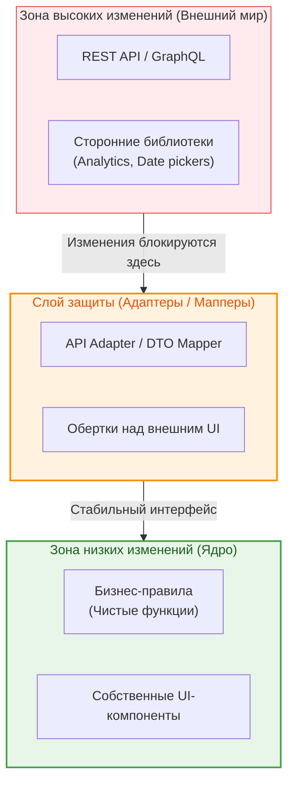

Бизнес-требования никогда не бывают финальными. То, что сегодня кажется законченной фичей, завтра потребует интеграции с новой системой аналитики, смены API-провайдера или редизайна UI. **Design for Change (Проектирование с учетом изменений)** — это майндсет, при котором система строится так, чтобы локализовать последствия будущих изменений, минимизировав каскадный рефакторинг.

## 1. Суть концепции и какую боль решаем

Боль фронтенд-разработки: изменение формата ответа от бэкенда заставляет переписывать десятки UI-компонентов, а переход с Redux на Zustand парализует продуктовую разработку на месяц.

**Design for Change** опирается на принцип: "То, что меняется вместе, должно находиться вместе; то, что меняется по разным причинам, должно быть разделено" (см. Separation of Concerns и SRP). Главная цель — сделать код таким, чтобы добавление новой функциональности достигалось написанием нового кода, а не модификацией старого (Open-Closed Principle).

### Анатомия изоляции изменений



## 2. Как это работает на практике

Самый частый вектор изменений — это формат данных от API. 

### Антипаттерн: Размывание контракта API по UI
Если API возвращает `user.first_name`, и мы используем это напрямую в компонентах, изменение поля на `firstName` сломает весь интерфейс.

```tsx
// API вернул: { first_name: "Иван", status_code: 1 }
function Header({ userData }) {
  // Компонент напрямую зависит от контракта API
  return <h1>Привет, {userData.first_name}!</h1>;
}
```

### Решение: Антикоррупционный слой (Anti-corruption layer)
Мы маппим данные на границе системы (например, в инфраструктурном слое или при получении ответа).

```typescript
// Стабильная доменная модель (не меняется, если бэкенд перепишут)
interface User {
  firstName: string;
  isActive: boolean;
}

// Адаптер: берет на себя удар при изменениях API
function mapUserDtoToDomain(apiData: any): User {
  return {
    firstName: apiData.first_name || apiData.firstName || 'Гость',
    isActive: apiData.status_code === 1
  };
}

// Компонент теперь защищен
function Header({ user }: { user: User }) {
  return <h1>Привет, {user.firstName}!</h1>;
}
```

## 3. Неочевидные нюансы и трейдоффы

*   **Преждевременная генерализация:** Самый большой риск Design for Change — это попытка угадать, *как именно* изменятся требования. Создание интерфейсов для "возможной смены базы данных", которая никогда не произойдет, только раздует кодовую базу (см. YAGNI).
*   **Правило трех гвоздей (Rule of Three):** Не создавайте абстракцию, пока не столкнетесь с дублированием проблемы трижды. Первая реализация — пишем прямолинейно. Вторая — замечаем паттерн, но оставляем как есть. Третья — рефакторим и выносим абстрацию, защищающую от изменений.
*   **Инкапсуляция сторонних библиотек:** Если вы используете тяжелую библиотеку (например, `moment.js` или `chart.js`), заверните ее в свой адаптер (например, `<MyChart data={...} />`). Когда потребуется сменить библиотеку на более легкую, вы перепишете только один файл, а не сотни импортов по всему проекту.
