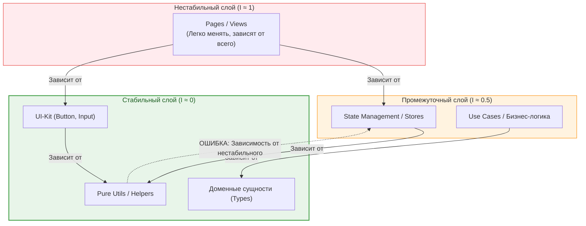

В инженерии программного обеспечения нестабильность — это не характеристика плохого кода, а математическая вероятность того, что модуль придется изменять из-за внешних факторов. Метрика **Instability (I)** тесно связана с [Afferent и Efferent Coupling](Afferent%20и%20Efferent%20Coupling.md) и позволяет объективно оценить архитектурный баланс проекта.

## 1. Суть концепции

Метрика вычисляется по формуле:
**`I = Ce / (Ca + Ce)`**

*   `Ca` (Afferent Coupling) — сколько модулей зависят от нас.
*   `Ce` (Efferent Coupling) — от скольких модулей зависим мы.

Значение `I` лежит в диапазоне от `0` до `1`:
*   **I = 0 (Максимально стабильный):** Модуль ни от чего не зависит (`Ce = 0`), но от него зависят многие (`Ca > 0`). Изменить его невероятно сложно, потому что это сломает всех его потребителей.
*   **I = 1 (Максимально нестабильный):** Модуль зависит от многих вещей (`Ce > 0`), но от него никто не зависит (`Ca = 0`). Его легко изменить, удалить или переписать, и это ни на кого не повлияет.

### Главное правило (Stable Dependencies Principle)
**Модули должны зависеть от модулей, которые более стабильны, чем они сами.** Зависимости должны всегда указывать в сторону уменьшения `I`.



## 2. Как это работает на практике

Большинство архитектурных катастроф во фронтенде случается, когда базовые, переиспользуемые вещи (которые должны быть `I = 0`) начинают импортировать бизнес-логику или компоненты верхнего уровня.

### Антипаттерн: Инверсия стабильности
Утилита форматирования (стабильный модуль) начинает импортировать глобальный стор (менее стабильный модуль), чтобы получить текущую локаль пользователя.

```typescript
// utils/format.ts (Ожидаем I = 0, но делаем I = 0.5)
import { useUserStore } from '@/store/user'; // Нарушение! Зависимость от стора.

export function formatCurrency(amount: number): string {
  const { locale } = useUserStore.getState(); // Утилита перестала быть чистой
  return new Intl.NumberFormat(locale, { style: 'currency', currency: 'USD' }).format(amount);
}
```
*Результат:* Теперь вы не можете протестировать `formatCurrency` или вынести ее в npm-пакет без подтягивания всего стейт-менеджера.

### Решение: Передача нестабильных данных как аргументов (DIP)

```typescript
// utils/format.ts (I = 0, чистая функция)
export function formatCurrency(amount: number, locale: string): string {
  return new Intl.NumberFormat(locale, { style: 'currency', currency: 'USD' }).format(amount);
}

// UI-компонент (I = 1) собирает всё вместе
function PriceDisplay({ price }) {
  const { locale } = useUserStore();
  return <span>{formatCurrency(price, locale)}</span>;
}
```

## 3. Неочевидные нюансы и границы применимости

*   **Нестабильность — это не плохо.** Конечные продуктовые фичи *должны* быть нестабильными (`I = 1`). Вы должны иметь возможность удалить страницу "Новогодняя акция" одним коммитом, не задумываясь о том, что это сломает корзину.
*   **Опасность "Zone of Pain" (Зона боли):** Это модули с `I = 0` (от них все зависят), но при этом они часто меняются бизнес-требованиями. Пример: гигантский монолитный `globalStyles.css` или `utils/index.ts`, куда скидывают всё подряд. Они причиняют боль при каждой попытке их изменить.
*   **Опасность "Zone of Uselessness" (Зона бесполезности):** Это модули, которые написаны максимально абстрактно и независимо (I = 0), но при этом их никто не использует (Ca = 0). Это чистый оверинжиниринг.
