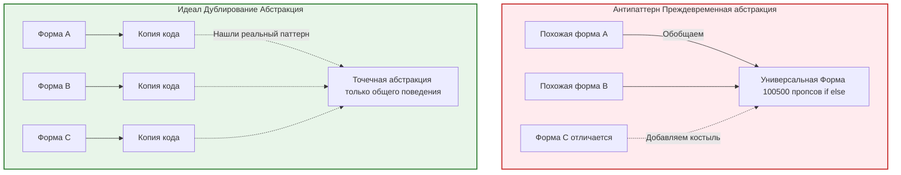

**Преждевременная абстракция (Premature Abstraction)** — это ситуация, когда разработчик обобщает код до того, как появится реальная необходимость в этом обобщении. В попытках сделать код "чистым", "гибким" и "готовым к будущему", создаются сложные интерфейсы, базовые классы и фабрики для задач, которые можно было бы решить парой простых функций.

Сэнди Метц (Sandi Metz) отлично сформулировала это правило: *"Дублирование кода гораздо дешевле, чем неправильная абстракция" (Duplication is far cheaper than the wrong abstraction).*

## 1. Какую боль мы пытаемся решить (и какую создаем)?

Разработчики боятся дублирования кода (DRY). Как только они видят два похожих куска кода, возникает непреодолимое желание вынести их в общую функцию. 

**Создаваемая боль:** Если вы создали абстракцию слишком рано, основываясь на неполных данных, будущие изменения бизнес-требований заставят эту абстракцию страдать. Вы начнете добавлять в неё `if/else`, передавать флаги-костыли, и со временем ваш "универсальный" компонент превратится в неподдерживаемого монстра (Франкенштейна).



## 2. Примеры во Frontend

### Антипаттерн: Универсальный компонент

Вам нужно сделать список пользователей и список товаров. Они похожи (картинка, заголовок, подзаголовок). Вы решаете создать `<UniversalCardList />`.

```tsx
// ❌ Плохо: Преждевременная абстракция (God Component)
export const UniversalCardList = ({ 
  data, 
  type, 
  showImage, 
  onItemClick, 
  isAdmin 
}) => {
  return (
    <ul>
      {data.map(item => (
        <li key={item.id} onClick={() => onItemClick(item)}>
          {/* Начинается ад из if/else */}
          {showImage && type === 'user' && <Avatar src={item.avatar} />}
          {showImage && type === 'product' && <ProductImg src={item.image} />}
          
          <h3>{type === 'user' ? item.name : item.title}</h3>
          
          {/* Специфичная бизнес-логика пролезла в "универсальный" компонент */}
          {type === 'user' && isAdmin && <BanButton id={item.id} />}
        </li>
      ))}
    </ul>
  );
};
```
С каждым новым типом списка количество пропсов и `if`-ов будет расти. Компонент стал хрупким.

### Правильный подход: WET (Write Everything Twice) и AHA (Avoid Hasty Abstractions)

Лучше написать два разных компонента. Пусть в них будет дублирование разметки `<ul><li>`.

```tsx
// ✅ Хорошо: Дублирование (пока не появится реальный паттерн)
export const UserList = ({ users, isAdmin }) => (
  <ul>
    {users.map(u => (
      <li key={u.id}>
        <Avatar src={u.avatar} />
        <h3>{u.name}</h3>
        {isAdmin && <BanButton id={u.id} />}
      </li>
    ))}
  </ul>
);

export const ProductList = ({ products }) => (
  <ul>
    {products.map(p => (
      <li key={p.id}>
        <ProductImg src={p.image} />
        <h3>{p.title}</h3>
      </li>
    ))}
  </ul>
);
```
Когда вы напишете третий и четвертый список, вы, возможно, увидите, что общим является не *весь компонент*, а только обертка или layout. Тогда вы создадите `ListLayout`, оставив рендеринг айтемов наруже (через `children` или `renderProps`).

## 3. Скрытые трейдоффы и границы применимости

1. **Правило трех (Rule of Three):** Не создавайте абстракцию, пока не столкнетесь с дублированием как минимум трижды. Два раза — это совпадение, три раза — это паттерн.
2. **Абстракция — это инвестиция.** Любая абстракция требует времени на проектирование, написание тестов, документирование и обучение других разработчиков. Если вероятность повторного использования низкая, инвестиция не окупится.
3. **Затраты на "распутывание" (De-abstraction):** Избавиться от плохой абстракции, от которой уже зависят 50 модулей в проекте, в десятки раз дороже, чем зарефакторить три скопированных куска кода в одну функцию. Если сомневаетесь — дублируйте.
4. **Случайное сходство vs Сущностное сходство:** Если два куска кода выглядят одинаково *сейчас*, это не значит, что они решают одну и ту же задачу. Если они меняются по разным бизнес-причинам в будущем (разные векторы изменений), объединять их — фатальная ошибка. Это нарушит принцип единственной ответственности (SRP).
