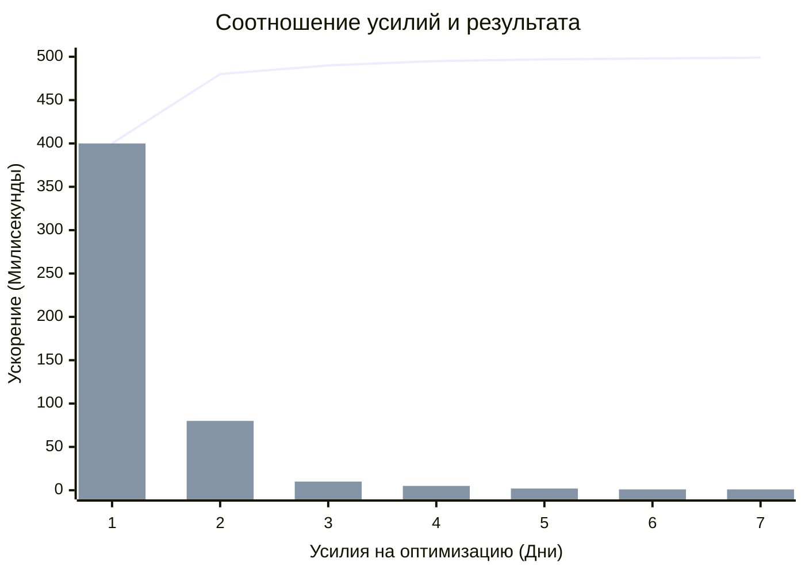

«Преждевременная оптимизация — корень всех (или большинства) зол в программировании», — знаменитая фраза Дональда Кнута. Во фронтенде эта проблема особенно актуальна из-за страха перед "лишними рендерами" и одержимости метриками Lighthouse.

## 1. Суть концепции

Разработчики часто тратят часы на ускорение участков кода, которые выполняются за доли миллисекунды, принося в жертву читаемость, архитектуру и время доставки фичи (Time-to-Market). 

**Боль:** Код становится хрупким, перегруженным хуками мемоизации или сложными алгоритмами, хотя реальное "узкое горлышко" приложения находится совсем в другом месте (например, в медленном ответе от бэкенда или загрузке 5 МБ картинок).

### Кривая стоимости оптимизации


*На графике видно: первые 20% усилий (например, внедрение виртуализации списка) дают 80% результата. Дальнейшие попытки выжать миллисекунды требуют огромных трудозатрат и почти не влияют на User Experience.*

## 2. Как это работает на практике

Главное правило: **Сначала сделай так, чтобы это работало. Потом — чтобы это было читаемо. И только потом (если профайлер показал проблему) — чтобы это работало быстро.**

### Антипаттерн: Одержимость мемоизацией в React
Разработчик оборачивает каждый компонент в `React.memo`, каждую функцию в `useCallback`, а каждое вычисление в `useMemo`, даже для списка из 10 элементов.

```tsx
// ОШИБКА: Преждевременная оптимизация
const UserList = React.memo(({ users }) => {
  // useMemo здесь занимает больше времени на создание и сборку мусора,
  // чем обычная фильтрация массива из 10 элементов.
  const activeUsers = useMemo(() => {
    return users.filter(u => u.isActive);
  }, [users]);

  const handleClick = useCallback((id) => {
    console.log(id);
  }, []);

  return activeUsers.map(u => <UserItem key={u.id} user={u} onClick={handleClick} />);
});
```

### Решение: Оптимизация на основе метрик
Пишем максимально простой и читаемый код. Если интерфейс начинает "лагать", мы открываем Chrome DevTools Performance или React Profiler, находим *конкретный* компонент, который рендерится 100мс, и точечно оптимизируем *только* его.

```tsx
// ПРАВИЛЬНО: Простой, декларативный код.
const UserList = ({ users }) => {
  const activeUsers = users.filter(u => u.isActive);

  return activeUsers.map(u => (
    <UserItem 
      key={u.id} 
      user={u} 
      onClick={(id) => console.log(id)} 
    />
  ));
};
```

## 3. Неочевидные нюансы и трейдоффы

*   **Грань между оптимизацией и компетентностью:** Отказ от преждевременной оптимизации — это **не оправдание** для написания откровенно плохого кода. Рендерить `` или рендерить 10 000 DOM-узлов без виртуализации — это не "отказ от оптимизации", это архитектурная ошибка.
*   **Скрытый оверхед:** Инструменты мемоизации (`useMemo`, кэширование) не бесплатны. Они потребляют память. Кэшируя всё подряд, вы можете устроить утечку памяти и парализовать браузер пользователя (особенно на слабых смартфонах), пытаясь спасти микросекунды процессорного времени.
*   **Архитектурная оптимизация первична:** Если вы неправильно спроектировали структуру стейта (например, храните всё в одном гигантском контексте, и каждое изменение поля формы рендерит всё приложение), никакие `useMemo` вам не помогут. Сначала исправьте архитектуру (State Colocation), а потом оптимизируйте алгоритмы.
