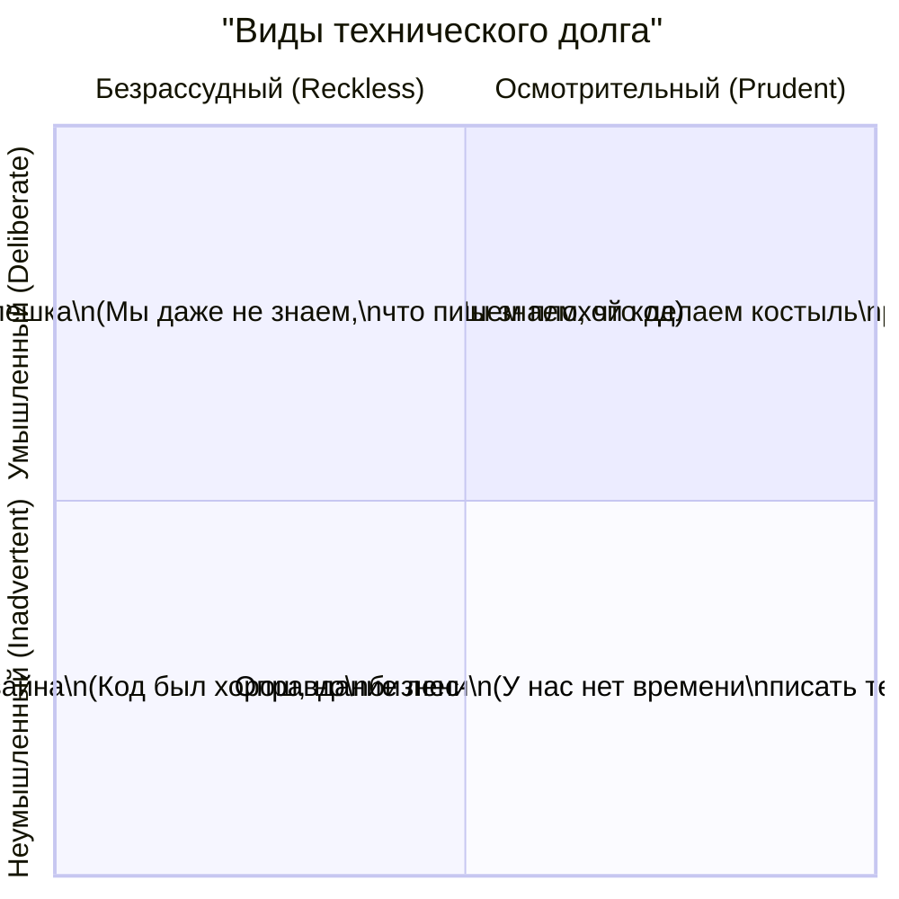

Концепция **"Технического долга"** была предложена Уордом Каннингемом для объяснения бизнесу компромиссов в разработке. Это метафора: когда мы выбираем быстрое, но неоптимальное решение (чтобы успеть к релизу), мы берем кредит.

Как и в финансах, кредит позволяет быстро получить желаемое (фичу на проде). Но за него придется платить **проценты** в виде усложнения кодовой базы, замедления разработки последующих фич и появления багов. 

## 1. Суть концепции

Технический долг не означает "плохой код". Это осознанный бизнес-компромисс.
**Боль:** Разработчики хотят рефакторить (выплачивать долг), бизнес хочет новые фичи (брать новые кредиты). Если долг не выплачивать, проценты сожрут всю "прибыль" команды: на добавление одной кнопки будет уходить неделя, и в итоге наступит "дефолт" — проект придется переписывать с нуля.

### Квадрант Технического Долга (по Мартину Фаулеру)


*Самый полезный долг находится в первом квадранте (Верхний правый). Самый опасный — во втором (Нижний левый).*

## 2. Как это работает на практике

Предположим, нам нужно интегрировать стороннюю систему аналитики `UglyAnalyticsSDK`, у которой ужасный API, требующий глобальных переменных.

### Антипаттерн: Разбрасывание долга по всему проекту (Токсичный долг)
Мы напрямую импортируем этот SDK в каждый UI-компонент.

```tsx
import { UglyAnalyticsSDK } from 'ugly-analytics';

function CheckoutButton() {
  const handleBuy = () => {
    // Внедрение грязного кода прямо в бизнес-логику UI
    window._ugly_global_id = '123'; 
    UglyAnalyticsSDK.pushEvent('buy', { val: 100 });
    // ...
  };
  return <button onClick={handleBuy}>Купить</button>;
}
```
*Результат:* Когда через год мы решим сменить аналитику на Google Analytics, нам придется вычищать этот "долг" из сотен файлов.

### Решение: Изоляция долга (Паттерн Фасад / Адаптер)
Мы понимаем, что SDK плохой, но времени искать другой нет. Мы осознанно берем долг, но *изолируем* его в одном месте (капсулируем).

```typescript
// analytics.service.ts
// Мы прячем весь грязный код здесь. Это наш "осознанный долг".
export const AnalyticsService = {
  trackPurchase: (amount: number) => {
    window._ugly_global_id = '123'; 
    UglyAnalyticsSDK.pushEvent('buy', { val: amount });
  }
};

// UI Компонент (Остается чистым)
import { AnalyticsService } from '@/services/analytics.service';

function CheckoutButton() {
  const handleBuy = () => AnalyticsService.trackPurchase(100);
  return <button onClick={handleBuy}>Купить</button>;
}
```

## 3. Неочевидные нюансы и трейдоффы

*   **Долг в ядре vs Долг на периферии:** Если вы берете долг в базовых абстракциях (например, делаете кривую архитектуру стейт-менеджера или базового UI-кита) — процентная ставка будет грабительской. Каждый новый компонент будет умножать этот долг. Если костыль находится в изолированной фиче (на странице 404) — этот долг можно не выплачивать годами.
*   **Правило бойскаута:** Лучший способ выплачивать непреднамеренный долг (устаревший код) — это принцип бойскаута: "Оставь код немного чище, чем он был до тебя". Если вы делаете задачу в старом файле, потратьте 15 минут на его рефакторинг.
*   **Банкротство:** Иногда долг настолько велик, что проект замирает. В таких случаях микрорефакторинг не поможет. Требуется выделять "карантинные зоны" (Strangler Fig pattern), постепенно заменяя старое приложение новым кусок за куском.
