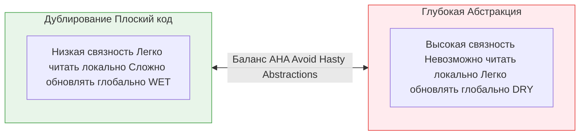

В погоне за элегантным кодом инженеры часто стремятся к максимальному переиспользованию, вынося любую повторяющуюся логику в абстракции. Однако у этого процесса есть обратная сторона. **Абстракция против читаемости** — это главный компромисс архитектуры, где принцип DRY (Don't Repeat Yourself) вступает в конфликт с когнитивной нагрузкой (Cognitive Load).

## 1. Суть концепции и проблему, которую решаем

**Боль:** Вы открываете компонент кнопки, чтобы изменить ее цвет, но обнаруживаете, что это `withTheme(withMetrics(BaseButton<GenericPolymorphicProps>))`. Чтобы понять, как передать цвет, вам нужно открыть пять разных файлов, продраться через сложные типы TypeScript и фабричные функции.

*   **Плюс абстракции:** Изменив код в одном месте, вы меняете поведение всей системы.
*   **Минус абстракции:** Локальная читаемость (способность понять код, просто глядя на него) стремится к нулю. Возникает проблема скрытого потока управления.

### Качели компромисса



## 2. Как это работает на практике

Самый частый пример — создание "Универсальной Формы" (Generic Form).

### Антипаттерн: Преждевременная абстракция ("Космолет")
Разработчик замечает, что форма логина и форма регистрации похожи, и создает универсальный HOC или генератор форм на основе JSON-конфигов.

```tsx
// ОШИБКА: Абстракция ради абстракции. Читаемость мертва.
const AuthForm = ({ type }) => {
  return (
    <GenericFormRenderer 
      config={type === 'login' ? loginConfig : registerConfig}
      validationSchema={GenericAuthSchemaFactory(type)}
      onSubmit={GenericSubmitHandler(type, '/api/auth')}
      theme="dark"
    />
  );
};
```
*Итог:* Когда маркетологи попросят добавить галочку "Я согласен с правилами" *только* в форму регистрации, этот "Космолет" придется переписывать, добавляя костыли в виде `if (type === 'register')`.

### Решение: AHA (Avoid Hasty Abstractions) — Избегайте поспешных абстракций
Дублирование кода дешевле, чем неправильная абстракция. Пишите линейный код, пока не станут очевидны реальные оси изменения.

```tsx
// ПРАВИЛЬНО: Плоский, читаемый код, даже если есть дублирование.
function LoginForm() {
  const { register, handleSubmit } = useForm();
  return (
    <form onSubmit={handleSubmit(loginApi)}>
      <Input {...register('email')} placeholder="Email" />
      <Input {...register('password')} type="password" />
      <Button type="submit">Войти</Button>
    </form>
  );
}

function RegisterForm() {
  const { register, handleSubmit } = useForm();
  return (
    <form onSubmit={handleSubmit(registerApi)}>
      <Input {...register('email')} placeholder="Email" />
      <Input {...register('password')} type="password" />
      <Checkbox {...register('rules')}>Согласен с правилами</Checkbox>
      <Button type="submit">Зарегистрироваться</Button>
    </form>
  );
}
```

## 3. Неочевидные нюансы и трейдоффы

*   **Контекст команды (Junior vs Senior):** Читаемость субъективна. Для разработчика с опытом функционального программирования абстракция на основе монад может быть читаемой и очевидной. Для команды джуниоров — это непреодолимый барьер. Архитектуру нужно подстраивать под уровень команды.
*   **Инкапсуляция сложности:** Абстракция хороша, когда она имеет узкий, четко очерченный API и прячет внутри сложную (но стабильную!) математику или логику. Например, хук `useDraggable()` — отличная абстракция. Нам не нужно знать, как он считает пиксели, мы просто получаем координаты. Но абстрагировать бизнес-логику (как в примере с формой) намного опаснее.
*   **Правило трех (Rule of Three):** Никогда не абстрагируйте на основе двух примеров. Дождитесь третьего юзкейса. К тому моменту вы поймете истинные границы переиспользуемости, и абстракция получится правильной.
