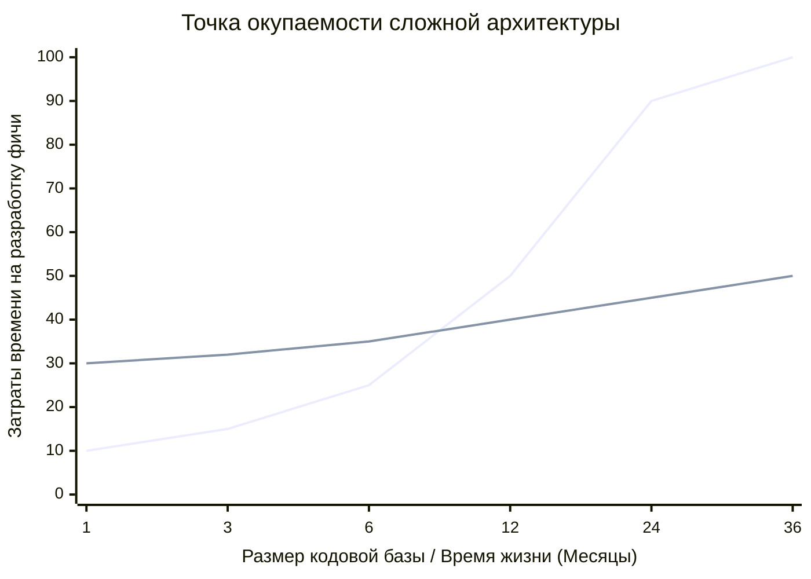

Индустрия фронтенда часто страдает от карго-культа архитектурных паттернов. Разработчики, прочитав статьи про Clean Architecture или Feature-Sliced Design (FSD), начинают применять их ко всем проектам подряд, забывая главное правило инженерии: **архитектура — это инструмент управления сложностью. Если сложности нет, инструмент становится обузой.**

## 1. Суть концепции

Сложная архитектура стоит денег (в виде времени разработчиков). Она требует большего количества файлов, интерфейсов, мапперов и строгих правил линтинга. 

**Боль:** Команда тратит неделю на написание CRUD-приложения, которое можно было бы написать за день, потому что они создают `Domain Entities`, `Use Cases` и `Repositories` для простого вывода таблицы пользователей из базы данных. Это классический **Overengineering** (оверинжиниринг).

### Когда окупается архитектура?


*На графике видно: в первые месяцы проект без архитектуры движется намного быстрее. Но по мере роста кодовой базы "стихийный" проект превращается в спагетти, и скорость падает до нуля. Проект со сложной архитектурой стартует медленно, но сохраняет стабильный темп годами.*

## 2. Как это работает на практике

Предположим, нам нужно написать лендинг с одной формой обратной связи.

### Антипаттерн: Clean Architecture там, где она не нужна
Разработчик создает 5 слоев абстракции для простейшего POST-запроса.

```typescript
// ОШИБКА: Оверинжиниринг для простой задачи
// 1. domain/Feedback.ts
export interface Feedback { email: string; text: string; }
// 2. domain/FeedbackUseCase.ts
export class SubmitFeedbackUseCase { constructor(private repo: FeedbackRepo) {} ... }
// 3. infrastructure/FeedbackRepoImpl.ts
export class ApiFeedbackRepo implements FeedbackRepo { ... }
// 4. ui/FeedbackForm.tsx (Где это всё собирается через DI)
```
*Результат:* Порог входа в проект взлетает до небес. Читаемость падает, так как логика размазана по пяти файлам.

### Решение: Выбор архитектуры по размеру проблемы
Для лендинга или простого MVP достаточно паттерна "Smart / Dumb Components" и простого хука для работы с API.

```tsx
// ПРАВИЛЬНО: KISS (Keep It Simple, Stupid)
import { useState } from 'react';
import { api } from '@/api';

export function FeedbackForm() {
  const [email, setEmail] = useState('');
  
  const handleSubmit = async (e) => {
    e.preventDefault();
    await api.post('/feedback', { email });
    alert('Спасибо!');
  };

  return (
    <form onSubmit={handleSubmit}>
      <input value={email} onChange={e => setEmail(e.target.value)} />
      <button type="submit">Отправить</button>
    </form>
  );
}
```

## 3. Неочевидные нюансы и границы применимости

*   **Признаки того, что сложная архитектура НЕ нужна:**
    1. Проект — это MVP с целью проверить гипотезу за 2 недели.
    2. Приложение представляет собой тонкий клиент (просто отрисовывает то, что прислал бэкенд, без сложной логики на клиенте).
    3. Команда состоит из 1-2 человек, и проект не планируется поддерживать дольше года.
*   **Признаки того, что пора внедрять архитектуру:**
    1. Появление сложной оффлайн-логики (Syncing, IndexedDB).
    2. Богатый UI-стейт (как в Figma, Notion, Miro).
    3. В проекте работает более 5 разработчиков, и они начинают конфликтовать (Merge Conflicts) из-за монолитной структуры папок.
*   **Архитектурный рефакторинг:** Не бойтесь начинать просто. Главное — следить за метриками связности кода. Когда вы заметите, что `FeedbackForm` начала обрастать тысячей строк логики, это сигнал к тому, что пора применять рефакторинг и выделять слои.
