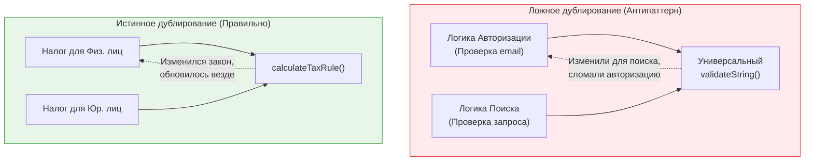

Один из самых коварных компромиссов в разработке — это баланс между принципом **DRY (Don't Repeat Yourself)** и метрикой **Coupling (Связность)**. Нас учат, что дублирование кода — это плохо. Но в реальности, слепое стремление к переиспользованию часто приводит к созданию жестко связанных систем, которые невозможно поддерживать.

## 1. Суть концепции

Когда вы выносите две похожие части кода в одну общую функцию, вы создаете **зависимость**. Теперь два независимых модуля (например, страница Корзины и страница Профиля) зависят от одного куска кода. 

**Боль:** Продуктовый менеджер просит сделать кнопку в Корзине зеленой и с иконкой. Вы меняете ваш переиспользуемый компонент `SharedButton`. Внезапно кнопка "Удалить аккаунт" в Профиле тоже становится зеленой. Вы чините Профиль, добавляя пропс `isDanger`, и кнопка в Корзине ломается. Это называется **Хрупкость (Fragility)** из-за высокой связности.

### Случайное совпадение vs Истинное дублирование


*Правило: DRY применяется к **бизнес-правилам**, а не к тексту кода. Если две строки кода выглядят одинаково, но отвечают за разные бизнес-процессы — это случайное совпадение. Их НЕЛЬЗЯ объединять.*

## 2. Как это работает на практике

### Антипаттерн: Бог-компонент
Мы создали `Card` для отображения товара. Затем решили использовать его для отображения статьи в блоге, потом — для профиля пользователя.

```tsx
// ОШИБКА: Чрезмерное переиспользование (Высокий Coupling)
function UniversalCard({ 
  type, title, price, author, date, imageUrl, onBuy, onRead 
}) {
  return (
    <div className="card">
      
      <h2>{title}</h2>
      {type === 'product' && <p>Цена: {price}</p>}
      {type === 'article' && <p>Автор: {author} ({date})</p>}
      
      {type === 'product' ? (
        <button onClick={onBuy}>Купить</button>
      ) : (
        <button onClick={onRead}>Читать</button>
      )}
    </div>
  );
}
```
*Результат:* Компонент оброс условиями (`if/else`). Его невозможно тестировать. Изменение дизайна карточки товара рискует сломать дизайн блога.

### Решение: Разделение (WET - Write Everything Twice)
Лучше иметь два независимых компонента, даже если их верстка на 80% совпадает.

```tsx
// ПРАВИЛЬНО: Низкая связность. Изменение одного не ломает другое.
function ProductCard({ product, onBuy }) {
  return (
    <div className="card product-card">
      
      <h2>{product.title}</h2>
      <p>Цена: {product.price}</p>
      <button onClick={onBuy}>Купить</button>
    </div>
  );
}

function ArticleCard({ article, onRead }) {
  return (
    <div className="card article-card">
      
      <h2>{article.title}</h2>
      <p>Автор: {article.author} ({article.date})</p>
      <button onClick={onRead}>Читать</button>
    </div>
  );
}
```

## 3. Неочевидные нюансы и трейдоффы

*   **Правило AHA (Avoid Hasty Abstractions):** Не торопитесь создавать абстракции. Скопировать код (Copy-Paste) на раннем этапе разработки часто безопаснее, чем преждевременно связать два модуля неверной абстракцией.
*   **Композиция спасает DRY:** Если в `ProductCard` и `ArticleCard` действительно много общего (например, красивая тень или обертка), не пытайтесь слить их в один монолит. Выделите *поведение* или *UI-каркас* через композицию (`<CardWrapper><ProductDetails /></CardWrapper>`).
*   **Удаление кода:** Переиспользуемый код очень сложно удалять (нужно проверять все места использования). Продублированный код удаляется за одну секунду (он изолирован).
