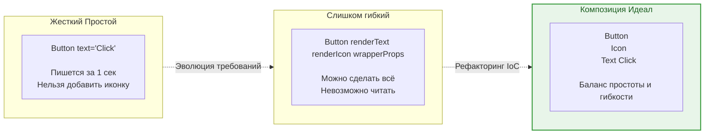

При проектировании UI-компонентов или архитектурных модулей мы постоянно стоим перед выбором: сделать решение **простым** (решает одну задачу, легко понять) или **гибким** (решает много задач, легко адаптировать под будущие требования). Проблема в том, что эти два качества обратно пропорциональны.

## 1. Суть концепции

*   **Простота (Simplicity):** Код делает ровно то, что заявлено. У него узкий API (мало пропсов/аргументов). Его легко использовать "из коробки", но если требования изменятся на 1%, компонент придется переписывать.
*   **Гибкость (Flexibility):** Код напичкан точками расширения (render-props, полиморфизм, коллбэки). Он может адаптироваться под любые требования дизайна, но его использование требует написания большого количества бойлерплейта.

**Боль:** Разработчик пишет `Dropdown`, закладывая в него гибкость "на вырост". В итоге у компонента появляется 40 пропсов (`renderOption`, `customArrowIcon`, `dropdownOffset`). Использовать такой компонент мучительно, а его документация занимает 5 страниц.

### Балансировка API



## 2. Как это работает на практике

Рассмотрим эволюцию компонента модального окна (Modal).

### Антипаттерн: Добавление пропсов ради гибкости (API Sprawl)
Каждое новое бизнес-требование решается добавлением нового флага (пропса).

```tsx
// ОШИБКА: Жесткий компонент мутировал в нечитаемого монстра
function Modal({ 
  isOpen, 
  title, 
  content, 
  showCloseIcon = true, 
  closeIconPosition = 'right', 
  footerButtons = ['cancel', 'submit'],
  submitText = 'OK',
  onCancel,
  onSubmit,
  isDangerousAction = false
}) {
  // ... сотня строк логики рендеринга
}

// Использование превращается в ад конфигурирования:
<Modal 
  isOpen={true} 
  title="Удалить?" 
  content="Вы уверены?" 
  isDangerousAction={true}
  submitText="Да, удалить"
/>
```

### Решение: Инверсия контроля (IoC) через композицию
Вместо того чтобы компонент `Modal` сам решал, как рендерить заголовок и кнопки, мы отдаем этот контроль наружу. `Modal` предоставляет только "каркас" и логику открывания/закрывания (Простота), а содержимое определяет вызывающий код (Гибкость).

```tsx
// ПРАВИЛЬНО: Компонент ничего не знает о бизнес-логике
import { Dialog, DialogTitle, DialogContent, DialogFooter } from '@/ui/dialog';

function DeleteUserModal({ isOpen, onClose, onConfirm }) {
  return (
    <Dialog open={isOpen} onOpenChange={onClose}>
      <DialogTitle>Удалить пользователя?</DialogTitle>
      <DialogContent>
        <p>Это действие необратимо.</p>
      </DialogContent>
      <DialogFooter>
        <Button variant="ghost" onClick={onClose}>Отмена</Button>
        <Button variant="danger" onClick={onConfirm}>Да, удалить</Button>
      </DialogFooter>
    </Dialog>
  );
}
```

## 3. Неочевидные нюансы и трейдоффы

*   **Иллюзия YAGNI:** Заранее закладывать "гибкость", которая может не понадобиться — это нарушение принципа YAGNI (You Aren't Gonna Need It). Вы платите цену за усложнение кода сегодня, хотя фича может никогда не пригодиться.
*   **Цена композиции:** Композитный подход (как в примере с `Dialog`) идеален для UI-библиотек (Design System). Но в рамках продуктового кода писать по 10 строк для каждого модального окна может быть утомительно. 
*   **Секретный баланс:** Паттерн **"Компонент-Фасад"**. Вы создаете гибкий низкоуровневый компонент через композицию (для сложных случаев), а поверх него пишете простые "жесткие" обертки для повседневного использования (например, `confirmModal('Удалить?')`, который под капотом собирает сложный `Dialog`).
