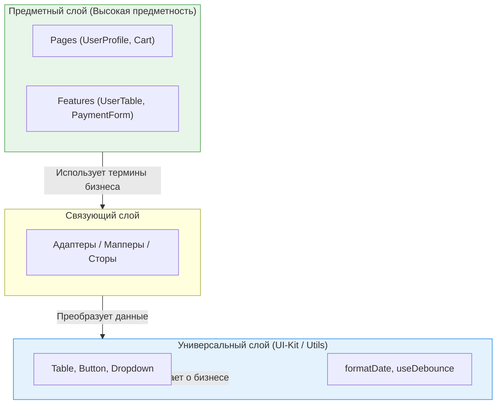

Архитектура программного обеспечения — это бесконечный танец между созданием обобщенных инструментов и решением конкретных бизнес-задач. Компромисс **Универсальность против Предметности (Universality vs Domain-Specificity)** определяет, где заканчивается UI-библиотека и начинается бизнес-логика.

## 1. Суть концепции

*   **Универсальность:** Код не знает ничего о вашем бизнесе (например, `Table`, `Input`, `debounce`). Он оперирует терминами "строки", "колонки", "события".
*   **Предметность (Domain):** Код отражает ваш бизнес (например, `UserList`, `TaxCalculator`, `AddToCartButton`). Он оперирует терминами "Пользователь", "Налог", "Корзина".

**Боль:** Смешивание этих двух миров. Например, когда в универсальную таблицу `Table` добавляют пропс `isUserAdminMode`, чтобы подкрасить строку. Универсальный компонент начинает "знать" о бизнес-правилах, превращаясь в монстра (God Object).

### Воронка абстракций



## 2. Как это работает на практике

### Антипаттерн: "Умный" универсальный компонент
Разработчик пишет "переиспользуемый" компонент `DataGrid`, который сам ходит в сеть.

```tsx
// ОШИБКА: DataGrid стал зависеть от API-клиента и конкретных эндпоинтов
function DataGrid({ entityType }) {
  const [data, setData] = useState([]);
  
  useEffect(() => {
    // Универсальный компонент лезет в бизнес-домен!
    api.get(`/${entityType}`).then(setData); 
  }, [entityType]);

  return <table>{/* рендер */}</table>;
}

// Использование:
<DataGrid entityType="users" />
```
*Результат:* Если для "users" потребуется передать токен, а для "products" — нет, `DataGrid` обрастет костылями-условиями.

### Решение: Четкое разделение
`DataGrid` должен быть тупым и универсальным (оперировать строками и колонками). Бизнес-логика (загрузка пользователей) должна жить в предметном компоненте `UsersList`.

```tsx
// 1. Универсальный слой (UI-Kit)
function DataGrid({ rows, columns }) {
  return <table>{/* рендер на основе пропсов */}</table>;
}

// 2. Предметный слой (Feature)
function UsersList() {
  const { users, isLoading } = useFetchUsers(); // Бизнес-логика
  
  const columns = [{ key: 'name', label: 'Имя' }]; // Маппинг
  
  return <DataGrid rows={users} columns={columns} />;
}
```

## 3. Неочевидные нюансы и трейдоффы

*   **Правило границ (Boundary Rule):** Чем ниже компонент в иерархии папок (например, в `src/shared`), тем более универсальным он должен быть. Чем выше (`src/features` или `src/pages`), тем более он предметный.
*   **Ловушка "Параметризации всего":** Попытка сделать предметный компонент универсальным через сотню пропсов. Например, `UserCard`, у которого есть пропсы `showAvatar`, `showEmail`, `showPhone`. В итоге это уже не карточка пользователя, а неудобный `GenericCard`. Проще сделать композицию: `<Card><Avatar /><Email /></Card>`.
*   **Именование — это архитектура:** Если в вашем UI-kit есть переменная `userRole`, вы нарушили границу. В UI-kit не бывает пользователей, там бывают `primary`, `secondary`, `danger`.
