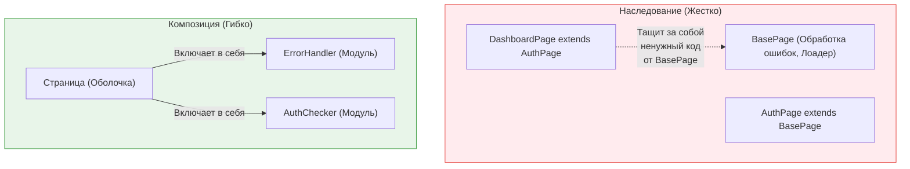

Принцип **"Композиция вместо наследования" (Composition over Inheritance)** — это фундаментальное правило объектно-ориентированного и компонентного программирования. Оно гласит: классы (или компоненты) должны достигать переиспользования кода за счет *включения* других объектов, а не через *наследование* от базового класса.

## 1. Суть концепции и какую боль решаем

**Боль (Проблема гориллы и банана):** Как сказал создатель Erlang Джо Армстронг: *"Проблема объектно-ориентированных языков в том, что они тащат за собой всю неявную среду. Вы хотели получить банан, но получили гориллу, которая держит этот банан, и все джунгли в придачу"*. 

Наследование создает жесткую иерархию **"является" (is-a)**. Если требования меняются так, что новая сущность вписывается в иерархию лишь частично, вам приходится создавать костыли (переопределять методы заглушками).
Композиция создает гибкую связь **"содержит" (has-a)**, работая как конструктор LEGO.

### Сравнение подходов



## 2. Как это работает на практике во Frontend

Во фронтенде (особенно в React и Vue) наследование компонентов считается абсолютным антипаттерном.

### Антипаттерн: Наследование классов (Старый React)
Попытка вынести общую логику в базовый класс-компонент.

```tsx
// ОШИБКА: Жесткая связь
class BaseList extends React.Component {
  fetchData() { /* базовая загрузка */ }
  renderLoader() { return <Spinner />; }
}

class UserList extends BaseList {
  componentDidMount() { this.fetchData(); }
  render() {
    if (this.state.loading) return this.renderLoader();
    return <ul>{/* ... */}</ul>;
  }
}
```
*Итог:* Если `ProductList` потребует другой лоадер, придется переопределять `renderLoader`. Класс `BaseList` быстро превратится в огромную свалку "на все случаи жизни".

### Решение: Композиция (Хуки и Children)
Мы разделяем логику и UI на независимые блоки и собираем их вместе.

```tsx
// ПРАВИЛЬНО: Логика через композицию хуков
function useFetchData(url) {
  // ... логика загрузки
  return { data, loading };
}

// UI через композицию компонентов (Render Props / Children)
function UserList() {
  const { data: users, loading } = useFetchData('/users');

  return (
    <ListLayout isLoading={loading} loader={<UserSkeleton />}>
      <ul>
        {users.map(u => <li key={u.id}>{u.name}</li>)}
      </ul>
    </ListLayout>
  );
}
```

## 3. Неочевидные нюансы и трейдоффы

*   **Бойлерплейт (Многословность):** Наследование подкупает тем, что вы пишете `extends BaseClass` и получаете всё "бесплатно". Композиция требует явного прокидывания пропсов и вызова нужных модулей. Это плата за гибкость.
*   **Глубина вложенности:** Злоупотребление композицией в React может привести к "Аду оберток" (Wrapper Hell): `<ThemeProvider><AuthProvider><RouteProvider><MyComponent/></...`. Решается с помощью паттерна Provider Composition.
*   **Где наследование уместно?** В кастомных ошибках (Custom Errors). Конструкция `class ApiError extends Error` — это идеальный и правильный случай использования наследования, так как `ApiError` действительно **является** ошибкой (`is-a`), и ловится через `instanceof`.
