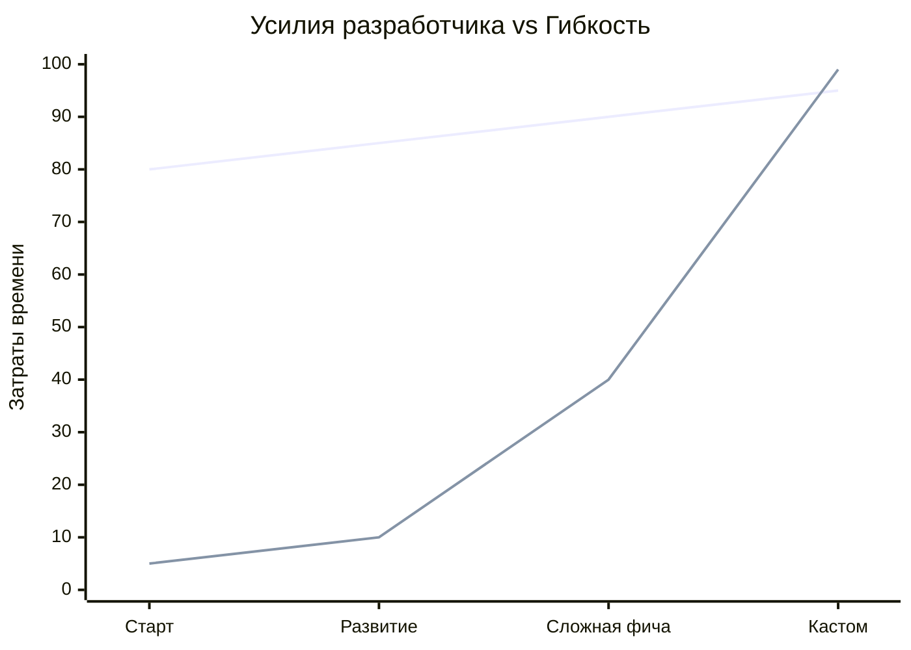

**Соглашения вместо конфигурации (Convention over Configuration, CoC)** — это парадигма проектирования, направленная на уменьшение количества решений, которые должен принимать разработчик. 

Фреймворк или инструмент задает строгие "соглашения" по умолчанию. Если вы следуете этим правилам, всё работает "из коробки". Вы пишете конфигурацию только тогда, когда вам нужно отойти от стандарта.

## 1. Суть концепции и какую боль решаем

**Боль:** В начале 2010-х разработка фронтенда состояла из бесконечной настройки Webpack, Babel, Gulp, ESLint. Создание "Hello World" занимало часы. Огромные файлы конфигурации (`webpack.config.js` на 1000 строк) становились нечитаемыми и требовали отдельного специалиста (DevOps/Build Engineer) для поддержки.

### Магия соглашений


*С CoC вы стартуете мгновенно. Проблемы (всплеск затрат времени) начинаются только тогда, когда бизнес требует сделать что-то, что противоречит архитектуре фреймворка.*

## 2. Как это работает на практике

Ярчайший пример CoC во фронтенде — файловый роутинг (File-based routing) в фреймворках вроде Next.js, Remix или Nuxt.

### Антипаттерн: Configuration (Конфигурация всего)
Классический подход React Router, где разработчик обязан вручную связать URL, компонент и параметры.

```tsx
// ОШИБКА: Ручная (явная) конфигурация (типично для SPA)
import { BrowserRouter, Route, Routes } from 'react-router-dom';
import Home from './pages/Home';
import UserProfile from './pages/UserProfile';

function App() {
  return (
    <BrowserRouter>
      <Routes>
        <Route path="/" element={<Home />} />
        {/* Разработчик должен помнить о совпадении пути и компонента */}
        <Route path="/users/:id" element={<UserProfile />} /> 
      </Routes>
    </BrowserRouter>
  );
}
```

### Решение: Convention (Соглашение)
В Next.js вы вообще не пишете код роутера. Вы просто создаете файлы в правильных папках.

```text
// ПРАВИЛЬНО: Соглашение от Next.js
app/
  page.tsx          -> автоматически становится "/"
  users/
    [id]/
      page.tsx      -> автоматически становится "/users/:id"
```
Фреймворк берет на себя всю черновую работу на основе негласного договора: "Если ты назовешь файл `page.tsx` и положишь его в папку, я сделаю его роутом".

## 3. Неочевидные нюансы и трейдоффы

*   **"Магия" и потеря явности:** CoC нарушает принцип [Explicit over Implicit](Explicit%20over%20Implicit.md). Когда что-то ломается, вы не можете просто пойти по цепочке вызовов функций (Ctrl+Click), потому что связи генерируются под капотом (например, во время сборки).
*   **Сложность кастомизации:** Если вам нужно сделать что-то за пределами соглашений (например, динамически менять роуты из базы данных до загрузки приложения), фреймворки с CoC часто сопротивляются этому, и вам приходится писать ужасные костыли (Workarounds).
*   **Ограничение свободы:** CoC заставляет команду подчиниться видению создателей фреймворка. Это отлично защищает проект от плохой архитектуры джуниоров (ведь папки уже заведены), но может раздражать синьоров, которые привыкли всё контролировать.
