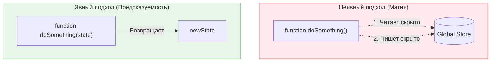

**«Явное лучше неявного» (Explicit is better than implicit)** — второе правило из Дзен Питона (The Zen of Python), которое стало золотым стандартом для любых языков программирования. В контексте фронтенда это означает, что код должен быть предсказуемым: посмотрев на функцию, вы должны понимать, какие данные ей нужны и что она изменяет, без необходимости изучать всё приложение.

## 1. Суть концепции

**Неявный код (Магия):** Полагается на глобальное состояние, "магические" инъекции, сайд-эффекты или контекст исполнения. Он короче писать, но его невозможно отлаживать.
**Явный код:** Честно объявляет все свои зависимости и результаты. Функция берет аргументы и возвращает результат.

**Боль:** Вы вызываете функцию `validateForm()`, и внезапно пользователя редиректит на страницу логина. Почему? Потому что глубоко внутри функции стоял скрытый вызов роутера, если токен истек. Это неявное поведение (Side-effect).

### Поток данных



## 2. Как это работает на практике

### Антипаттерн: Неявная зависимость от глобального объекта
Функция берет данные "из воздуха" (из `window` или глобального скоупа).

```typescript
// ОШИБКА: Функция скрыто зависит от window.currentUser
function getUserGreeting() {
  const user = window.currentUser; // Неявная зависимость!
  if (!user) return 'Привет, Гость';
  return `Привет, ${user.name}`;
}

// Как это тестировать? Придется мокать (подменять) глобальный window.
```

### Решение: Явная передача аргументов (Чистая функция)

```typescript
// ПРАВИЛЬНО: Функция честно заявляет, что ей нужен user
interface User { name: string; }

function getUserGreeting(user: User | null) {
  if (!user) return 'Привет, Гость';
  return `Привет, ${user.name}`;
}

// Тестирование сводится к вызову getUserGreeting({ name: 'Иван' })
```

### Антипаттерн 2: Неявный "Prop Drilling" через Context (В React)
Часто разработчики кладут всё подряд в React Context, чтобы не передавать пропсы.

```tsx
// ОШИБКА: Неявно получаем данные из контекста (сотни файлов выше)
function SubmitButton() {
  const { isFormValid, submitForm } = useContext(GodContext);
  return <button disabled={!isFormValid} onClick={submitForm}>Отправить</button>;
}
// Вытащить эту кнопку в другой проект — невозможно.
```

### Решение 2: Явные пропсы
```tsx
// ПРАВИЛЬНО: Кнопка явно требует того, что ей нужно
function SubmitButton({ isValid, onSubmit }) {
  return <button disabled={!isValid} onClick={onSubmit}>Отправить</button>;
}
```

## 3. Неочевидные нюансы и трейдоффы

*   **Конфликт с "Convention over Configuration":** Файловый роутинг в Next.js — это неявно. Использование макросов в Babel/Vite — это неявно. Мы часто жертвуем "явностю" ради скорости разработки и "DX" (Developer Experience).
*   **Prop Drilling (Проблема многословности):** Слишком явный код приводит к тому, что вы передаете `user` через 10 слоев компонентов, которые им не пользуются, просто чтобы доставить его вниз. Это ухудшает читаемость. Здесь нужен баланс: используйте Context для глобальных вещей (Тема, Локаль, Сессия), но передавайте явно то, что меняется часто.
*   **Именование:** Явность проявляется и в названиях. Переменная `data` — неявная. Переменная `activeUserList` — явная. Функция `process()` — неявная. Функция `calculateAndSaveTax()` — явная (мы сразу видим сайд-эффект сохранения).
