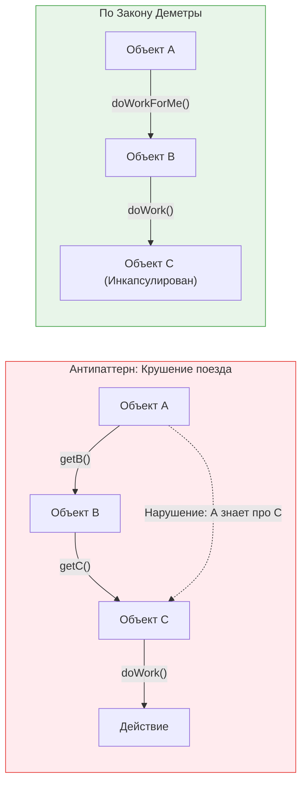

**Закон Деметры (Law of Demeter, LoD)** — это эвристическое правило проектирования, которое часто кратко формулируют как "Не разговаривай с незнакомцами" (Don't talk to strangers) или "Общайся только с непосредственными друзьями".

## 1. Суть концепции и какую боль решаем

Правило гласит, что модуль/объект не должен знать о внутреннем устройстве объектов, с которыми он взаимодействует. 

**Боль:** Хрупкость кода (Fragility) и жесткая связность (Tight Coupling). Если компонент А знает, что внутри компонента B есть компонент C, то при любом изменении C или B, сломается и А. Это вызывает эффект домино при рефакторинге.

### Цепочка вызовов (Train Wreck)


*Если в коде встречается цепочка `user.profile.settings.getTheme()`, это классическое нарушение Закона Деметры, известное как "Крушение поезда" (Train Wreck).*

## 2. Как это работает на практике

Во фронтенде Закон Деметры чаще всего нарушается при работе со сложными объектами состояния (Store) и при глубокой передаче пропсов (Prop Drilling).

### Антипаттерн: Компонент знает слишком много
Компонент `Header` лезет глубоко в структуру объекта `appState`, чтобы достать нужные данные.

```tsx
// ОШИБКА: Header знает о сложной внутренней структуре всего приложения
function Header({ appState }) {
  // Нарушение Закона Деметры. Что если структура базы изменится?
  const userName = appState.entities.users.currentUser.profile.firstName;
  const theme = appState.preferences.ui.theme;

  return <header className={theme}>Привет, {userName}</header>;
}
```

### Решение: Селекторы или плоские пропсы (Делегирование)
Компонент должен получать только то, что ему непосредственно нужно. Если мы используем Redux, эту проблему решают селекторы.

```tsx
// ПРАВИЛЬНО: Header общается только со своими "друзьями" (плоскими пропсами)
function Header({ userName, theme }) {
  return <header className={theme}>Привет, {userName}</header>;
}

// Вышестоящий слой (Контейнер или Селектор) берет на себя грязную работу:
const ConnectedHeader = () => {
  const userName = useStore(selectCurrentUserName); // Селектор скрывает структуру
  const theme = useStore(selectTheme);
  return <Header userName={userName} theme={theme} />;
};
```

## 3. Неочевидные нюансы и трейдоффы

*   **Fluent Interfaces / Method Chaining:** В JavaScript популярны цепочки вызовов массива (`array.filter().map().reduce()`) или промисов (`fetch().then().catch()`). Это **НЕ является** нарушением Закона Деметры. Закон применяется к навигации по структуре *разных* объектов, а в случае с массивами/промисами мы каждый раз получаем объект того же типа или ожидаемый результат одного конвейера.
*   **Оверхед делегирования:** Строгое следование Закону Деметры может привести к появлению множества методов-оберток (wrapper methods). Например, чтобы не писать `user.department.getManager()`, мы пишем `user.getDepartmentManager()`. Если таких методов становятся сотни, класс `User` раздувается. Иногда нарушить закон (создать небольшую цепочку) дешевле, чем писать кучу бойлерплейта.
