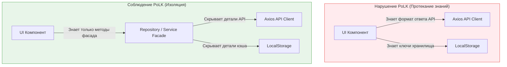

**Принцип наименьшего знания (Principle of Least Knowledge, PoLK)** — это более широкая архитектурная формулировка Закона Деметры (Law of Demeter). Если Закон Деметры фокусируется на взаимодействии конкретных объектов (кто чьи методы вызывает), то PoLK применяется к модулям, слоям и архитектуре в целом.

## 1. Суть концепции

Принцип гласит: **Модуль должен обладать минимально возможной информацией о структуре, поведении и данных других модулей.** Информацию нужно выдавать строго по принципу "need-to-know" (знать только необходимое).

**Боль:** Тотальная связность (Spaghetti Code). Если модуль UI знает, какой HTTP-клиент используется для отправки данных (Axios или Fetch), или какие ключи есть в LocalStorage, заменить эти инструменты в будущем будет невозможно без переписывания всего UI.

### Инкапсуляция знаний



## 2. Как это работает на практике

Во фронтенде этот принцип ярче всего проявляется при работе с глобальными конфигурациями и сторонними библиотеками.

### Антипаттерн: Протекание конфигурации маршрутизатора
Компонент кнопки знает, как устроен роутинг (React Router) и какие параметры он принимает.

```tsx
import { useHistory } from 'react-router-dom';

// ОШИБКА: Кнопка "знает", что мы используем react-router-dom
// и знает точную структуру URL ('/products/123/checkout').
export function BuyButton({ productId }) {
  const history = useHistory();
  
  const handleClick = () => {
    history.push(`/products/${productId}/checkout?source=button`);
  };

  return <button onClick={handleClick}>Купить</button>;
}
```

### Решение: Абстрагирование (Dependency Injection)
Компонент должен знать только то, что при нажатии нужно вызвать коллбэк. Знание о роутинге переносится на верхний уровень (или в специальный сервис).

```tsx
// ПРАВИЛЬНО: Кнопка ничего не знает о маршрутизации.
// Она знает только про свое событие onBuy.
export function BuyButton({ onBuy }) {
  return <button onClick={onBuy}>Купить</button>;
}

// Использование (в слое страницы, который имеет право знать про роутинг):
function ProductPage({ product }) {
  const router = useRouter(); // Абстракция над роутером
  return <BuyButton onBuy={() => router.goToCheckout(product.id)} />;
}
```

## 3. Неочевидные нюансы и трейдоффы

*   **PoLK vs Удобство разработки (DX):** Скрывая всё за фасадами и интерфейсами, мы защищаем архитектуру, но усложняем навигацию по коду. Разработчику сложнее понять, *что именно* произойдет при вызове `router.goToCheckout()`, пока он не провалится в реализацию.
*   **Скрытие зависимости от среды (Environment):** UI-компоненты не должны обращаться к `process.env.NEXT_PUBLIC_API_URL` или `window.location`. Это знание о среде выполнения. Компоненты должны быть "чистыми" функциями от пропсов и стейта. Конфигурация среды должна инжектироваться на самом верхнем уровне (в точке сборки приложения).
